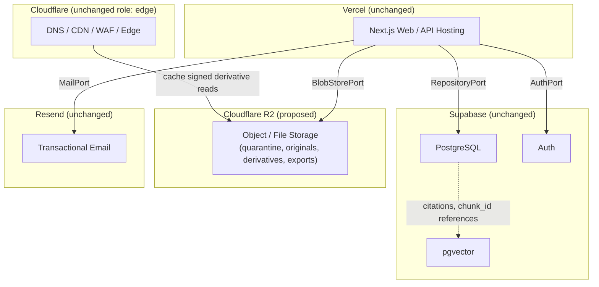
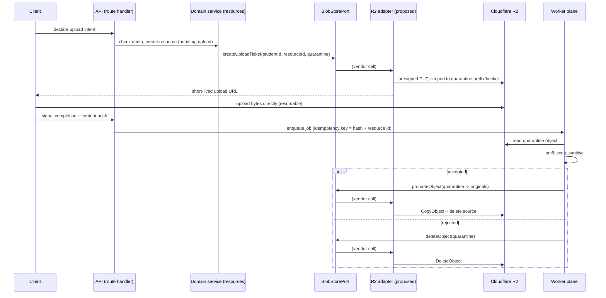

# Avora — Architecture Change Proposal

> **UPDATE (2026-09-03): Direction decided, not implemented.**
> The evaluation below concluded, and the founder(s) have since decided the architecture **direction**: Cloudflare R2 is the intended target for Avora's object/file storage, replacing Supabase Storage's role once implemented, security-reviewed, and migrated. This decision is now formally recorded as **`AD-42`** — see [`docs/adr/AD-42-cloudflare-r2-object-storage.md`](./adr/AD-42-cloudflare-r2-object-storage.md), which is the authoritative decision record going forward. **This document is preserved as the original evaluation and is not rewritten to erase that it began as a proposal under evaluation** — everything below this notice reflects that original evaluation's content and status at the time it was written. Where this document and `AD-42` differ on status language, `AD-42` and `docs/architecture.md` §13.0 govern.
>
> **What changed:** the vendor-direction question this document opened is answered (R2, per founder decision). **What has not changed:** no code has been written, no migration has occurred, Supabase Storage remains the current production implementation, and the governance gates this document always said would be required — CISO/processor review (`SEC-211`), a second non-authoring reviewer on this protected-path change (`ENG-322`, `ENG-004`), and human leadership approval for the eventual adapter (`docs/AVORA-TOOLCHAIN.md` §29) — remain pending exactly as `AD-42` records them. See `AD-42`'s "Governance and approval status" table for the current, itemised state of each gate.

---

> **Original status line, as first published (superseded by the update above, kept for history):**
> **Status: PROPOSED / NOT APPROVED / NOT IMPLEMENTED.**
> This document evaluates a possible future change. It does not authorise, schedule, or begin any implementation. Supabase Storage remains the sole active production object-storage vendor until this proposal (or a successor) is formally approved through the governance procedure in [§15](#15-governance-and-approval-requirements) and the authoritative documents (`docs/architecture.md`, `docs/AVORA-TOOLCHAIN.md`, `docs/REPOSITORY.md`) are amended accordingly.

---

## 1. Purpose

This document proposes evaluating a replacement of **Supabase Storage** with **Cloudflare R2** for Avora's object/file storage responsibility — the layer holding uploaded academic files, derivatives, exports, and quarantined pre-validation bytes.

It exists to open a documented, structured evaluation, consistent with the repository's documentation-first principle (`EP-09`) and amendment procedure (`docs/REPOSITORY.md` §26.2). It is a discussion and impact-assessment artifact, not an Architecture Decision Record. Per `docs/REPOSITORY.md` §9 and §26.2, a formal decision of this kind is eventually recorded as an ADR in `docs/adr/` (format: `AD-<number>-<slug>.md`, indexed in `docs/adr/README.md`). **That directory does not currently exist in this repository**, and this document does not create it, assign it an `AD-##` number, or assign an `AOQ-##` number in `docs/architecture.md` — numbering those registers is the responsibility of the owning document's maintainer (`@avora/architecture`) at the point the decision is formally opened, per [§15](#15-governance-and-approval-requirements). This document is written so its content can be transcribed into that ADR without rework once the process is opened.

**Assumptions made in writing this document** (`ENG-405`), stated separately from what the governing documents say:
- **Assumption A1:** No prior architecture decision record for object-storage vendor selection exists. Verified by repository search — no `AD-##` entry in `docs/architecture.md` §44 names a storage vendor, and no ADR file exists on disk.
- **Assumption A2:** "Cloudflare R2" in this proposal refers only to R2's S3-compatible object storage product. It does not refer to, and does not propose adopting, any other Cloudflare product beyond what is already adopted (DNS, CDN, WAF, bot management — `docs/architecture.md` §6 Technology Stack table, `docs/AVORA-TOOLCHAIN.md` §7).
- **Assumption A3:** This proposal targets the storage layer described in `docs/architecture.md` §13 ("Storage Architecture") — the resource-file storage path reachable through `BlobStorePort` — not Supabase Postgres, Supabase Auth, Supabase Realtime, or `pgvector`, none of which are in scope.

---

## 2. Current Architecture

Recorded here exactly as supported by the repository, per governing-document authority (`docs/architecture.md`, `docs/SECURITY.md`, `docs/AVORA-TOOLCHAIN.md`). No current decision is rewritten by this section.

### 2.1 Current stack (relevant slice)

| Concern | Vendor | Role | Source |
| --- | --- | --- | --- |
| Relational data + `pgvector` | Supabase PostgreSQL 15+ | System of record; vector search | `docs/architecture.md` §6 Technology Stack table |
| Auth | Supabase Auth | Identity, session issuance | `docs/architecture.md` §6 |
| Object/file storage | **Supabase Storage** | Uploaded originals, derivatives, exports, quarantine | `docs/architecture.md` §6, §13 |
| CDN / WAF / DNS | Cloudflare | Edge caching for static + signed-media paths, WAF, bot management, first-tier rate limiting (`NFR-033`) | `docs/architecture.md` §6; `docs/AVORA-TOOLCHAIN.md` §7 |
| Web/API hosting | Vercel | Next.js App Router hosting, preview deployments | `docs/architecture.md` §6 |
| Transactional email | Resend | Auth, receipts, deletion confirmations only — never bulk/marketing | `docs/architecture.md` §6; behind `MailPort` |
| Long-running work | Container worker plane | Ingestion, extraction, embedding, exports | `docs/architecture.md` throughout |

Cloudflare's documented role today is strictly CDN/WAF/DNS. **Cloudflare R2 is not mentioned anywhere in the current governing documents or code** — a repository-wide search found no reference to it outside of unrelated Mermaid diagram node IDs (`R2` used as a node label, unrelated to Cloudflare R2) and unrelated npm package names in lockfiles.

### 2.2 Current storage architecture

**Bucket topology** (`docs/architecture.md` §13.1):

| Bucket | Contents | Access | Requirement |
| --- | --- | --- | --- |
| `quarantine` | Freshly uploaded bytes, pre-validation | No read access to anyone but the ingestion worker | `NFR-034` |
| `originals` | Validated, unmodified original files | Owner read via short-lived signed URL | `FR-035` |
| `derivatives` | Page rasters, normalised images, thumbnails, extracted media | Owner read via signed URL | Ingestion pipeline |
| `exports` | Generated export bundles | Owner read, short TTL, auto-expired | `FR-004`, `FR-076` |
| `shared` | Not a physical copy — shares reference `originals` through the grant projection | Grant-scoped | `FR-130`–`FR-133` |

**Path convention:** `{bucket}/{student_id}/{resource_id}/{version}/{filename}`. The `student_id` first path segment lets storage policy enforce ownership on the path itself, giving storage the same single-predicate property as the database (`docs/architecture.md` §13.1, `AG-04`).

**Upload flow** (`docs/architecture.md` §13.2): client declares intent → API checks quota and creates the resource row (`state = pending_upload`) → API issues a resumable upload ticket scoped to `quarantine` → client uploads directly to quarantine, resumable across network loss → client signals completion with a content hash → a job is enqueued (idempotency key = content hash + resource id) → the worker sniffs, scans, and sanitises → on acceptance the bytes are **promoted to `originals`, immutable**; on rejection they are purged from quarantine and the resource is marked `rejected`.

**Access and lifecycle** (`docs/architecture.md` §13.3):
- All reads are short-lived signed URLs issued per request after an ownership check. No public buckets, no long-lived URLs.
- CDN delivery through Cloudflare for cacheable derivatives, with cache keys that never cross identities.
- Content hash recorded at ingest, verified at promotion and export.
- Originals are immutable; re-processing produces a new `extracted_content` version, never a modified original (`FR-035`, `AD-06`).
- Quarantine objects expire aggressively (hours); export bundles expire on a short published schedule; originals persist until deleted by the student or by account deletion, at which point the deletion subsystem (§37) removes them across all copies and backups within the published window (`NFR-042`).

**Upload security controls** (`docs/architecture.md` §13.4; restated as binding in `docs/SECURITY.md`): type sniffing independent of extension, allowlisted types, size/page ceilings, malware scan before promotion, structural sanitisation (active-content stripping, PDF re-serialisation, image re-encode stripping EXIF/GPS), archive/nesting limits, rendering isolation, and extraction isolation with no unallowlisted outbound network access.

Binding security identifiers already in force over this layer include `SEC-180` (nothing promoted until every control passes; failures are purged, never partially promoted), `SEC-181` (upload tickets scoped to one resource, one student, one bucket, short validity), `SEC-212` (no public bucket/path/anonymous access; all reads are short-lived signed URLs after an ownership check), and `SEC-213` (CDN cache keys are identity-scoped).

**Worker access:** the container worker plane is the sole holder of the service-role credential used against storage; a `SUPABASE_SERVICE_ROLE_KEY` reference resolving outside `apps/worker/**` or `packages/adapters/**` fails the build (`docs/REPOSITORY.md` §5, `SEC-005`).

### 2.3 Existing port/adapter for storage

A vendor-neutral port for this capability **already exists and is already implemented** — this is the load-bearing fact for everything downstream in this proposal:

- **Port:** `packages/domain/resources/ports/BlobStorePort.ts` declares `BlobStorePort` with four operations: `createUploadTicket`, `createSignedReadUrl`, `promoteObject`, `deleteObject`, all typed over `ResourceStorageLocation` (`{ bucket, objectPath, version }`) and the closed bucket set `["quarantine", "originals", "derivatives", "exports", "shared"]` (`packages/domain/resources/contracts/ResourceStorage.contract.ts`).
- **Port README** (`packages/domain/resources/ports/README.md`): "Ports in this directory must not import vendor SDKs. Supabase Storage, S3-compatible storage, and any future storage provider belong in adapter packages, not in this module."
- **Current adapter:** `packages/adapters/supabase/storage/adapter.ts` implements the port using `@supabase/supabase-js` (`createSignedUploadUrl` / `createSignedUrl` / `move` / `remove`), and asserts student-path ownership on every call via `packages/adapters/supabase/storage/path.ts`.
- **Authoritative port list:** `docs/ENGINEERING-RULES.md` §5.3 (`ENG-026`) names `BlobStorePort` as the current storage port and states "a new port is an architectural amendment" — meaning a new *vendor* does not require a new *port* if `BlobStorePort`'s contract already covers it (see [§8](#8-port--adapter-boundary)).
- **Open caveat inherited from the repository, not created by this proposal:** `docs/REPOSITORY.md` §5.8 records that `packages/adapters/` itself is not yet named in `architecture.md` §32 and is tracked as `GAP-01`, pending amendment `AMD-03`. Any new adapter placed under `packages/adapters/` inherits that open item; it is not resolved by this document.

### 2.4 Deletion architecture (current)

`AD-38` (`docs/architecture.md` §37, Architecture Decision Register §44): deletion is an orchestrated, tracked, verifiable, multi-store subsystem with a published completion window. The cascade explicitly includes object storage as target class **F2** — "originals, derivatives, exports, quarantine remnants" — alongside primary rows (F1), search/vector indices (F3), caches (F4), analytics (F5), the evaluation store (F6), shares (F7), and backups (F8, crypto-shredded per-student).

Binding rules: access revocation is immediate, physical erasure completes within the published window (`NFR-042`); verification is a real step that asserts absence in every store, never inferred from "the delete statement succeeded" (`SEC-472`); deletion receipts retain identifiers and timestamps only, never content. The general rule that any new data-holding destination must join this cascade in the same PR that introduces it is `SEC-007` (restated `ENG-310`), and `SEC-491` makes this a hard eligibility gate: **"A processor that cannot support verified per-student deletion is not eligible."**

---

## 3. Proposed Architecture

The proposal replaces Supabase Storage's role — object/file bytes only — with Cloudflare R2, while Supabase's other responsibilities are unchanged. Cloudflare R2 does **not** replace Supabase; it replaces one responsibility currently assigned to Supabase.



Target vendor responsibility list, restated as a tree per the task framing:

```
Supabase
├── PostgreSQL
├── pgvector
└── Auth

Cloudflare R2
└── Object / File Storage

Resend
└── Transactional Email

Vercel
└── Next.js Web/API Hosting

Cloudflare
└── DNS / CDN / WAF / Edge
```

The domain-facing contract does not change: every caller continues to depend only on `BlobStorePort` (`packages/domain/resources/ports/BlobStorePort.ts`). What changes is which adapter implements that port in the runtime wiring (`packages/adapters/supabase/storage/` today; a new adapter, e.g. `packages/adapters/cloudflare-r2/` — name not yet confirmed, see [§17](#17-open-questions)).

Historical note: this section preserves the original proposal wording from when the vendor direction was still under evaluation. The vendor-direction decision is now resolved in AD-42: Cloudflare R2 is the intended target. AD-42 and docs/architecture.md §13.0 are authoritative for the current decision and status.

---

## 4. Motivation

Reasons under evaluation for considering R2, distinguished by category. No performance benchmarks or cost projections are asserted here — vendor-published characteristics are cited qualitatively only.

**A. Architectural advantages (candidate)**
- Separates large binary academic content from the relational system of record, so Postgres growth (and therefore backup size, replication lag, and `pgvector` index maintenance) is decoupled from file-volume growth.
- R2 exposes an S3-compatible API, which is a widely implemented interface — this could simplify a future adapter swap if a further storage-vendor change were ever needed, without touching `BlobStorePort` or domain code (`ENG-018`, `ENG-026`).
- Cloudflare already terminates the CDN/edge path in front of derivative delivery (`docs/architecture.md` §13.3); co-locating storage and CDN under one vendor is architecturally adjacent to what is already in place, though this proposal does not assume any specific latency or cache-hit improvement without measurement.
- Dedicated object storage is purpose-built for large, infrequently-mutated binary academic files (PDFs, scans, page rasters), which is a closer match to Avora's originals/derivatives/exports access pattern than a general-purpose Postgres-adjacent storage layer.

**B. Trade-offs**
- Supabase Storage today gives a single vendor for auth, data, and storage, which currently simplifies operational surface area (one dashboard, one support relationship, one bill). Splitting storage to a second vendor increases the number of systems that must be independently monitored, secured, and reasoned about for outage/incident response.
- Supabase Storage's integration with Supabase's own access model is presumably closer out-of-the-box (though Avora's current architecture already re-derives its own ownership and signed-URL model on top of it per §13.3 — see [§6](#6-security-impact)).

**C. Migration complexity** — see [§10](#10-migration-strategy).

**D. Security implications** — see [§6](#6-security-impact).

**E. Operational implications** — see [§12](#12-operational-impact).

**F. Cost considerations** — see [§11](#11-cost-considerations).

---

## 5. Architecture Comparison

| Dimension | Current (Supabase Storage) | Proposed (Cloudflare R2) |
| --- | --- | --- |
| API shape | Supabase Storage JS client (`createSignedUploadUrl`, `createSignedUrl`, `move`, `remove`) | S3-compatible API (presigned PUT/GET, `CopyObject`, `DeleteObject`) |
| Ownership enforcement | Adapter-level path assertion (`assertStoragePathBelongsToStudent`) plus Supabase-side storage policy | Adapter-level path assertion only — R2 has no equivalent of Postgres RLS; ownership must be enforced entirely in the adapter/domain layer before any URL is signed (see [§6](#6-security-impact)) |
| Vendor SDK location | `packages/adapters/supabase/storage/` | Would be `packages/adapters/<r2-adapter>/` — a **new** adapter, not a new port |
| Domain/port contract | `BlobStorePort` | Unchanged — same `BlobStorePort` |
| CDN relationship | Cloudflare caches Supabase-Storage-origin derivatives | Cloudflare would cache R2-origin derivatives — potentially a same-vendor origin-to-edge path, unconfirmed benefit without measurement |
| Deletion cascade | F2 target class already implemented against Supabase Storage | F2 target class re-implemented against R2; cascade verification step must be extended, not weakened (`SEC-472`) |

---

## 6. Security Impact

This is the section the source task marked critical, and it is treated as such here: **moving storage vendors must not weaken tenant isolation, RLS-equivalent access control, object ownership, deletion guarantees, quarantine security, signed-access controls, or the zero-content-logging requirement (`NN-09`).**

**A load-bearing fact about the current system, confirmed in code:** Supabase's Row Level Security does not, by itself, govern object-storage access in the way it governs Postgres tables. The current adapter (`packages/adapters/supabase/storage/adapter.ts`) already performs an explicit ownership assertion (`assertStoragePathBelongsToStudent`) before issuing any signed URL or performing any operation, rather than relying solely on a storage-side policy. This means the authorization boundary Avora depends on today is **application/adapter-enforced ownership checking prior to signing**, not an implicit vendor guarantee — R2 can preserve this boundary exactly, because the enforcement point does not move.

Analysis by concern:

- **Application/backend authorization:** Every `BlobStorePort` call already carries `studentId` and `resourceId` and is expected to assert ownership before acting (per the existing adapter pattern). An R2 adapter must replicate this: verify the caller's session-derived `studentId` owns `resourceId` (via the domain/repository layer, under RLS) *before* constructing any presigned URL or performing any R2 operation. This is a port-contract requirement already implied by `BlobStorePort`'s input types, not a new invariant.
- **Signed URLs / short-lived access:** R2 presigned URLs (SigV4, S3-compatible) support expiry windows analogous to Supabase's signed URLs. TTL must remain "minutes," matching the existing bound on the residual access window after share revocation (`docs/architecture.md` §13.3, §12.5).
- **Object key design:** The existing path convention `{bucket}/{student_id}/{resource_id}/{version}/{filename}` should be preserved as the R2 object key, keeping `student_id` as the leading segment. Because R2 (like S3) does not evaluate row-level predicates on that path the way Postgres RLS does, the path structure alone is not a security control under R2 — it becomes purely an organizational/audit convenience, and **all access decisions must be made in the adapter/domain layer before a key is ever resolved to a URL.** This is a stricter posture than may be assumed by analogy to Supabase, and is flagged explicitly so it is not silently dropped during migration.
- **Predictable-key abuse:** `resource_id` is expected to remain a non-sequential identifier (`ResourceId` branded type, `ENG-054`); this proposal assumes — and does not weaken — that keys are not guessable. No new predictability is introduced by an R2 key scheme that mirrors the current path convention.
- **Quarantine isolation:** The `quarantine` bucket/prefix must remain reachable only by the worker plane's credential, mirroring `SEC-181` (upload tickets scoped to one resource, one student, one bucket, short validity) and `SEC-180` (nothing promoted until every control passes; rejects are purged, never partially promoted). R2 bucket-level or prefix-level access-key scoping must be configured to enforce this — this is a **configuration and adapter-implementation detail requiring explicit design**, not assumed solved by this document.
- **Upload authorization:** Presigned PUT URLs must be scoped the same way current upload tickets are — one resource, one student, `quarantine` only, short validity (`SEC-181`).
- **Download authorization:** Every read continues to require an ownership check immediately before signing (`SEC-212`); no public bucket, no long-lived URL, no anonymous read.
- **Worker access:** Only the worker plane holds R2 access-key credentials, exactly as it is today the sole holder of the Supabase service-role key (`SEC-005`). R2 access keys must never be reachable from any client-input runtime (web route handlers, mobile bundle).
- **Deletion guarantees:** The F2 cascade target (`docs/architecture.md` §37) must be re-pointed at R2 without weakening `SEC-472`'s verification requirement — an R2 `DeleteObject` (and `DeleteObjects` for batch) call succeeding is not, by itself, evidence of deletion; the cascade's verification step must independently confirm absence, exactly as it must today. Backup/crypto-shredding equivalents for R2 (if R2's backup surface differs from Supabase's) must be identified before this can be considered resolved — flagged as an open item in [§17](#17-open-questions).
- **Preventing cross-student object access:** Enforced entirely by the adapter/domain ownership check prior to signing (see above), not by an R2-native equivalent of RLS, because none exists at the object-storage layer for either vendor today.
- **Secret/key management:** R2 access keys must be treated as a service-role-class secret under `SEC-005` / `ENG-267`–`ENG-272`: never committed, never read by feature code, never bundled, never logged. Rotation/revocation procedure must be defined before adoption.
- **Auditability:** Every promote/delete/sign operation should continue to be observable at the same granularity as today (resource id, bucket, operation, actor — never filename or content, per `NN-09`, `ENG-255`).
- **Failure handling / revocation / expiry:** Failure modes (expired ticket, revoked share, quota exceeded) must degrade the same way they do today — an honest, recoverable error state (`ENG-250`–`ENG-254`), never a silent failure and never a fallback that widens access.

**Explicit statement required by the source task:** this proposal does not authorize, imply, or accept any weakening of tenant isolation, RLS, object ownership, deletion guarantees, quarantine security, signed-access controls, or zero-content-logging. Any adapter implementation that cannot demonstrably preserve all of the above is not eligible for adoption, consistent with `SEC-491`.

---

## 7. Storage Model Mapping

Proposed mapping — **provisional**, and marked wherever it requires design confirmation rather than presented as settled.

| Current concept | Proposed R2 concept | Confirmation required? |
| --- | --- | --- |
| `quarantine` bucket | R2 bucket or prefix scoped to worker-only access keys | **Yes** — bucket-per-concern vs. prefix-per-concern within a single bucket is an open design question; R2 access-key scoping differs from Supabase Storage's bucket policies and needs its own design pass |
| `originals` bucket | R2 bucket or prefix, owner-read via presigned URL | **Yes** — same bucket-vs-prefix question |
| `derivatives` bucket | R2 bucket or prefix, owner-read via presigned URL, CDN-cacheable | **Yes** |
| `exports` bucket | R2 bucket or prefix, short-TTL owner-read, auto-expired | **Yes** — R2 lifecycle-rule equivalent to Supabase's export expiry needs confirmation |
| `shared` (no physical copy today) | Unchanged: authorization remains entirely in the application/domain layer via the grant projection; no object is copied for sharing under either vendor | No — this is a domain-layer decision independent of storage vendor |
| Path `{bucket}/{student_id}/{resource_id}/{version}/{filename}` | Preserved as object key structure, `student_id` leading | No — but re-flagged per [§6](#6-security-impact) that this becomes an organizational convention only, not an access-control mechanism, under R2 |

**Not assumed final:** whether R2 implementation uses one bucket with four prefixes or four separate buckets. Separate buckets more closely mirror current Supabase bucket boundaries and may simplify per-bucket access-key scoping (quarantine especially); a single bucket with prefixes may simplify lifecycle-rule management. This is called out explicitly as requiring a design decision in the eventual ADR, not decided here.

---

## 8. Port / Adapter Boundary

This section is descriptive of the existing rules; it does not implement or modify anything.

- **The interface that remains stable:** `BlobStorePort` (`packages/domain/resources/ports/BlobStorePort.ts`) and its associated contracts in `packages/domain/resources/contracts/ResourceStorage.contract.ts`. No domain service, route handler, or job that calls `BlobStorePort` today would need to change if the underlying adapter changed, because the port's four operations (`createUploadTicket`, `createSignedReadUrl`, `promoteObject`, `deleteObject`) are already vendor-neutral.
- **What is vendor-specific and belongs behind an adapter:** all R2 SDK calls (S3-compatible client construction, presigned URL generation, `CopyObject`/`DeleteObject` calls, R2-specific error mapping) would live in a new adapter package, analogous to `packages/adapters/supabase/storage/`, per the port README's own instruction that "Supabase Storage, S3-compatible storage, and any future storage provider belong in adapter packages, not in this module."
- **Per `ENG-026`:** "a module that needs a capability from an external vendor declares a port; it never reaches for the vendor. … A new port is an architectural amendment." Because `BlobStorePort` already exists and already covers this capability, introducing R2 is an **adapter change, not a port change** — a materially smaller and differently-governed class of change than introducing a new capability would be.
- **How Supabase Storage and R2 could theoretically coexist during migration:** because the port is the only thing domain code depends on, a migration-phase composition (e.g., a dual-write wrapper implementing `BlobStorePort` that calls both adapters, or a read-router that consults a per-resource "storage location" field) is architecturally possible without touching domain code. This document does not specify which coexistence strategy to use — see [§10](#10-migration-strategy) — only that the port boundary makes such a strategy possible in principle.
- **How a future provider could replace R2 without changing domain logic:** the same way this proposal itself is possible — a new adapter implementing `BlobStorePort`, wired in at the composition root, with zero change to `packages/domain/resources/**` or any caller.
- **Inherited open item, not created here:** `packages/adapters/` itself is tracked as `GAP-01` / pending amendment `AMD-03` per `docs/REPOSITORY.md` §5.8 — its absence from `architecture.md` §32 is already an open item independent of this proposal. Any new adapter placed there is subject to that same pending amendment.

No port is declared, modified, or implemented by this document.

---

## 9. Data Flow

Illustrative only — the proposed flow preserves every step of the current flow (`docs/architecture.md` §13.2), substituting the vendor at the storage boundary.



Every ownership check, quota check, and sanitisation step in the current architecture is preserved; only the vendor behind `Adapter → R2` changes.

---

## 10. Migration Strategy

High-level only. No phase below is implemented, scheduled, or authorized by this document.

- **Phase 0 — Architecture approval.** ADR opened in `docs/adr/` per `docs/REPOSITORY.md` §26.2; `architecture.md` §6/§13/§32 amendment drafted; founder/CISO sign-off per `SEC-211` and `docs/AVORA-TOOLCHAIN.md` §29.
- **Phase 1 — R2 proof of concept.** Isolated, non-production evaluation of the S3-compatible API against the operations `BlobStorePort` requires (presigned PUT/GET, copy, delete, prefix-scoped access keys). No student data used (`ENG-342`).
- **Phase 2 — Adapter implementation.** New adapter package implementing `BlobStorePort` for R2, mirroring the ownership-assertion pattern already present in `packages/adapters/supabase/storage/`. Zero changes to `packages/domain/resources/**`.
- **Phase 3 — Security tests.** RLS-equivalent negative-authorization tests for the new adapter (cross-student access attempts must fail), quarantine isolation tests, deletion-verification tests, signed-URL expiry tests — the same test classes `docs/ENGINEERING-RULES.md` §17 already mandates for storage-adjacent changes.
- **Phase 4 — Dual-read/dual-write or controlled migration strategy, if required.** Strategy (dual-write, shadow-read, per-resource storage-location flag, or a cutover window) is an open design question, not decided here — see [§17](#17-open-questions).
- **Phase 5 — Migrate existing objects.** Bulk copy of existing `originals`/`derivatives`/`exports` (and any live `quarantine` remnants, handled per their existing short expiry) from Supabase Storage to R2.
- **Phase 6 — Verify integrity.** Content-hash verification of every migrated object against the hash already recorded at ingest (`docs/architecture.md` §13.3); reject and halt on any mismatch.
- **Phase 7 — Switch production reads/writes.** Composition root repoints `BlobStorePort` to the R2 adapter.
- **Phase 8 — Deletion verification.** Confirm the F2 deletion-cascade target class (`docs/architecture.md` §37) operates correctly against R2, including verification-step behavior (`SEC-472`), before Supabase Storage is considered retirable.
- **Phase 9 — Retire Supabase Storage only after verification.** Not before Phases 5–8 are independently confirmed complete, including a full deletion-cascade drill (`SEC-474`-style) against the new vendor.

**Explicitly preserved through migration:** content integrity (hash-verified), all metadata, ownership (`student_id`/`resource_id` relationships), version history, deletion semantics, citation/reference validity (`NN-11` — a citation is a foreign key to `chunks`, never to a storage path, so citation validity is unaffected by which object-storage vendor holds the underlying bytes), and derived-artifact provenance (`ENG-166`).

---

## 11. Cost Considerations

Directional only. No monthly cost projection is asserted; final cost assumptions must be verified against current published vendor pricing before any adoption decision, since both vendors' pricing can change.

Relevant pricing dimensions to evaluate, not conclusions:

- **Storage (per GB-month):** both vendors charge for data at rest; the comparison must be run against actual current file-volume and growth trajectory, not estimated here.
- **Class A operations (writes/lists):** upload, promote (copy), and list-style operations; pricing model and free-tier allowances differ by vendor and must be checked against current published rate cards.
- **Class B operations (reads):** signed-URL-driven reads and worker reads during extraction.
- **Egress:** Cloudflare R2 is publicly documented by Cloudflare as charging no fee for egress bandwidth, which is commonly cited as R2's primary differentiator from most S3-compatible object storage. This proposal notes that this is a stated vendor characteristic worth verifying and quantifying against Avora's actual read/export volume — it is not treated here as a settled cost saving, since Supabase Storage's own current egress costs are not quantified in this document either.
- **Free allowances:** both vendors publish free tiers; these should be checked against current usage before any projection is built.
- **Growth considerations:** file volume is expected to grow with active-student count and resource-per-student ratio; whichever vendor is chosen, the pricing model should be re-evaluated at defined growth checkpoints rather than assumed static.

No billing code is added or proposed by this document.

---

## 12. Operational Impact

| Area | Current | Proposed | Impact | Risk | Mitigation | Approval required |
| --- | --- | --- | --- | --- | --- | --- |
| Postgres | System of record | Unchanged | None | None | — | No |
| pgvector | Vector search | Unchanged | None | None | — | No |
| Auth | Supabase Auth | Unchanged | None | None | — | No |
| RLS | Enforced on all student-scoped Postgres tables | Unchanged for Postgres; storage access remains adapter-enforced as it is today (§6) | None to Postgres RLS; storage ownership-check logic re-implemented in new adapter | New adapter could under-implement the ownership check | Mandatory negative-authorization tests before adoption (Phase 3) | Yes — `SEC-211`, CISO |
| Blob storage | Supabase Storage | Cloudflare R2 | Vendor swap behind `BlobStorePort` | Adapter defect could weaken isolation | Phase 3 security tests; `SEC-491` eligibility gate | Yes |
| Uploads | Resumable, quarantine-scoped tickets | Same pattern via R2 presigned PUT | None to client contract | Ticket-scoping misconfiguration | Mirror `SEC-181` exactly in new adapter | Yes |
| Downloads | Short-lived signed URLs | R2 presigned GET URLs | None to client contract | TTL misconfiguration | Mirror existing TTL bound | Yes |
| Signed URLs | Supabase signed URL | R2 SigV4 presigned URL | Implementation detail only | Key/secret handling | `SEC-005`-class secret management | Yes |
| Ingestion worker | Reads quarantine via service-role credential | Reads via R2 access key, worker-only | None to worker logic | Credential scope too broad | Prefix/bucket-scoped access keys | Yes |
| Resource extraction | Reads originals/derivatives | Unchanged logic, new storage backend | None | None beyond adapter correctness | Phase 3 tests | No (covered above) |
| Derivatives | Stored + CDN-cached | Stored in R2, CDN-cached (same Cloudflare edge) | Potentially simpler origin-to-edge path | Cache-key identity scoping (`SEC-213`) must be preserved | Explicit test of cache-key scoping under new origin | Yes |
| Exports | Short-TTL bucket | R2 prefix/bucket with lifecycle rule | Needs R2 lifecycle-rule design | Rule misconfiguration could leak stale exports past TTL | Confirm lifecycle rule before adoption | Yes |
| Sharing | No physical copy; grant projection | Unchanged | None | None | — | No |
| Deletion | F2 cascade target against Supabase Storage | F2 cascade re-pointed at R2 | Must not weaken `SEC-472` verification | Silent partial deletion | Independent verification step, Phase 8 drill | Yes — `SEC-007`, `SEC-491` |
| Backups | Supabase-managed, crypto-shredding support (`AD-38` F8) | R2 backup/versioning model must be identified | Unknown until Phase 1 | Backup deletion guarantee unconfirmed for R2 | Explicit backup-deletion research before adoption | Yes |
| Observability | Existing storage-layer logging (no content, per `NN-09`) | Must be re-instrumented for R2 adapter | None to policy | New adapter could log more than intended | Typed logger fields only (`ENG-256`) | No new approval beyond standard review |
| Security | Full profile in §6 | Full profile in §6 | See §6 | See §6 | See §6 | Yes |
| Cost | Supabase Storage pricing | R2 pricing, see §11 | Directional only | Unverified assumptions | Verify against current rate cards before decision | Yes (financial sign-off) |
| Local development | Supabase local storage emulation (if used) | R2 local/dev equivalent needs confirmation | Unknown until Phase 1 | Dev/prod parity gap | Confirm local dev story in Phase 1 | No (engineering-lead) |
| CI/CD | Existing pipeline, no storage-vendor-specific step known | New adapter needs its own test suite wired into CI | Additive | None beyond normal CI risk | Standard CI gating | No (engineering-lead) |
| Vercel | Hosts web/API | Unchanged | None | None | — | No |
| Cloudflare | CDN/WAF/DNS role only | Unchanged role; R2 is a separate Cloudflare product, evaluated only for storage | None to existing CDN/WAF/DNS role | None | — | No |
| Resend | Transactional email | Unchanged | None | None | — | No |

---

## 13. Risks and Mitigations

| Risk | Description | Mitigation |
| --- | --- | --- |
| Ownership-check regression | A new adapter could omit the ownership assertion the current Supabase adapter performs, silently permitting cross-student access | Mandatory negative-authorization tests (`docs/ENGINEERING-RULES.md` §17) before any adoption; `SEC-491` eligibility gate applies |
| Deletion-cascade weakening | R2's deletion/backup model may differ enough from Supabase's that verified per-student deletion (`SEC-472`) is harder to demonstrate | Explicit Phase 8 deletion-verification drill; adoption blocked until demonstrated (`SEC-491`) |
| Quarantine isolation gap | R2 access-key scoping may not map 1:1 onto Supabase's bucket-policy isolation of `quarantine` | Dedicated design pass on bucket/prefix and access-key scoping before Phase 2 begins |
| Migration data loss or corruption | Bulk object migration could lose or corrupt bytes, metadata, or version history | Content-hash verification against ingest-time hash for every object (Phase 6); halt-on-mismatch policy |
| Citation integrity | None expected — citations are foreign keys to `chunks`, never to storage paths (`NN-11`) | No mitigation needed beyond confirming no code path violates `NN-11` by embedding a storage path in a citation |
| Vendor concentration on Cloudflare | Adopting R2 alongside existing Cloudflare CDN/WAF/DNS increases dependency on a single vendor for two distinct concerns | Documented as a trade-off in §4; not a blocking risk, but should be named explicitly in the eventual ADR's "rejected alternatives" / risk section |
| Cost assumptions going stale | Vendor pricing changes over time | §11 explicitly avoids fixed projections; re-verify pricing immediately before any adoption decision, not at proposal time |
| Governance process not followed | Adapter or architecture.md changes land without the required amendment/second-reviewer step | `docs/**` and `packages/config/**` are protected paths requiring a second, non-authoring approver (`ENG-322`, `ENG-004`); this is procedural, not optional |

---

## 14. Testing and Verification Requirements

To be satisfied **before** any adoption, not at proposal stage:

- [ ] RLS-equivalent negative-authorization tests for the new adapter — cross-student read/write/delete attempts must fail (mirrors `docs/ENGINEERING-RULES.md` §17's mandatory RLS negative-authorization tests, applied to the storage boundary since Postgres RLS itself is untouched).
- [ ] Quarantine isolation tests — confirm only the worker-plane credential can read `quarantine`.
- [ ] Signed-URL expiry tests — confirm TTL bounds match the existing minutes-scale bound (`docs/architecture.md` §13.3).
- [ ] Upload-ticket scope tests — one resource, one student, one bucket/prefix, short validity (`SEC-181`).
- [ ] Deletion-verification tests — confirm the F2 cascade target independently verifies absence, not merely a successful delete call (`SEC-472`).
- [ ] Content-hash integrity tests for migrated objects (Phase 6).
- [ ] Cache-key identity-scoping test for CDN-fronted derivative reads against the new origin (`SEC-213`).
- [ ] Contract tests confirming the new adapter satisfies `BlobStorePort`'s existing type contract with no signature changes required in domain callers.
- [ ] Structural-adaptivity (`AD-41`) cases are not applicable to this change — storage-vendor selection does not touch academic structure — but should be re-confirmed unaffected as part of review.
- [ ] Full AI evaluation suite is not applicable — this change does not touch prompts, routing, or retrieval.

---

## 15. Governance and Approval Requirements

This proposal, and any work that follows it, is subject to the repository's existing governance mechanisms — none of which are altered by this document:

- **Amendment procedure** (`docs/REPOSITORY.md` §26.2): an ADR in `docs/adr/` (context, decision, consequences, rejected alternatives) must be opened and merged **before** `architecture.md` §6/§13/§32 is amended, and before any adapter code is written. `docs/REPOSITORY.md` §2 tree and §18.1 matrix are updated in the same pass.
- **Change class:** per `docs/REPOSITORY.md` §26.1, this is a **Structural** change (new adapter under `packages/adapters/`, an amendment to `architecture.md` §6/§13) — the `architecture.md` amendment must merge first (`ENG-010`, `ENG-334`), then the code.
- **Vendor addition review** (`SEC-211`): adding a vendor that touches student data requires processor review (`docs/SECURITY.md` §58), a data-inventory entry, a deletion-cascade entry (`SEC-007`), and **CISO approval**.
- **Human leadership approval** (`docs/AVORA-TOOLCHAIN.md` §29): explicitly required for "creating a new vendor adapter" and, separately, for any new package dependency the R2 SDK would introduce (`ENG-404`).
- **Protected paths, second reviewer** (`docs/REPOSITORY.md` §20.1, `ENG-322`, `ENG-004`): `docs/**`, `packages/config/**`, and `package.json` are protected paths requiring a second, non-authoring approver. This document itself, once submitted as a real PR, falls under that rule.
- **Escalation trigger already in force** (`AGENTS.md` — "the change touches authorisation, grounding, deletion, provenance, or an invariant guard — flag it for a second human reviewer"): this change touches deletion and authorization directly, so it is flagged as such here.
- **No `NN-##` invariant is proposed for change.** This proposal does not ask to relax `SEC-005`, `SEC-007`, `NN-09`, `NN-11`, or any other invariant; it asks that they be satisfied against a different vendor.

---

## 16. Decision Status

```
ORIGINAL STATUS (as first published):
PROPOSED / NOT APPROVED / NOT IMPLEMENTED

CURRENT STATUS (as of 2026-09-03):
DIRECTION DECIDED (AD-42) / IMPLEMENTATION NOT STARTED / GOVERNANCE GATES PENDING
```

**This section is updated in place; the paragraph below it is left exactly as originally written, for history.** The vendor-direction question this proposal opened has been decided by the founder(s): Cloudflare R2 is the target, recorded formally as `AD-42` (`docs/adr/AD-42-cloudflare-r2-object-storage.md`), with `docs/architecture.md` §6 and §13.0 amended accordingly. This does **not** mean the remaining governance steps below are satisfied — `AD-42`'s "Governance and approval status" table records CISO/processor review (`SEC-211`), second-reviewer sign-off on this protected-path change (`ENG-322`/`ENG-004`), and human-leadership approval for the future adapter (`docs/AVORA-TOOLCHAIN.md` §29) as still **pending**. Treat `AD-42` as authoritative on exactly what is and is not approved.

*Original paragraph, unchanged:* Supabase Storage remains the active production object-storage architecture. This document does not change `docs/architecture.md`, `docs/AVORA-TOOLCHAIN.md`, `docs/REPOSITORY.md`, or any code. Formal adoption requires the governance steps in [§15](#15-governance-and-approval-requirements), culminating in an ADR and an amendment to the authoritative documents. *(That ADR now exists — see the update above.)*

---

## 17. Open Questions

These are candidates for formal open-question numbering (`AOQ-##` in `docs/architecture.md`, or an equivalent register) at the point this proposal is formally opened by its owning document's maintainer. No number is assigned here, consistent with `ENG-408` (never fabricate an identifier).

**Update (2026-09-03):** the founder decision recorded in `AD-42` resolves *which vendor* (R2), not any of the eight implementation-detail questions below — all eight remain genuinely open and are carried forward into `AD-42` as prerequisites for the future adapter/migration work, not decided by this update. Item 7 below is additionally addressed by a related finding in `AD-42`'s "Governance and approval status" section: a drift was found between `docs/REPOSITORY.md` (which still describes `packages/adapters/` as pending amendment `AMD-03`/`GAP-01`) and `docs/architecture.md` §32.1 rule 3 (which already names `packages/adapters/` as the sanctioned location for non-AI vendor adapters, in force today). That drift is reported for `@avora/architecture` to reconcile; it does not block sequencing, since the existing Supabase storage adapter already lives in that same location.

1. **Bucket vs. prefix topology.** Should R2 use one bucket with four prefixes (`quarantine/`, `originals/`, `derivatives/`, `exports/`) or four separate buckets, mirroring Supabase's current bucket boundaries? This affects access-key scoping granularity (§7).
2. **Access-key scoping mechanism.** What is the R2-native equivalent of "worker-only read access to `quarantine`" — per-bucket API tokens, prefix-scoped tokens, or an application-layer gate only? (§6)
3. **Coexistence/migration strategy.** Dual-write, shadow-read, a per-resource storage-location flag, or a scheduled cutover window — which minimizes risk for Avora's specific access patterns? (§10, Phase 4)
4. **Backup and crypto-shredding equivalence.** Does R2 offer a mechanism equivalent to Supabase's backup crypto-shredding used for deletion-cascade target F8, or does the deletion architecture need a new mechanism specifically for R2-held backups? (§6, §13)
5. **Local development story.** What is the R2 equivalent of any current local/dev storage emulation, and does it preserve dev/prod parity? (§12)
6. **New adapter package name and location.** This document uses `packages/adapters/cloudflare-r2/` as an illustrative placeholder only — the actual name is a decision for the ADR, not this document.
7. **Interaction with the pending `packages/adapters/` amendment (`GAP-01`/`AMD-03`).** Should the R2 adapter proposal be sequenced after that pre-existing gap is resolved, or can they be amended together in one `architecture.md` pass?
8. **Egress-cost verification.** What is Avora's actual current egress volume against Supabase Storage, needed to make R2's no-egress-fee characteristic a quantified rather than directional consideration? (§11)

---

*This document was prepared as a documentation-only architecture change proposal. No application code, database migration, storage bucket, dependency, authentication logic, RLS policy, worker code, Vercel configuration, Resend integration, or UI/mobile/web code was modified in the preparation of this document.*
