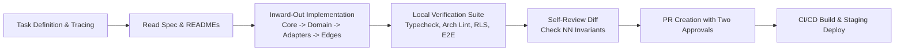
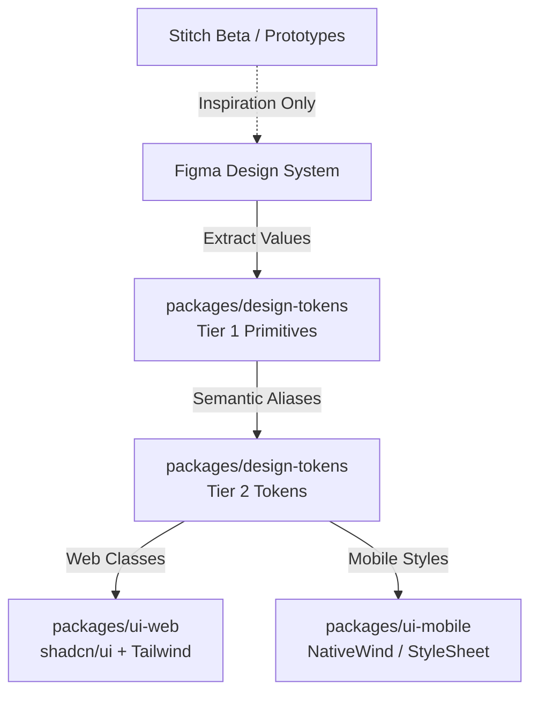
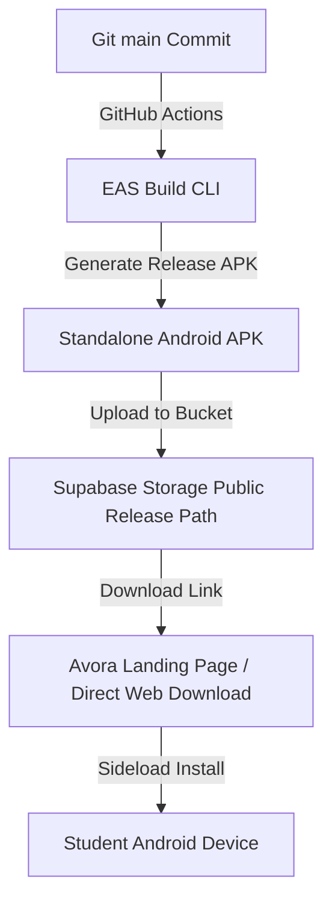
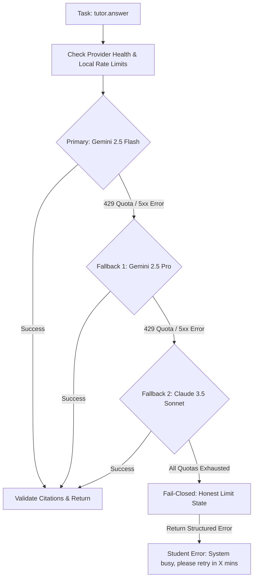

# Avora AI — Toolchain & AI Workflow Architecture

> **Document class:** Operational Specification & Toolchain Architecture<br />
> **Authority:** Below `AGENTS.md` and `docs/MASTER-ROADMAP.md`; references and implements governing specifications<br />
> **Status:** Authoritative<br />
> **Created:** 2026-08-24<br />
> **Target Release Model:** V0 (~20-tester Friends Beta via direct APK) → V1 (Department rollout via direct APK) → Campus Beta → Regional Public Launch

---

## 1. Purpose

This document defines the complete, authoritative toolchain for building, testing, deploying, monitoring, documenting, and operating Avora AI. It establishes:

1. **Tool Evaluation & Selection:** Clear classifications (`ADOPT`, `EVALUATE`, `OPTIONAL`, `FUTURE`, `REJECT`) for all candidate tools across Design, Development, Frontend, Backend, AI, Infrastructure, Observability, Analytics, Communication, Payments, Automation, Testing, and Knowledge.
2. **AI Responsibility Model:** Strict separation between Development AI (tools used by engineers to write, review, and plan code) and Runtime AI (models and gateways invoked inside the product).
3. **Runtime AI Provider Strategy:** A resilient, fail-closed, server-isolated provider architecture with rate limiting, cost control, and legitimate quota-fallback mechanisms that strictly adhere to vendor Terms of Service.
4. **Release-Specific Toolchains:** Tailored tooling footprints for V0 (direct website APK distribution to ~20 testers), V1 (department-level direct APK rollout), Campus Beta, and Regional Public Launch.
5. **Anti-Duplication & Minimal Footprint:** Eliminating overlapping tools to preserve architectural simplicity, reduce attack surface, and prevent unnecessary SaaS subscription overhead.

---

## 2. Toolchain Principles

1. **Development AI ≠ Runtime AI:** An AI assistant used to write or review code (e.g. Antigravity, Claude Code, Cursor) has zero authority in production and is never imported into application bundles (`ENG-210`, `SEC-560`–`563`).
2. **The Context is Owned, The Model is Rented:** All student context, academic trees, embeddings, and prompt assets remain strictly within Avora's Postgres and container worker planes. Vendor APIs are ephemeral stateless execution engines accessed solely through narrow adapters behind the AI Gateway (`AD-12`, `AD-14`, `architecture.md` §5.1).
3. **Single Store of Record:** Relational data, hierarchical academic graphs (`ltree`), vector embeddings (`pgvector`), and durable queue states reside in PostgreSQL under Row Level Security (`RLS`). External vector databases or parallel stores that fragment the deletion cascade are strictly prohibited (`AD-38`, `SEC-007`, `SEC-471`).
4. **One Job Per Tool:** Every adopted tool must have one clearly defined responsibility. Redundant services (e.g. Clerk alongside Supabase Auth, Pinecone alongside pgvector, Zapier alongside container workers) are rejected (`ENG-003`, `EP-10`).
5. **Direct Distribution First (V0/V1):** The Indian beachhead requires rapid, friction-free iteration. V0 and V1 distribute Android APKs directly from the Avora website, bypassing Play Store review friction until Campus Beta (`PRD.md` §27).
6. **No Phantom Free Tiers:** Free-tier API quotas are strictly bounded (e.g. Google AI Studio RPM/RPD limits). Systems must be designed for cost visibility, spend caps, and legitimate paid pay-as-you-go capacity rather than relying on brittle free-tier assumptions (`BM-01`, `BM-02`, `SEC-330`).
7. **Fail-Closed Security Posture:** If a security control, rate limit, quota, or citation check cannot be validated, the system fails closed and refuses execution (`NN-11`, `NN-12`, `SEC-073`).

---

## 3. Authoritative Source Hierarchy

When evaluating tools or making architectural adjustments, the authority hierarchy defined in `AGENTS.md` §2 applies:

```
1. docs/PRD.md (Product Truth)
2. docs/architecture.md (System Truth)
3. docs/ENGINEERING-RULES.md · docs/SECURITY.md (Engineering & Security Constraints)
4. docs/DESIGN-SYSTEM.md (Visual & Design Token Truth)
5. Sibling Specs (DATA-MODEL.md, AI-SPEC.md, PRIVACY.md, UX-FLOWS.md, ANALYTICS.md)
6. docs/MASTER-ROADMAP.md (Master Development Plan)
7. docs/AVORA-TOOLCHAIN.md (This File — Toolchain & AI Operations)
8. AGENTS.md · CLAUDE.md (Agent Operating Guidelines)
```

Where a proposed tool conflicts with an upstream document, **the upstream document wins**.

---

## 4. Complete Tool Inventory

The following candidate tools were evaluated across all functional domains:

| Category | Candidates Evaluated |
| :--- | :--- |
| **Design** | Figma, Stitch Beta (Google Labs), Claude Opus |
| **Development** | Cursor, Claude Code, GitHub, Antigravity |
| **Frontend** | Next.js (App Router), Tailwind CSS, shadcn/ui, Lucide Icons |
| **Backend & DB** | Supabase (PostgreSQL, Auth, Storage, Realtime), Clerk, Pinecone, Upstash |
| **AI (Dev & Runtime)** | Antigravity, ChatGPT, Claude (Anthropic), Claude Code, Gemini / Google AI Studio (`@google/genai`), Perplexity, Opal, Jules |
| **Infrastructure** | Vercel, Cloudflare, GoDaddy |
| **Monitoring & Logs** | PostHog, Sentry, Better Stack |
| **Analytics** | PostHog, Plausible Analytics |
| **Communication** | Resend, Intercom, Beehiiv |
| **Payments** | Stripe, Indian UPI PSP (Razorpay/Cashfree/PhonePe) |
| **Automation & Jobs** | Native Worker Plane (`apps/worker`), n8n, Zapier, Trigger.dev |
| **Testing** | Firebase Test Lab, TestFlight, Vitest/Node Test Runner |
| **Knowledge & Docs** | Claude Opus, GitHub, Obsidian, NotebookLM |
| **Tooling in Repo** | pnpm, Turborepo, TypeScript, ESLint, Prettier, syncpack, pgvector, ltree, KaTeX |

---

## 5. Adopt / Evaluate / Optional / Future / Reject Matrix

Every candidate tool has been assigned exactly one classification based on repository evidence, architecture rules, and current vendor capabilities:

| Tool | Category | Classification | Primary Rationale & Governing Citation |
| :--- | :--- | :--- | :--- |
| **Figma** | Design | `ADOPT` | Industry-standard UI component design & handoff; source for `DESIGN-SYSTEM.md`. |
| **Stitch Beta** | Design | `OPTIONAL` | Experimental Google Labs prompt-to-UI tool for rapid prototyping; non-authoritative. |
| **Claude Opus** | Design / Docs | `ADOPT` | Deep architectural reasoning, spec synthesis, design review, and complex documentation. |
| **Antigravity** | Development | `ADOPT` | Primary agentic coding harness and multi-agent repository orchestration (`AGENTS.md`). |
| **Claude Code** | Development | `ADOPT` | High-capability CLI-based implementation agent for terminal and deep codebase refactoring. |
| **Cursor** | Development | `OPTIONAL` | Interactive IDE for human pair-programming; secondary to repo agent harness. |
| **GitHub** | Development | `ADOPT` | Monorepo source control, PR reviews, branch protection, Actions CI/CD (`REPOSITORY.md`). |
| **Next.js (App Router)** | Frontend | `ADOPT` | Production web application and authenticated route handlers (`apps/web`, `AD-01`). |
| **Tailwind CSS** | Frontend | `ADOPT` | Utility-first CSS consumed via Tier 2 design tokens (`packages/design-tokens`). |
| **shadcn/ui** | Frontend | `ADOPT` | Accessible, copy-owned web primitive components (`packages/ui-web`). |
| **Lucide Icons** | Frontend | `ADOPT` | Lightweight, tree-shakeable icon set matching clean design tokens. |
| **Supabase (PostgreSQL)**| Backend | `ADOPT` | Core database with `pgvector`, `ltree`, Row Level Security, and JSONB (`AD-01`, `AD-08`). |
| **Supabase Auth** | Backend | `ADOPT` | Native auth engine integrated with Postgres RLS via `auth.uid()` (`AD-09`, `SEC-040`). |
| **Supabase Storage** | Backend | `ADOPT` | S3-compatible blob storage for quarantine and original academic files (`AD-26`). |
| **Clerk** | Backend | `REJECT` | Redundant with Supabase Auth; breaks single-session RLS context in Postgres. |
| **Pinecone** | Backend | `REJECT` | Redundant with `pgvector`; fragments deletion cascade and tenant RLS boundary (`SEC-007`). |
| **Upstash (Redis/QStash)**| Backend | `REJECT` | Redundant with PostgreSQL durable job queues (`public.*_jobs` tables). |
| **Gemini / Google AI Studio** | Runtime AI | `ADOPT` | Approved runtime provider (`@google/genai@2.18.0`) for vision OCR, embeddings, and tutor (`AD-14`). |
| **Claude (Anthropic API)** | Runtime AI | `EVALUATE` | Candidate secondary runtime fallback provider behind `TutorAnswerInvocationPort` (`AD-14`). |
| **ChatGPT (OpenAI API)** | Runtime AI | `EVALUATE` | Candidate tertiary runtime fallback provider behind `TutorAnswerInvocationPort` (`AD-14`). |
| **Perplexity** | Research | `OPTIONAL` | External web research tool for human engineers; strictly barred from runtime (`NN-02`). |
| **Jules** | Development | `EVALUATE` | Google Cloud asynchronous background coding agent; candidate for automated PRs. |
| **Opal** | Development | `REJECT` | No-code toy app builder from Google Labs; incompatible with strict monorepo architecture. |
| **Vercel** | Infrastructure | `ADOPT` | Zero-configuration Next.js edge and web deployment platform (`apps/web`, `AD-01`). |
| **Cloudflare** | Infrastructure | `ADOPT` | Edge DNS, CDN caching for static assets, DDoS mitigation, and WAF (`SEC-380`). |
| **GoDaddy** | Infrastructure | `REJECT` | Legacy registrar; domain registration should be managed via Cloudflare Registrar or Namecheap. |
| **Sentry** | Observability | `ADOPT` | Application error monitoring and crash reporting with strict content filtering (`NN-09`). |
| **Better Stack** | Observability | `OPTIONAL` | Uptime monitoring, external synthetic heartbeat checks, and public status page. |
| **PostHog** | Analytics | `ADOPT` | Product analytics, feature flags, and funnels using type-safe allowlisted schemas (`ENG-201`). |
| **Plausible Analytics** | Analytics | `REJECT` | Redundant with PostHog; lacks cohort funnel tracking and user activation analysis. |
| **Resend** | Communication | `ADOPT` | Transactional email provider for OTP codes and account receipts (`MailPort`, `ENG-183`). |
| **Intercom** | Communication | `REJECT` | Heavy bloated customer support widget; incompatible with low-end mobile target. |
| **Beehiiv** | Communication | `REJECT` | Newsletter marketing platform; outside application operational boundaries. |
| **Stripe** | Payments | `ADOPT` | Global payment processor behind `BillingPort` (`AD-31`). |
| **Indian UPI PSP** | Payments | `ADOPT` | Razorpay/Cashfree/PhonePe behind `PaymentCollectionPort` for Indian beachhead (`AD-31`, `AOQ-03`). |
| **Native Worker Plane** | Automation | `ADOPT` | Self-hosted container runtime (`apps/worker`) for async jobs, OCR, indexing (`AD-08`). |
| **Trigger.dev** | Automation | `EVALUATE` | Open-source background job framework; potential container runtime helper if needed. |
| **n8n / Zapier** | Automation | `REJECT` | External iPaaS workflow tools; violates security boundary and data cascade rules (`SEC-007`). |
| **Firebase Test Lab** | Testing | `ADOPT` | Automated matrix testing of Android APK on real physical low-end devices (`ENG-131`). |
| **TestFlight** | Testing | `FUTURE` | iOS beta distribution; deferred to V2/V3 (V0/V1 is Android APK direct download). |
| **Obsidian** | Knowledge | `OPTIONAL` | Local markdown tool for offline founder thinking and personal research notes. |
| **NotebookLM** | Knowledge | `OPTIONAL` | Analysis tool for understanding institutional engineering syllabi and curricula. |

---

## 6. AI Responsibility Matrix

To eliminate confusion between development tools and runtime infrastructure, AI systems are assigned strict, non-overlapping roles:

```
┌──────────────────────────────────────────────────────────────────────────────────┐
│                             DEVELOPMENT & PLANNING AI                            │
│                                                                                  │
│   Antigravity            Claude Code            Claude Opus        Cursor        │
│   - Multi-agent harness  - Deep CLI coding      - Architecture     - Interactive │
│   - Workspace governor   - Terminal refactors   - Spec drafting    - Pair editing│
│   - Verification checks  - Test implementation  - Security review                │
└────────────────────────────────────────┬─────────────────────────────────────────┘
                                         │ Produces verified, typed TypeScript code
                                         ▼
┌──────────────────────────────────────────────────────────────────────────────────┐
│                               AVORA RUNTIME AI                                   │
│                                                                                  │
│   AI Gateway (packages/ai/gateway/)                                              │
│   - 10-Stage Execution Pipeline (Budget -> Context -> Envelope -> Routing ...)  │
│                                                                                  │
│   Concrete Provider Adapters (Server/Worker Plane Only):                         │
│   - Primary: Google Gemini 2.5 Flash / Pro via @google/genai (AD-14)             │
│   - Evaluated Fallback 1: Anthropic Claude 3.5 Sonnet via OrchestrationPort      │
│   - Evaluated Fallback 2: OpenAI GPT-4o-mini via OrchestrationPort               │
└──────────────────────────────────────────────────────────────────────────────────┘
```

### Detailed Role Allocation
| AI Tool / Model | Primary Operational Role | Permitted Scope | Strictly Forbidden Scope |
| :--- | :--- | :--- | :--- |
| **Antigravity** | **Workspace Orchestrator & Multi-Agent Governor** | Project planning, multi-agent coordination, running full verification suites, enforcing `AGENTS.md`. | Directly serving end-user tutor requests in production. |
| **Claude Code** | **Deep Implementation & Refactoring Agent** | Writing domain services, writing complex tests, refactoring modules, CLI task execution. | Modifying protected paths without two approvals; adding unapproved packages. |
| **Claude Opus** | **Architecture, Security & Specification Reviewer** | Reviewing threat models, drafting constitutional specs, verifying RLS policies, evaluating design tokens. | Direct production runtime invocation without an approved gateway adapter. |
| **Cursor** | **Interactive IDE Assistant** | Fast inline code completions and interactive debugging during active developer sessions. | Autonomous multi-file commits without human oversight. |
| **Gemini (Google AI Studio)** | **Primary Avora Runtime AI Engine** | Multimodal OCR vision, chunk embeddings, grounded tutor generation via `@google/genai` in worker. | Client-side execution in `apps/web` or `apps/mobile`; bypassing AI Gateway. |
| **Perplexity** | **External Research Assistant** | Researching library documentation, official API pricing, and academic university syllabi. | Ingesting student academic content or private source code. |
| **Google Jules** | **Asynchronous Background Task Agent** | Handling automated GitHub maintenance tasks (lint fixes, dependency updates) in cloud VMs. | Committing directly to `main` without CI and human review. |
| **Google Opal** | **Rejected** | None. | Monorepo implementation or workflow automation. |

---

## 7. Development Workflow

The development lifecycle enforces strict local verification before any change enters Git history:



1. **Task Declaration:** Every task traces to a requirement identifier (`FR-###`, `AD-##`, `ENG-###`).
2. **Inward-Out Construction:**
   - Define contracts & brands in `@avora/core`.
   - Implement pure domain services in `packages/domain`.
   - Implement database repositories & RLS in `packages/db`.
   - Implement worker handlers & web routes in `apps/worker` and `apps/web`.
   - Implement mobile UI in `apps/mobile` using Tier 2 design tokens.
3. **Pre-Commit Verification:** Run the full 9-step baseline verification suite.
4. **Trunk-Based PRs:** Small PRs (~400 lines), squash merged to `main` with linear history (`ENG-320`–`327`).

---

## 8. Design Workflow



- **Tokens Source of Truth:** `packages/design-tokens` defines Tier 1 raw values and Tier 2 semantic tokens. Hardcoded hex colors, pixel margins, and raw font sizes are banned in UI components (`ENG-124`).
- **Web & Mobile Parity:** Primitives use `shadcn/ui` on web and native components on mobile, both consuming identical Tier 2 design token values.
- **Experimental Prototyping:** Tools like Stitch Beta can be used for rapid ideation, but generated code must be rewritten using Avora design tokens before entering the repository.

---

## 9. Research & Documentation Workflow

- **Curriculum & Syllabus Research:** Use Perplexity or NotebookLM to analyze Indian university curricula (VTU, JNTU, Anna Univ) for structure validation (`AD-41`).
- **Specification Authoring:** Written in markdown under `docs/`. Major architectural shifts require an Architectural Decision Record in `docs/adr/` (`ENG-335`).
- **Living Documentation:** Module READMEs are updated in the same pull request that modifies public module surfaces (`ENG-011`, `ENG-337`).

---

## 10. Testing Workflow

Avora implements a comprehensive, multi-layered automated testing pyramid (`ENGINEERING-RULES.md` §56.2):

```
       / \       E2E Critical Flows (e2e/flows/: academic, extraction, tutor)
      /   \      AI Quality & Grounding Gates (evals/suites/: eval:ai, eval:extraction)
     /     \     Database RLS Negative-Auth (packages/db/test:rls — 106+ cases)
    /       \    Contract & Integration Tests (packages/*/test:contract, test:integration)
   /_________\   Domain Unit Tests & State Machines (packages/*/test:unit)
```

- **RLS Harness:** Every student-scoped table must have a declarative `.rls-plan.json` asserting deny-by-default for cross-tenant reads, inserts, updates, and deletes (`ENG-175`, `SEC-080`).
- **Adaptivity Suite (`AD-41`):** Verifies that arbitrary 0-to-5 level academic hierarchies parse correctly without hardcoded level names (`NN-01`).
- **Evaluation Gate (`eval:ai`):** Asserts zero hallucinated citations on synthetic and real test corpora before build approval (`NN-11`, `SEC-301`).

---

## 11. Deployment Workflow (Release Model: Direct APK First)

### V0 & V1 Distribution Model (No Play Store)
For V0 (Friends Beta ~20 testers) and V1 (Department rollout), distribution is entirely direct:



- **Web App (`apps/web`):** Deployed to **Vercel** with edge routing and serverless API route handlers.
- **Worker Plane (`apps/worker`):** Built as an OCI container image (distroless base, digest pinned per `SEC-503`) and deployed to a container runtime (Cloud Run or Railway).
- **Database (`supabase`):** Schema migrations applied via Supabase CLI in CI (`ENG-178`).
- **Mobile Client (`apps/mobile`):** Built using Expo Application Services (EAS Build) into a signed, standalone Android APK. The APK is hosted on the web landing page for direct download, bypassing Google Play Store review delays.

---

## 12. Monitoring & Observability Workflow

- **Error Monitoring (Sentry):** Captures runtime exceptions in web, mobile, and worker. **Strict Redaction Rule (`NN-09`, `SEC-355`–`357`):** No student academic content, file names, or prompt texts may appear in Sentry breadcrumbs or exception payloads.
- **Product Analytics (PostHog):** Ingests structured, typed events defined in `docs/ANALYTICS.md`. Properties are allowlisted at the type level (`ENG-201`, `SEC-443`).
- **Infrastructure Health:** Four Golden Signals (Latency, Traffic, Errors, Saturation) instrumented on container worker queues and API routes (`ENG-263`).

---

## 13. Communication & Email Workflow

- **Transactional Engine:** **Resend** (via `MailPort` in `packages/domain/platform`).
- **Permitted Messages:** Single-use Email OTP authentication codes, passwordless sign-in links, and critical account deletion receipts.
- **Prohibited:** Bulk unsolicited marketing newsletters or promotional blast emails inside the transactional path.

---

## 14. Automation & Background Jobs Workflow

- **Architecture:** Zero external automation SaaS (no Zapier, no n8n). All background jobs run on the self-hosted container worker plane (`apps/worker`, `AD-08`).
- **Queue Engine:** PostgreSQL-backed durable job tables (`public.resource_ingestion_jobs`, `public.resource_extraction_jobs`, `public.resource_chunking_jobs`, `public.resource_indexing_jobs`, `public.resource_upload_ticket_jobs`).
- **Transactional Enqueue:** Jobs are committed in the same database transaction as the trigger event, preventing lost work (`ENG-154`, `ENG-191`).
- **Execution Lifecycle:** Worker claims jobs using `FOR UPDATE SKIP LOCKED`, maintains heartbeats, implements exponential backoff with jitter, and checkpoints multi-step jobs (`ENG-191`–`194`).

---

## 15. Payment Workflow

- **Architecture:** `BillingPort` and `PaymentCollectionPort` abstraction in `packages/domain/billing` (`AD-31`).
- **Providers:**
  - **Stripe:** International card payments and subscriptions.
  - **Indian UPI PSP (Razorpay / Cashfree / PhonePe):** Instant UPI QR and mandate collections for the Indian student market (`AOQ-03`).
- **Security:** Webhooks signature-verified before parsing; idempotent transaction recording; no raw payment credentials stored in Avora databases (`SEC-103`, `SEC-140`).

---

## 16. AI Runtime Provider Architecture

```
┌──────────────────────────────────────────────────────────────────────────────────┐
│                              AI GATEWAY PIPELINE                                 │
│   (packages/ai/gateway/)                                                         │
│                                                                                  │
│   1. Task Declaration (task: 'tutor.answer', task: 'resource.extract')           │
│   2. Budget & Entitlement Gate (cost limit checked before scheduling)            │
│   3. Deterministic Context Assembly (retrieval chunk ID collection)              │
│   4. Sealed Evidence Envelope (student text marked untrusted, zero authority)    │
│   5. Dynamic Model Routing Policy (versioned config with auto-fallback)          │
│   6. Provider Invocation (Worker/Server only via @google/genai)                  │
│   7. Output Contract Validation (schema, formatting, safety bounds)              │
│   8. Machine Citation Verification (asserts chunk locators; fail-closed)         │
│   9. Provenance Stamping (AI badge, model version, prompt version)               │
│   10. Cost & Token Telemetry (records actual cost against student ledger)        │
└──────────────────────────────────────────────────────────────────────────────────┘
```

### Provider Execution Rules
1. **Server/Worker Isolation:** All AI model invocations execute on the worker or server API tier. Provider SDKs are never bundled into client applications (`NN-02`, `ENG-215`, `SEC-250`).
2. **Task-Based Routing:** Callers declare task intents (e.g. `tutor.answer`, `resource.extract`), never raw model names (`ENG-211`).
3. **No Direct Model Calls:** No feature component or web handler may instantiate a model SDK directly (`ENG-210`).

---

## 17. API Key & Secret Management Strategy

1. **Environment Variable Tiers:** Defined in typed schemas in `packages/config/env/` (`AD-11`, `ENG-267`):
   - `client.env.ts`: Public variables prefixed with `NEXT_PUBLIC_` or `EXPO_PUBLIC_`. Zero secrets allowed (`SEC-231`).
   - `server.env.ts`: Web server secrets (Supabase anon keys, auth callback secrets).
   - `worker.env.ts`: Worker plane secrets (`SUPABASE_SERVICE_ROLE_KEY`, `GEMINI_API_KEY`).
2. **SEC-005 Invariant:** `SUPABASE_SERVICE_ROLE_KEY` is present *only* in worker runtimes and is verified absent from `apps/web` in CI.
3. **Secret Rotation:** Dual-key rotation windows supported for API keys and database credentials (`ENG-271`, `SEC-241`).

---

## 18. Legitimate Provider Quota & Fallback Strategy

To guarantee high availability without violating provider terms or resorting to unauthorized account-rotation tricks:



### Strict Compliance Invariants
- **No Free-Tier Account Cycling:** Avora will never scrape, rotate ephemeral API keys, or create automated throwaway accounts to bypass rate limits. All fallbacks operate across legitimate, pre-configured billing accounts (`SEC-006`, `SEC-340`).
- **Model Degradation Hierarchy:** Interactive tasks fall back across model tiers (Flash → Pro → Secondary Provider) before failing closed (`ENG-213`).
- **Honest User State:** When all quotas are exhausted, the API returns a structured HTTP 429 error explaining the load condition and providing an exact retry delay (`ENG-250`, `ENG-287`, `SEC-323`).

---

## 19. Rate Limiting & Abuse Prevention

1. **Client Identity Rate Limiting:** Enforced at the API route layer per authenticated `student_id` using sliding-window rate limiters (`ENG-286`, `SEC-390`).
2. **Cost-Based Limiting:** Separate from request counting; tracks total token spend per student per hour to prevent accidental amplification (`SEC-320`, `SEC-330`).
3. **Queue Shedding Order:** Under heavy load, background jobs shed in strict order: `Background (indexing) → Batch (summaries) → Deferred (classifications) → Interactive (tutor answer)`. Read paths are never shed (`ENG-197`, `SEC-392`).

---

## 20. Cost Control Strategy

| Service / Resource | Free Tier Limits | Paid Tier & Trigger | Spend Cap / Control Mechanism |
| :--- | :--- | :--- | :--- |
| **Google AI Studio (Gemini)** | 10 RPM / 500 RPD (Flash Free); 5 RPM / 25 RPD (Pro Free) | Pay-as-you-go billing on GCP Console | Provider spend budget alert set at $50/mo; per-task token bounds (`SEC-330`). |
| **Supabase** | 2 free projects, 500 MB database, 1 GB storage, 50k MAU | Pro Plan ($25/month) when DB > 500 MB | Strict table indexing (`student_id`), storage quarantine purging (`SEC-180`). |
| **Vercel** | Hobby tier (non-commercial only) | Pro Plan ($20/seat/month) for commercial beta | Bandwidth alerts and serverless execution timeout limits (15s). |
| **Cloudflare** | Free DNS, CDN, SSL, DDoS protection | Pro ($20/mo) if custom WAF rules needed | Cache headers on static derivatives and landing page assets (`SEC-213`). |
| **PostHog** | 1,000,000 events/month free | Pay-as-you-go above 1M events | Strict schema allowlist; no chat token streaming events (`ENG-201`). |
| **Sentry** | 5,000 errors/month free | Team Plan ($26/mo) if volume spikes | Error sampling in client; debug logs disabled in production (`ENG-259`). |
| **Resend** | 3,000 emails/month (100/day) free | Pro ($20/mo) for 50k emails/mo | Single-use OTP rate limiting per device and IP (`SEC-042`). |

---

## 21. Security & Data Protection Architecture

Avora enforces deep multi-layered security controls across all adopted tools:

1. **Tenant Isolation:** Every query asserts `student_id = auth.uid()` in database RLS. Negative-authorization test suites run in CI (`SEC-080`).
2. **Content Sanitization:** Extracted text is sanitized at chunk creation; active HTML, scripts, and macros are stripped before database persistence (`ENG-222`, `SEC-281`).
3. **Zero Content in Logs (`NN-09`):** Loggers and error reporters reject content-bearing types at compile time (`ENG-256`, `SEC-355`).
4. **Multi-Store Deletion Cascade:** Deleting a student account or resource triggers coordinated erasure across Postgres rows, Supabase storage files, and `pgvector` embeddings (`AD-38`, `SEC-007`, `SEC-471`).

---

## 22. V0 Toolchain (Friends Beta — ~20 Testers)

*Target: Minimal, robust, zero Play Store friction, standalone APK web download.*

- **Design:** Figma, `packages/design-tokens`.
- **Development AI:** Antigravity (Governor), Claude Code (Implementation), Claude Opus (Review).
- **Frontend / Client:** Next.js on Vercel (web), Expo on EAS Build (standalone Android APK).
- **Backend & Data:** Supabase Postgres (`pgvector`, `ltree`), Supabase Storage, Supabase Auth.
- **Worker Plane:** Container worker runtime (`apps/worker`) deployed to Cloud Run or Railway.
- **Runtime AI:** Google Gemini 2.5 Flash / Pro via `@google/genai` (Google AI Studio Pay-As-You-Go with $50 spend limit).
- **Observability & Analytics:** Sentry (Errors), PostHog (Product analytics).
- **Communication:** Resend (Email OTP).
- **Testing:** Local Vitest/Node test runners, `test:rls` harness, `eval:ai` suite.
- **Distribution:** Direct download of `Avora-Beta-v0.apk` from the Avora web landing page.

---

## 23. V1 Toolchain (Department Rollout)

*Target: Scaled campus testing, automated device validation, multi-subject syllabus coverage.*

- **Additions to V0:**
  - **Firebase Test Lab:** Automated testing of the standalone APK on physical low-end Android devices (Redmi, Samsung Galaxy A-series) to enforce `ENG-131`.
  - **Indian UPI PSP (Razorpay/Cashfree):** Test mode integration for early subscription access validation.
  - **Better Stack:** External synthetic health monitoring and status page.
- **Distribution:** Continued direct APK web download and over-the-air (OTA) updates via Expo Updates.

---

## 24. Campus Beta Toolchain (3–5 Partner Institutions)

- **Additions to V1:**
  - **Automated Exam Calendar Freeze (`AD-34`):** `.github/freeze-calendar.yml` active in release CI to block deployments during student exams.
  - **Cloudflare WAF:** Active rate limiting and bot management against scrapers (`SEC-380`).
  - **Live UPI Billing:** Active payment collection for paid student quotas (`AD-31`).

---

## 25. Regional Public Launch Toolchain (Production Readiness)

- **Additions to Campus Beta:**
  - **Google Play Store / Apple App Store:** Formal store submission and review pipelines (`release-mobile.yml`).
  - **Third-Party Pen Test Harness:** Verified remediation of independent security audit findings (`SEC-430`, `SEC-431`).
  - **24/7 PagerDuty / Sentry Alert Escalation:** On-call staffing for semester examination periods (`LR-06`).

---

## 26. Future-Stage Tool Candidates (V2 / V3 Horizons)

- **TestFlight:** iOS beta distribution (V2).
- **Voice Interaction Engine:** WebRTC / Live API streaming audio transcription (V2).
- **Enterprise LMS Connectors:** Canvas, Moodle, Blackboard LTI adapters (V3).

---

## 27. Tool Substitution Rules

If any adopted vendor degrades in service quality, changes licensing, or experiences pricing spikes, the following pre-approved substitutions apply:

| Current Tool | Pre-Approved Substitute | Migration Seam & Barrier |
| :--- | :--- | :--- |
| **Google Gemini API** | **Anthropic Claude 3.5 / OpenAI GPT-4o** | Zero code change outside `@avora/ai/adapters/` (`AD-14`, `AD-16`). |
| **Vercel** | **Cloudflare Pages / AWS Amplify** | Zero change outside Next.js build output configuration. |
| **Resend** | **Postmark / AWS SES** | Implements `MailPort` in `packages/domain/platform`. |
| **Sentry** | **Better Stack Logs / Datadog** | Implements `LoggerContract` and OpenTelemetry traces. |
| **Stripe** | **Razorpay / Cashfree** | Implements `BillingPort` in `packages/domain/billing`. |

---

## 28. What NOT to Introduce (Anti-Patterns & Exclusions)

The following tools and patterns are explicitly barred from the Avora codebase:

1. **No External SaaS Vector Databases (e.g. Pinecone, Weaviate):** Violates unified Postgres RLS and breaks single-store deletion cascades (`SEC-007`).
2. **No Third-Party Workflow iPaaS (e.g. Zapier, n8n):** Breaches data isolation; all jobs must run on the audited container worker plane (`AD-08`).
3. **No Redundant Auth Providers (e.g. Clerk, Auth0):** Breaks native Supabase Postgres RLS context (`auth.uid()`).
4. **No Client-Side AI SDKs:** Provider keys must never touch client runtimes (`NN-02`, `SEC-250`).
5. **No Password Authentication:** Prohibited by `AD-09` and `SEC-040`; OAuth and email OTP only.
6. **No Phantom Free-Tier Scripts:** Banned from using automated key rotation or throwaway accounts to bypass API limits.

---

## 29. Human Approval Requirements

An engineer or AI assistant must stop and request explicit human leadership approval before:
1. Adding any new package dependency to `package.json` (`ENG-404`).
2. Creating a new vendor adapter or modifying a Port in `packages/domain/*/ports/` (`ENG-026`).
3. Changing model routing weights or default provider selection (`SEC-342`).
4. Modifying Row Level Security policies in `supabase/policies/` (`ENG-331`).
5. Altering design tokens in `packages/design-tokens/` (`ENG-322`).

---

## 30. Open Decisions Register

The following toolchain decisions remain open and are tracked in the architecture register:

| ID | Open Decision | Owner | Context & Next Step |
| :--- | :--- | :--- | :--- |
| `AOQ-01` | **Antigravity Capability Surface:** Extent of Antigravity multi-agent orchestration vs. direct Gemini provider adapter. | CTO + Founders | Direct Gemini adapter is primary for V0; Antigravity adapter maintained in parity. |
| `AOQ-03` | **Indian UPI PSP Selection:** Razorpay vs. Cashfree vs. PhonePe. | Founders | Decision required during V1 before live Campus Beta billing. |
| `AOQ-04` | **Free-Tier Quota Ledger Unit:** Interactions vs. Tokens vs. Unified Compute Credits. | Product | Unit-agnostic ledger implemented in Stage 12; display unit decided prior to Beta. |
| `AOQ-05` | **Data Residency Topology:** India-only primary vs. cross-region disaster recovery backup. | Founders + Counsel | Primary in Supabase India (`SEC-480`); DR replication policy pending legal review. |

---

## 31. Recommended Final Stack Summary

```
================================================================================
AVORA AI AUTHORITATIVE STACK SUMMARY (V0 / V1 BASELINE)
================================================================================
Layer               Selected Tool / Technology        Governance Rule
--------------------------------------------------------------------------------
Monorepo Workspace  pnpm + Turborepo                  REPOSITORY.md §2
Primary Client      Expo / React Native (Android APK) AD-02
Web Client & API    Next.js (App Router) on Vercel   AD-01, ENG-150
Design Tokens       packages/design-tokens            DESIGN-SYSTEM.md §14
Web UI Components   shadcn/ui + Tailwind CSS          packages/ui-web
Database & Vectors  Supabase PostgreSQL + pgvector    AD-01, AD-19, AD-30
Auth Engine         Supabase Auth (OAuth + OTP)       AD-09, SEC-040
Object Storage      Supabase Storage (Quarantine/Org) AD-26, SEC-180
Worker Plane        Container Worker (apps/worker)    AD-08, ENG-191
Runtime AI Provider Google Gemini via @google/genai   AD-14, SEC-250
AI Gateway          packages/ai/gateway/              architecture.md §14.2
Error Monitoring    Sentry (Zero content logging)     NN-09, SEC-355
Product Analytics   PostHog (Typed allowlist schema)  ENG-201, SEC-443
Transactional Mail  Resend (Single-use OTP only)      packages/domain/platform
Development AI      Antigravity (Lead) + Claude Code  AGENTS.md
Distribution (V0/V1)Direct APK Web Download (No Play) PRD.md §27
================================================================================
```
