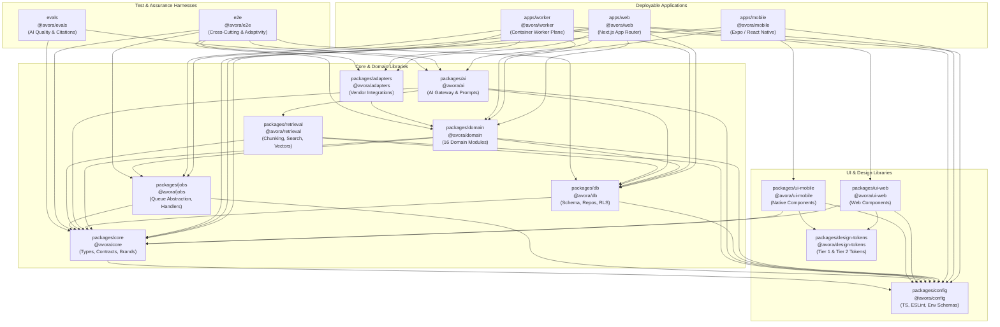

# Avora AI — Master Development Roadmap

> **Document class:** Roadmap — single authoritative development plan<br />
> **Owner:** Founding Product Manager + CTO<br />
> **Authority:** Below `AGENTS.md` (§2 hierarchy); references but never contradicts upstream documents<br />
> **Status:** Living document — updated at each Stage boundary<br />
> **Created:** 2026-08-23<br />
> **Last Audited & Hardened:** 2026-08-23<br />
> **Pre-Stage-12 Verified GREEN:** 2026-08-23

---

## 1. Product Purpose & Durable Commitments

Avora is an AI-powered Academic Operating System for students. It ingests everything a student is given, understands the structure of their specific programme, and uses AI to help them learn, plan, revise, and perform — grounded in their own materials, with verifiable citations, on the device they already carry.

> *"Bring us your semester. We will make sense of it."* — [`docs/PRD.md` §8](file:///d:/Projects/Avora/docs/PRD.md#L120)

### Beachhead Market
- **Target Audience:** Undergraduate engineering students in India (semesters 1–8), mobile-first, across affiliated universities (e.g. VTU, Anna University, JNTU, Mumbai University), autonomous colleges, and deemed universities.
- **Key Realities:** Heterogeneous curricula, non-standard terminology (Units, Modules, Chapters, Blocks), fragmented materials (handwritten notes, messy Xerox packets, mobile photos of whiteboards, uncurated slide decks, syllabi PDFs), low-end Android hardware dominance (4 GB RAM, flaky network / CGNAT).

### Four Durable Commitments ([`docs/PRD.md` §4](file:///d:/Projects/Avora/docs/PRD.md#L45))
1. **Adapt, never impose** — Conforms dynamically to the student's own academic hierarchy; never forces an artificial schema (`NN-01`, `AD-04`, `AD-05`).
2. **Ground everything** — AI responses anchored exclusively in student-provided materials with verifiable machine-resolved citations (`NN-02`, `NN-03`, `NN-11`, `AIR-001`, `AIR-006`).
3. **Reduce time-to-value to minutes** — Meaningful utility delivered in the very first session under 10 minutes (`FR-010`, `LR-01`).
4. **Earn trust permanently** — Strict privacy, uncompromised role-based tenant isolation, explicit provenance stamps, and zero data leakage (`NN-04`, `NN-09`, `SEC-005`, `SEC-007`).

**North Star Metric:** Weekly Active Studying Students (WASS) ([`docs/PRD.md` §26.1](file:///d:/Projects/Avora/docs/PRD.md#L1120)).

---

## 2. System Architecture & Boundaries

**Architectural Style:** Modular monolith with asynchronous container worker plane ([`docs/architecture.md` §5](file:///d:/Projects/Avora/docs/architecture.md#L65), `AD-01`, `AD-08`).

```
┌──────────────────────────────────────────────────────────────────────────────────┐
│                                 CLIENT PLANE                                     │
│   apps/mobile (Expo / React Native)            apps/web (Next.js App Router)     │
│   - Primary mobile client (AD-02)               - Web client & authenticated API  │
│   - Offline outbox & storage (AD-29)            - Route handlers (ENG-150)        │
└───────────────────────────────┬──────────────────────────────┬───────────────────┘
                                │ HTTPS / WSS                  │ HTTPS (User Auth)
                                ▼                              ▼
┌──────────────────────────────────────────────────────────────────────────────────┐
│                                 DATA PLANE                                       │
│   Supabase Postgres (pgvector, ltree)           Supabase Storage (Quarantine/Org)│
│   - Row Level Security on all tables (ENG-172)  - Pre-signed ticket uploads      │
│   - Authenticated student role access           - Isolated bucket namespaces      │
└───────────────────────────────▲──────────────────────────────▲───────────────────┘
                                │ Service-Role Key (SEC-005)   │ Signed URLs Only
                                │ (Confined to Worker Plane)   │
┌───────────────────────────────┴──────────────────────────────┴───────────────────┐
│                                WORKER PLANE                                      │
│   apps/worker (Container Worker Runtime)                                         │
│   - Durable job claim loop & heartbeat (ENG-191)                                 │
│   - Resource Ingestion & OCR/Vision Extraction (AD-20, AD-21)                    │
│   - Structure-aware Chunking & Embedding Indexing (AD-19, AD-30)                 │
│   - AI Gateway & Provider Invocation (@google/genai pinned) (AD-12, AD-14)       │
└──────────────────────────────────────────────────────────────────────────────────┘
```

**Controlling Philosophy:** *"The model is rented. The context is owned."* ([`docs/architecture.md` §5.1](file:///d:/Projects/Avora/docs/architecture.md#L75))

### 16 Bounded Domain Modules ([`docs/architecture.md` §5.3](file:///d:/Projects/Avora/docs/architecture.md#L110), `ENG-015`)
1. `identity` — Student authentication, profiles, device sessions (`AuthPort`)
2. `academic` — Terms, subjects, recursive structure units, paths (`ltree`)
3. `resources` — Raw uploads, lifecycle state, mime/hash validation (`BlobStorePort`)
4. `knowledge` — Structured extraction blocks, OCR pages, provenance (`ResourceExtractionPort`)
5. `tutor` — AI conversation orchestration, multi-turn dialogue, citations (`TutorAnswerInvocationPort`)
6. `notes` — Structured study notes, user revisions, summary associations
7. `recall` — Flashcards, Leitner/FSRS spaced repetition scheduling (`SchedulerPort`)
8. `assessment` — Generated quizzes, deterministic multiple-choice grading
9. `mastery` — Topic-level understanding progress calculations
10. `planning` — Study session scheduling, exam countdowns
11. `insights` — Aggregated study analytics, streak tracking
12. `sharing` — Capability-based resource/note share grants (`SharePort`)
13. `billing` — Subscription status, quotas, UPI/Stripe integration (`BillingPort`)
14. `ai` — Central AI Gateway, task budgeting, routing, output validation
15. `jobs` — Durable queue abstractions, state machines, dispatchers (`QueuePort`)
16. `platform` — Cross-cutting notifications, real-time push, mail (`RealtimePort`, `MailPort`)

---

## 3. Evidence Classification Key

To maintain strict truth across this document, every status assertion is classified according to the following 8-tier evidence key:

| Classification | Definition & Criteria |
| :--- | :--- |
| `VERIFIED COMPLETE` | Code is written, tested, passing all mandatory CI verification gates, and confirmed by independent repository audit. |
| `IMPLEMENTED` | Code exists in the repository but has not yet completed all end-to-end integration/eval closure gates. |
| `IN PROGRESS` | Work is actively underway; contracts/scaffolding exist, but implementation is incomplete. |
| `PLANNED` | Fully specified in PRD/Architecture/Engineering docs with clear boundaries, but no production code written yet. |
| `DEFERRED` | Formally designated for a future release horizon (V1, V2, or V3) and deliberately excluded from V0. |
| `INTENTIONAL FUTURE WORK` | Documented long-term capability with no assigned implementation milestone. |
| `TECHNICAL DEBT` | Identified gap or non-blocking deviation with a documented owner and tracking issue. |
| `UNKNOWN` | Repository evidence is insufficient to verify state; requires explicit investigation before proceeding. |

---

## 4. Complete Stage History — Stages 1 through 11

### Stage 1: Repository Foundation & Workspace Setup
- **Objective:** Establish monorepo governance, build orchestration, compiler strictness, and architectural linting rules.
- **Groups:** Group 1 (Repo structure, pnpm workspace, `turbo.json`, root configs), Group 2 (`packages/config` ESLint rules, Prettier, TSConfig baselines).
- **Status:** `VERIFIED COMPLETE`
- **Evidence:** `package.json`, `pnpm-workspace.yaml`, `turbo.json`, `packages/config/README.md`.
- **Architectural & Security Decisions:** Monorepo closed to 8 top-level folders (`REPO-002`). `utils/`, `helpers/`, `shared/`, `lib/` strictly prohibited (`ENG-017`). Strict TS flags enabled with zero `any` (`ENG-050`, `ENG-051`).
- **Tests & Gates:** `lint:arch` baseline operational.

### Stage 2: Core Domain Types & Contract Primitives
- **Objective:** Create the single source of truth for pure domain types, branded identifiers, result types, and contract helpers.
- **Groups:** Group 1 (`@avora/core` domain types, error structures, brand constructors, query keys, time/text primitives).
- **Status:** `VERIFIED COMPLETE`
- **Evidence:** `packages/core/README.md` L11, `packages/core/domain-types/`.
- **Architectural & Security Decisions:** Branded types for all entity IDs (`StudentId`, `ResourceId`, `ChunkId`) (`ENG-054`). Result types for expected failures (`ENG-056`). Zero repository dependencies for `@avora/core` except `@avora/config` (`ENG-013`).

### Stage 3: Domain Package & Module Entry Points
- **Objective:** Establish the 16 domain modules with strict folder topologies and public API boundaries.
- **Groups:** Group 1 (`packages/domain` module structure, closed folder topologies, domain service seams).
- **Status:** `VERIFIED COMPLETE`
- **Evidence:** `packages/domain/README.md` L11, `packages/domain/*/README.md`.
- **Architectural & Security Decisions:** Closed module directory topology (`contracts/`, `services/`, `repositories/`, `events/`, `jobs/`, `policies/`, `ports/`, `__tests__/`) (`ENG-016`). Cross-module direct table queries prohibited (`ENG-024`).

### Stage 4: Infrastructure Foundation & Baseline Security Gates
- **Objective:** Scaffold background job processing, retrieval interfaces, structural adaptivity test harness, and citation validity evaluators.
- **Groups:** Group 5 (`@avora/jobs` queue contracts, `@avora/retrieval` package shell), Group 6 (Always-on `AD-41` structural adaptivity harness in `e2e/adaptivity/`, fail-closed citation validity gate in `evals/`).
- **Status:** `VERIFIED COMPLETE`
- **Evidence:** `packages/jobs/README.md` L11, `packages/retrieval/README.md` L13, `e2e/README.md` L14, `evals/README.md` L13.
- **Tests & Gates:** `pnpm --filter e2e run test:adaptivity` (3 cases pass), `pnpm --filter evals run eval:ai` (9 cases pass).

### Stage 5: Design System & Application Shells
- **Objective:** Establish design token architecture, web/mobile UI component boundaries, and first runnable app shells.
- **Groups:** Group 2 (`@avora/design-tokens` Tier 1 raw primitives & Tier 2 semantic tokens, `@avora/ui-web`, `@avora/ui-mobile`), Group 3 (`apps/web` Next.js runnable shell), Group 4 (`apps/mobile` Expo runnable shell).
- **Status:** `VERIFIED COMPLETE`
- **Evidence:** `packages/design-tokens/README.md`, `packages/ui-web/README.md`, `packages/ui-mobile/README.md`, `apps/web/README.md` L14, `apps/mobile/README.md` L14.
- **Architectural & Security Decisions:** Two-tier token hierarchy (`tier-1` raw values, `tier-2` semantic aliases) (`ENG-124`). Web and mobile UI libraries strictly isolated from backend and database packages (`ENG-014`).

### Stage 6: Student Identity & Session Persistence
- **Objective:** Implement student record lifecycle, Supabase Auth synchronization, and authenticated web route handlers.
- **Groups:** Group 1–5 (Student identity schema, auth trigger, DB repository), Group 6 (Web auth route handlers: OAuth start, magic link, callback, signout).
- **Status:** `VERIFIED COMPLETE`
- **Evidence:** Migration `20260804234500_identity_students.sql`, migration `20260805191000_identity_auth_user_trigger.sql`, `packages/db/README.md` L11, `apps/web/README.md` L16.
- **Architectural & Security Decisions:** Identity bound to durable `students` table (`SEC-060`). Identity derived strictly from verified session token; client-supplied identity parameters rejected (`ENG-162`, `SEC-004`).

### Stage 7: Resource Intake & Worker Ingestion Pipeline
- **Objective:** Provide secure resource upload contracts, pre-signed upload tickets, durable ingestion queueing, worker claim loop, and byte validation.
- **Groups:** Group 2 (Supabase Storage adapter), Group 4 (Resources DB repo), Group 5 (Upload API contracts), Group 6 (Web upload routes `/api/resources/uploads`), Group 7 (Ingestion job handoff), Group 8 (`resource_ingestion_jobs` persistence), Group 9 (Worker queue claim loop & heartbeat), Group 10 (Worker ingestion validator), Group 11 (Resource ingestion E2E flow plan & RLS closure).
- **Status:** `VERIFIED COMPLETE`
- **Evidence:** Migrations `20260805223000_resources_upload_intent.sql`, `20260806164100_resource_ingestion_jobs.sql`, `apps/worker/README.md` L14–16, `packages/db/README.md` L86–95.
- **Tests & Gates:** 13 RLS test plans (106 cases) passing. `SEC-005` verified: service-role key restricted to worker plane.

### Stage 8: Academic Structure Graph
- **Objective:** Implement the recursive, label-agnostic academic graph (Terms → Subjects → Structure Units) with `ltree` path indexing.
- **Groups:** Group 1 (Academic contracts), Group 2 (Schema: `academic_terms`, `subjects`, `structure_units`), Group 3 (Academic DB repositories), Group 4 (Adaptive academic setup domain service), Group 5 (API contracts in `@avora/core`), Group 6 (Authenticated routes `/api/academic/*`), Group 7 (Academic setup E2E flow plan & RLS closure).
- **Status:** `VERIFIED COMPLETE`
- **Evidence:** Migration `20260807083100_academic_structure.sql`, `packages/domain/README.md` L61–85, `packages/db/README.md` L96–136, `apps/web/README.md` L149–167.
- **Architectural & Security Decisions:** Structural adaptivity invariant (`NN-01`, `AD-04`, `AD-05`): zero hardcoded hierarchy names in schema, columns, code, or prompts.

### Stage 9: Resource Extraction Pipeline
- **Objective:** Build domain contracts, extraction schema, job handoff, and worker handling for extracting structured content blocks from files.
- **Groups:** Group 1 (Extraction domain contracts), Group 2 (Schema: `resource_extraction_documents`, `resource_extracted_content_blocks`), Group 3 (Extraction DB repo), Group 4 (Extraction application service), Group 5 (Job handoff `resource.extraction.extract`), Group 6 (Worker extraction handler), Group 7 (Extraction completion harness & RLS verification).
- **Status:** `VERIFIED COMPLETE`
- **Evidence:** Migration `20260807122600_resource_extraction_documents.sql`, `docs/stage-9-resource-extraction-completion.md`, `packages/domain/README.md` L86–109, `apps/worker/README.md` L79–92.

**Contemporaneous Completion Groups (Stage 9/10 boundary):**
- **Completion Group B:** Resource placement persistence (`resource_placements`, `resource_placement_corrections`, `resource_placement_candidates` via migrations `20260814124500`, `20260814131500`, `20260805223100`). Status: `VERIFIED COMPLETE`.
- **Completion Group C:** Resource classification job handoff (`ResourceClassificationJobEnvelope`, `ResourceClassificationQueuePort`). Status: `VERIFIED COMPLETE`.

### Stage 10: Retrieval Foundations & Extraction Hardening
- **Objective:** Scaffold retrieval chunk schemas, extend extraction failure/provenance tracking, establish extraction quality eval suite, and wire deterministic E2E harness.
- **Groups:** Group 1 (Retrieval chunk contracts), Group 2 (Schema: `chunks` and extraction schema extensions `resource_extraction_pages`, `failures`, `provenance`), Group 3 (Chunk repositories & extraction adapter port seam), Group 4 (Extraction document checkpointing & transactional enqueue), Group 5 (Extraction quality eval suite `eval:extraction`), Group 6 (Processing status API `/api/resources/:id/status`), Group 7 (Deterministic E2E extraction test harness).
- **Status:** `VERIFIED COMPLETE`
- **Evidence:** Migrations `20260811172000_retrieval_chunks.sql`, `20260815093500`, `20260816071000`, `20260817000000`, `20260817120000`, `evals/README.md` L57, `e2e/flows/resource-extraction/README.md`.
- **Tests & Gates:** `pnpm --filter e2e run test:resource-extraction` (3 cases pass).

### Stage 11: AI Tutor Pipeline (Retrieval → Chunking → Indexing → Grounding → Tutor Gateway)
- **Objective:** Build the end-to-end structure-aware chunking pipeline, embedding indexing job dispatcher, scoped retrieval search contracts, AI Gateway tutor contracts, and tutor grounding verification harness.
- **Groups:** Group 2 (Chunking & indexing job schemas with transactional enqueue functions), Group 3 (Structure-aware deterministic chunking pipeline & worker composition), Group 4 (Resource indexing handler & embedding adapter seam), Group 5 (Scoped retrieval search with strict pre-filtering `AD-19`), Group 6 (AI Gateway tutor contracts & shared domain types), Group 7 (Tutor provider orchestration adapter boundary), Group 8 (Tutor API contracts & web route boundary `/api/tutor`), Group 9 (Tutor grounding & citation E2E flow plan).
- **Status:** `VERIFIED COMPLETE`
- **Evidence:** Migrations `20260818090000` through `20260818120000`, `packages/retrieval/README.md` L92–160, `packages/ai/README.md` L92–130, `apps/worker/README.md` L102–129, `e2e/flows/tutor-grounding/README.md`.
- **Tests & Gates:** `pnpm --filter e2e run test:tutor-grounding` (5 cases pass), `pnpm --filter @avora/ai run test:contract` (passes).

### Cross-Cutting: Resource Upload Ticket Isolation (Stage 11 / Pre-Stage-12)
- **Objective:** Guarantee that signed upload URLs are generated exclusively by the worker plane, maintaining zero service-role exposure in web.
- **Status:** `VERIFIED COMPLETE`
- **Evidence:** Migrations `20260819090000_resource_upload_ticket_jobs.sql`, `20260823090000_resource_upload_ticket_jobs_idempotency.sql`, `apps/worker/src/resource-upload-ticket/ResourceUploadTicketWorker.ts`.

---

## 5. Current Baseline: Pre-Stage-12 Verified GREEN State

**Baseline Status:** `GREEN` (Independently audited and verified on 2026-08-23).

```
================================================================================
PRE-STAGE-12 VERIFIED BASELINE SUMMARY
================================================================================
Repository Task / Test Suite                     Result        Status
--------------------------------------------------------------------------------
1. TypeScript Compilation (turbo run typecheck)  27/27 passed  VERIFIED GREEN
2. Architecture Lint (turbo run lint:arch)       16/16 passed  VERIFIED GREEN (0 errors)
3. Full Workspace Lint (turbo run lint)          16/16 passed  VERIFIED GREEN (0 errors)
4. Database RLS Harness (@avora/db test:rls)     13 plans/106  VERIFIED GREEN (100% pass)
5. AI Gateway Contracts (@avora/ai test:contract)Passed        VERIFIED GREEN
6. Tutor Grounding E2E (e2e test:tutor-grounding)5/5 passed    VERIFIED GREEN
7. Structural Adaptivity E2E (e2e test:adaptivity)3/3 passed   VERIFIED GREEN
8. Resource Extraction E2E (e2e test:resource-ex)3/3 passed    VERIFIED GREEN
9. AI Quality Evals (evals eval:ai)              9/9 passed    VERIFIED GREEN
10. Unit/Contract/Integration (turbo run test:*) 12/12 passed  VERIFIED GREEN
11. Git Whitespace Integrity (git diff --check)  0 errors      VERIFIED GREEN
12. SEC-005 Service Role Key Isolation Audit     0 leaks       VERIFIED GREEN
================================================================================
```

### Pre-Stage-12 Binding Approvals & Decisions
1. **Design Tokens (`containerSm`, `containerMd`):** Added `560px` and `760px` to Tier 1 and Tier 2 semantic layout tokens to eliminate raw literals (`packages/design-tokens/tier-1/index.ts` L44–45, `tier-2/index.ts` L51–52).
2. **Worker Process Lifecycle Console Logging:** Scoped ESLint override in `packages/config/eslint/base.js` exclusively for `apps/worker/src/main.ts` and `apps/worker/src/runtime/shutdown.ts`.
3. **`@google/genai@2.18.0` SDK Approval:** Formally approved by owner for server/worker-side provider adapter implementation (`packages/ai/README.md` L199–205).
4. **Upload Ticket Idempotency:** Added unique partial index via `20260823090000_resource_upload_ticket_jobs_idempotency.sql` enforcing single in-flight job per resource (`ENG-139`, `ENG-157`).

---

## 6. Detailed Stage 12 Specification (V0 Completion)

Stage 12 connects the implemented, tested infrastructure into fully operational end-to-end product experiences for V0.

```
STAGE 12 EXECUTION FLOW & GROUP DEPENDENCY TOPOLOGY:

[Group 1: Extraction Adapters] ──▶ [Group 2: Embedding & Vector Index] ──▶ [Group 3: Hybrid Retrieval]
                                                                                     │
                                                                                     ▼
[Group 6: Auto-Classification] ◀── [Group 2: Embedding] ◀─────────────── [Group 4: AI Gateway Invocation]
                                                                                     │
                                                                                     ▼
[Group 8: Mobile Auth & Screens] ──────────────────────────────────────▶ [Group 5: Tutor Streaming API]
             │                                                                       │
             ▼                                                                       ▼
[Group 9: Mobile Upload & Camera] ─────────────────────────────────────▶ [Group 10: Mobile Tutor UI]
                                                                                     │
                                                                                     ▼
[Group 11: Deletion Cascade] ◀────────────────────────────────────────── [Group 7: Resource Summaries]
             │
             ▼
[Group 12: Stage 12 RLS Closure] ──▶ [Group 13: Stage 12 Full E2E & Eval Gate Closure]
```

---

### Group 1: Concrete Resource Extraction Adapters
- **Objective:** Implement concrete `ResourceExtractionPort` adapters for digital PDF parsing, classical OCR, and multimodal vision extraction.
- **Required Deliverables:**
  1. PDF text/structure extraction adapter (`@avora/adapters/extraction/pdf`).
  2. OCR/Vision adapter via `@google/genai` vision for handwritten notes and Xerox scans (`@avora/adapters/extraction/vision`).
  3. Sanitization of extracted text blocks at chunk creation time (`ENG-222`, `SEC-281`).
- **Owning Packages:** `@avora/adapters`, `@avora/domain` (`resources`), `@avora/worker`.
- **Dependencies:** Stage 9 Group 1 (Contracts), Stage 10 Group 3 (Adapter seam), Stage 11 Group 3 (Chunker).
- **Protected Paths:** `packages/config/**`, `packages/ai/prompts/**`.
- **Security & RLS:** Worker runs sandboxed parsers with bounded memory and execution time (`ENG-282`, `SEC-183`). Original file immutable (`NN-05`).
- **Required Tests:** Unit tests for extractors; `eval:extraction` suite passing on benchmark corpus.
- **Acceptance Criteria:** Digital PDFs extract with 99%+ text fidelity; scans extract with structured headings, locators, and bounding page numbers.
- **Explicit Non-Goals:** Audio/video transcription (deferred to V3).

---

### Group 2: Embedding Generation & Vector Indexing
- **Objective:** Implement concrete `EmbeddingPort` adapter to generate dense vector embeddings for chunks and populate the Postgres `pgvector` HNSW index.
- **Required Deliverables:**
  1. Concrete Gemini embedding client (`packages/ai/adapters/google/`, per `architecture.md` section 47.1 / line 1881: "There are exactly two adapter directories: `packages/ai/adapters/` for model, embedding and orchestration providers, and `packages/adapters/` for every other external vendor." `packages/adapters/embeddings/` is correctly documentation-only — a concrete provider adapter there would fail CI, ENG-018.) — **correction, 2026-08-24:** this bullet originally read `@avora/adapters/embeddings/gemini`, which conflicts with the architecture and was never implemented at that path.
  2. Indexing worker execution handler updating `public.chunk_embeddings` (`vector(1536)`, HNSW-indexed). — **correction, 2026-08-24:** this bullet originally read `public.chunks.embedding` (`vector(768)` / `vector(1536)`), which conflicts with `architecture.md` lines 286, 584, 596, 1881 (a dedicated, independently-versioned `chunk_embeddings` table, distinct from `chunks`) and with `packages/db/repositories/resource-indexing-jobs/README.md`'s pre-existing "Embedding provider calls, embedding persistence (`chunk_embeddings`)..." note. Architecture.md is higher authority than this roadmap (CLAUDE.md section "Document | Authority"); the roadmap wording was stale, not the implementation. 1536, not 768, was selected — see the Stage 12 Group 2 owner decision below.
  3. Content-addressed embedding cache to prevent duplicate inference cost (`AD-30`, `ENG-238`, `SEC-322`).
- **Owning Packages:** `@avora/adapters`, `@avora/retrieval`, `@avora/worker`, `@avora/db`.
- **Dependencies:** Stage 11 Group 4 (Indexing handler), `@google/genai` approval.
- **Security & RLS:** Vectors stored with non-null `student_id`; vector search pre-filtered before distance calculation (`ENG-171`, `SEC-290`).
- **Required Tests:** Integration tests verifying chunk embedding storage and similarity indexing.
- **Acceptance Criteria:** `resource_indexing_jobs` complete successfully; chunks gain valid embeddings; search returns nearest neighbors.
- **Explicit Non-Goals:** Cross-student shared vector index (prohibited by `NN-04`).

---

### Group 3: Hybrid Retrieval Search Implementation
- **Objective:** Implement `RetrievalSearchPort` combining dense vector ANN search with full-text keyword search (`pg_trgm` / `tsvector`).
- **Required Deliverables:**
  1. Hybrid retrieval search service in `@avora/retrieval`.
  2. Explicit SQL query enforcing `student_id = auth.uid()` and scope filters before vector ranking (`ENG-171`, `SEC-290`).
  3. Retrieval insufficiency threshold evaluator returning `RetrievalInsufficiency` error contract (`ENG-226`, `SEC-292`).
- **Owning Packages:** `@avora/retrieval`, `@avora/db`.
- **Dependencies:** Group 2 (Embeddings populated), Stage 11 Group 5 (Scoped retrieval contracts).
- **Security & RLS:** Deny-by-default on empty scope or cross-student scope resolution (`SEC-290`, `SEC-291`).
- **Required Tests:** Unit and contract tests for hybrid ranking and insufficiency cutoff.
- **Acceptance Criteria:** Query over indexed corpus returns top-k chunks with precise locators; empty/unrelated query returns explicit insufficiency.
- **Explicit Non-Goals:** Web search or external retrieval fallback (`NN-02`, `ENG-227`).

---

### Group 4: AI Gateway Tutor Answer Invocation
- **Objective:** Implement concrete `TutorAnswerInvocationPort` adapter and wire the complete 10-stage AI Gateway pipeline.
- **Required Deliverables:**
  1. Concrete Gemini tutor answer client in `@avora/ai/adapters/google/`.
  2. Complete 10-stage execution pipeline: Task declaration → Budget gate → Context assembly → Sealed evidence envelope → Model routing → Provider invocation → Output validation → Machine citation verification → Provenance stamping → Cost telemetry (`architecture.md` §14.2).
  3. Fail-closed citation validator blocking unverified citations (`AIR-006`, `ENG-229`, `ENG-230`, `SEC-301`).
- **Owning Packages:** `@avora/ai`, `@avora/adapters`, `@avora/worker`.
- **Dependencies:** Group 3 (Hybrid retrieval), Stage 11 Groups 6–7 (Tutor contracts & boundary).
- **Protected Paths:** `packages/ai/prompts/**`, `packages/ai/gateway/routing/**`, `packages/ai/gateway/envelope/**`.
- **Security & RLS:** Student evidence placed in sealed envelope with zero authority (`NN-03`, `SEC-280`). Provenance stamped (`NN-07`, `ENG-166`, `SEC-312`).
- **Required Tests:** `evals/suites/citation-validity` (zero fabricated citations), `test:tutor-grounding`.
- **Acceptance Criteria:** Tutor answers grounded strictly in retrieved chunks; every citation resolves to exact chunk ID and page locator; missing evidence triggers structured insufficiency.
- **Explicit Non-Goals:** Autonomous agent tool execution / code execution (prohibited by `SEC-280`, `SEC-350`).

---

### Group 5: Tutor Streaming API & Web Route Integration
- **Objective:** Implement streaming HTTP responses (Server-Sent Events) from the web tutor route `/api/tutor` to clients.
- **Required Deliverables:**
  1. Web route handler streaming SSE responses conforming to `askTutorContract` (`apps/web/app/api/tutor/route.ts`).
  2. Edge token streaming pipeline respecting time-to-first-token SLO (< 1.5s) (`AD-03`, `NFR-003`, `ENG-294`).
  3. Client-side stream consumer in web UI (`packages/ui-web`).
- **Owning Packages:** `apps/web`, `@avora/ai`, `@avora/ui-web`.
- **Dependencies:** Group 4 (AI Gateway operational).
- **Security & RLS:** Stream verifies session student identity before opening; citation verification runs on completed stream buffer before marking final (`SEC-300`).
- **Required Tests:** Contract tests for SSE framing; latency benchmark tests.
- **Acceptance Criteria:** First token rendered under 1500 ms; stream delivers incremental tokens, final citation chips, and provenance badge.
- **Explicit Non-Goals:** Client-side direct provider connection (prohibited by `NN-02`, `ENG-215`, `SEC-250`).

---

### Group 6: Resource Auto-Classification
- **Objective:** Implement automated classification of uploaded documents to Subjects and Structure Units.
- **Required Deliverables:**
  1. Worker-side classification job handler consuming `ResourceClassificationJobEnvelope`.
  2. Classification service matching document content/headings to student's academic graph (`FR-038`, `AD-22`).
  3. Single-action candidate acceptance/correction API endpoint (`FR-039`).
- **Owning Packages:** `@avora/domain` (`academic`, `resources`), `apps/worker`, `apps/web`.
- **Dependencies:** Group 2 (Embeddings), Stage 8 (Academic structure), Completion Group C (Classification job queue).
- **Security & RLS:** Placement suggestions restricted to student's own academic tree (`NN-04`).
- **Required Tests:** E2E flow `flows/resource-placement/` passing; classification accuracy eval > 85%.
- **Acceptance Criteria:** Uploaded syllabus or chapter notes automatically placed in correct unit; student can confirm or correct in 1 click.
- **Explicit Non-Goals:** Automated structural mutation without student consent.

---

### Group 7: Resource Summary Generation
- **Objective:** Automatically generate structured summaries for ingested resources.
- **Required Deliverables:**
  1. Task declaration `resource.summary` in AI Gateway.
  2. Worker summary generation job handler.
  3. Summary UI card in `@avora/ui-web` and `@avora/ui-mobile` with `AIGeneratedBadge` (`NN-07`).
- **Owning Packages:** `@avora/ai`, `@avora/domain` (`notes`), `apps/worker`.
- **Dependencies:** Group 4 (AI Gateway operational).
- **Security & RLS:** Summary permanently linked to source resource; inherits source deletion lifecycle (`SEC-007`).
- **Required Tests:** Summary contract validation tests; prompt eval gate.
- **Acceptance Criteria:** Ingested resource produces concise, structured summary highlighting key concepts, formulas, and definitions.
- **Explicit Non-Goals:** Speculative cross-document synthesis (deferred to V1).

---

### Group 8: Mobile Authentication & Academic Onboarding
- **Objective:** Implement mobile authentication screens and the first-session academic onboarding experience in Expo.
- **Required Deliverables:**
  1. Mobile authentication flow: Google OAuth, Apple Sign-In, and Email OTP (`apps/mobile`, `@avora/ui-mobile`).
  2. Secure token storage using iOS Keychain / Android Keystore (`ENG-134`, `SEC-124`).
  3. Academic onboarding wizard: university/college selection, branch, term setup, subject declaration, and structure setup (`FR-010`–`017`).
- **Owning Packages:** `apps/mobile`, `@avora/ui-mobile`, `@avora/domain` (`identity`, `academic`).
- **Dependencies:** Stage 5 Group 4 (Mobile shell), Stage 6 (Auth), Stage 8 (Academic API).
- **Security & RLS:** Zero secrets stored in unencrypted mobile storage (`SEC-124`, `SEC-125`).
- **Required Tests:** Mobile component tests; device matrix validation on Android (`ENG-131`).
- **Acceptance Criteria:** Student completes sign-in and full semester structure setup in < 3 minutes on low-end Android device.
- **Explicit Non-Goals:** Password-based authentication (prohibited by `AD-09`, `SEC-040`).

---

### Group 9: Mobile Resource Intake & Camera Capture
- **Objective:** Provide robust mobile document upload including multi-file selection, camera capture, and background queueing.
- **Required Deliverables:**
  1. Mobile camera document capture with multi-page grouping into single resource (`FR-032`, `ENG-284`).
  2. Global client intake queue surviving app backgrounding and process restarts (`ENG-132`, `ENG-133`).
  3. Real-time upload progress updates via Supabase Realtime subscriptions (`ENG-119`).
- **Owning Packages:** `apps/mobile`, `@avora/ui-mobile`.
- **Dependencies:** Group 8 (Mobile auth), Stage 7 (Upload API & worker ticket issuance).
- **Security & RLS:** Uploads use pre-signed tickets to quarantine storage (`SEC-180`, `SEC-181`).
- **Required Tests:** Mobile background upload tests; offline queue persistence tests.
- **Acceptance Criteria:** 10-page handwritten Xerox capture uploads seamlessly over 3G/flaky network with automatic retry.
- **Explicit Non-Goals:** Local on-device OCR inference (worker-side only).

---

### Group 10: Mobile Tutor Conversation Interface
- **Objective:** Deliver the primary mobile AI Tutor interface with streaming answers, math/code formatting, and citation chips.
- **Required Deliverables:**
  1. Mobile chat interface scoped to Resource, Unit, Subject, or Workspace (`FR-051`).
  2. Markdown + KaTeX LaTeX math rendering and syntax-highlighted code blocks (`FR-058`).
  3. Interactive `CitationChip` components opening source document viewer at exact bounding box/page (`FR-052`, `NN-08`).
  4. Explicit `AIGeneratedBadge` on every assistant response (`NN-07`, `AIR-010`).
- **Owning Packages:** `apps/mobile`, `@avora/ui-mobile`.
- **Dependencies:** Group 5 (Streaming API), Group 8 (Mobile auth).
- **Security & RLS:** Citation chips navigate only to student-owned resources; unauthorized document access fails closed (`SEC-070`).
- **Required Tests:** Mobile accessibility test (screen reader announces citation sources per `NN-08`).
- **Acceptance Criteria:** Student asks question; stream renders tokens smoothly with math formulas; tapping citation opens original page highlighting excerpt.
- **Explicit Non-Goals:** Free-text, ungrounded general-knowledge chat without explicit mode switch (`ENG-227`).

---

### Group 11: Multi-Store Deletion Cascade (V0 Scope)
- **Objective:** Implement guaranteed, orchestratable deletion across relational records, storage blobs, and vector indexes (`AD-38`, `SEC-007`, `SEC-470`–`474`).
- **Required Deliverables:**
  1. Deletion domain service in `@avora/domain` (`identity`, `resources`, `tutor`).
  2. Step-up authentication challenge for bulk/account deletion (`SEC-052`, `SEC-470`).
  3. Coordinated deletion cascade: Postgres metadata → Supabase Storage original/derived files → `pgvector` chunks → conversation history (`ENG-309`, `SEC-471`).
  4. Deletion verification harness asserting zero orphaned records (`SEC-472`).
- **Owning Packages:** `@avora/domain`, `@avora/db`, `@avora/worker`.
- **Dependencies:** Groups 1–4 (All storage destinations established).
- **Protected Paths:** `supabase/migrations/**`, `supabase/policies/**`.
- **Security & RLS:** Deletion is immediate and irreversible; physical erasure executed across all stores; audit log records deletion receipt with zero content (`NN-09`, `SEC-362`).
- **Required Tests:** Deletion cascade test suite verifying absence across all tables and buckets.
- **Acceptance Criteria:** Deleting a resource or account removes all associated DB rows, chunks, embeddings, and storage objects without residual trace.
- **Explicit Non-Goals:** Soft-delete retention of student academic material past deletion window (`SEC-473`).

---

### Group 12: Stage 12 RLS Closure & Negative-Authorisation Harness
- **Objective:** Ensure 100% RLS policy coverage and negative-authorization test plans for all tables introduced or updated in Stage 12.
- **Required Deliverables:**
  1. Formal RLS policies for every new table with single-predicate `student_id = auth.uid()` rules (`ENG-172`, `ENG-173`, `SEC-080`–`082`).
  2. Declarative `.rls-plan.json` test plans covering cross-student read, write, update, and delete vectors.
- **Owning Packages:** `@avora/db`, `supabase/policies`.
- **Dependencies:** Groups 1–11.
- **Security & RLS:** No permissive `ALL` policies; build fails if any user-scoped table lacks negative-auth tests (`ENG-175`, `SEC-080`).
- **Required Tests:** `pnpm --filter @avora/db run test:rls` passing 100% of plans.
- **Acceptance Criteria:** Every table in the schema is protected by verified deny-by-default RLS.

---

### Group 13: Stage 12 Full Verification & AI Eval Gate Closure
- **Objective:** Execute full system regression and evaluation gates, establishing verified GREEN status for Stage 12 completion.
- **Required Deliverables:**
  1. Complete E2E flow validation: Mobile onboarding → Document upload → Worker extraction → Chunking → Vector indexing → Grounded tutor conversation → Deletion.
  2. Full AI eval suite pass: Grounding fidelity, zero fabricated citations, extraction quality (`AD-21`, `AD-41`).
  3. Low-end Android hardware matrix pass (`ENG-131`, `NFR-052`).
- **Owning Packages:** `e2e`, `evals`, all workspace packages.
- **Dependencies:** Groups 1–12.
- **Acceptance Criteria:** All 12 verification tasks pass without warnings; zero regressions against Pre-Stage-12 baseline.

---

## 7. Complete Release Journey: From Internal Testing to Production

The release journey transitions development completion into real-world student validation across five distinct gates:

```
[Stage 12 Complete]
         │
         ▼
┌─────────────────────────────────────────────────────────────┐
│ 1. INTERNAL TESTING (Core Team & Synthetic Simulation)      │
│    - Verification Suite GREEN (12/12)                       │
│    - Security, RLS, and AD-41 adaptivity gates passed       │
│    - Staging environment deployed & seeded                  │
└──────────────────────────────┬──────────────────────────────┘
                               │
                               ▼
┌─────────────────────────────────────────────────────────────┐
│ 2. FRIENDS / CLOSED BETA (PRD Phase 0: ~20 Trusted Students) │
│    - Diverse engineering colleges (VTU, JNTU, Anna Univ)    │
│    - Real messy course materials (Xerox, handwriting)       │
│    - Target: Time-to-value < 10 mins; Zero hallucinated cites│
└──────────────────────────────┬──────────────────────────────┘
                               │
                               ▼
┌─────────────────────────────────────────────────────────────┐
│ 3. CAMPUS BETA (PRD Phase 1: 3–5 Institutions, Cohort-Based)│
│    - Invitation-based rollout (~500–1,000 students)         │
│    - Exam freeze automation verified (AD-34)                │
│    - Target: >40% activation, >35% W4 retention             │
└──────────────────────────────┬──────────────────────────────┘
                               │
                               ▼
┌─────────────────────────────────────────────────────────────┐
│ 4. REGIONAL PUBLIC LAUNCH (PRD Phase 2: Open Availability)  │
│    - Timed to academic term start (LR-01)                   │
│    - Independent penetration test remediation complete     │
│    - Paid tier UPI/Stripe integration live (AD-31)          │
└──────────────────────────────┬──────────────────────────────┘
                               │
                               ▼
┌─────────────────────────────────────────────────────────────┐
│ 5. POST-LAUNCH EXPANSION (V1, V2, V3 Release Horizons)      │
│    - Study Planner, Flashcards, Sharing, Offline, Voice     │
└─────────────────────────────────────────────────────────────┘
```

---

### Milestone 1: Internal Testing (Team Baseline)
- **Entry Criteria:** Stage 12 Groups 1–13 completed; full local verification suite passing.
- **Required Verification:**
  - `turbo run typecheck`, `turbo run lint:arch`, `turbo run lint` clean.
  - 100% RLS test cases passing across all tables.
  - E2E flow tests (`academic-setup`, `resource-extraction`, `tutor-grounding`) passing on staging.
- **Security Criteria:** `SEC-005` zero-service-role leakage verified; no hardcoded API keys; Sentry logging verified content-free (`NN-09`).
- **Operational Criteria:** Staging environment provisioned on Vercel, Supabase (India region), and Worker runtime with digest pinning (`SEC-503`).
- **Exit Criteria:** Core team can successfully execute full onboarding, upload 5 varied engineering documents, and complete a grounded study session without error.
- **Stop Conditions:** Any RLS failure, citation fabrication, or worker crash.

---

### Milestone 2: Friends / Closed Beta (~20 Students — PRD Phase 0)
- **Entry Criteria:** Internal Testing exit criteria satisfied; mobile binary built for Android/iOS via EAS.
- **Cohort Composition:** ~20 undergraduate engineering students across at least 3 institutions (affiliated and autonomous) in semesters 3–6, including lab-heavy disciplines (Mechanical, ECE, CS).
- **Required Verification:**
  - Real Xerox notes, handwritten assignments, and professor slides ingested and extracted.
  - Auto-classification accuracy measured against ground truth.
  - Zero fabricated citation incidents reported (`SEC-357`, `SEC-402`).
- **Security Criteria:** Strict tenant isolation under concurrent student load; encryption at rest; signed URL expirations enforced.
- **Operational Criteria:** Sentry crash reporting operational; cost and token consumption monitored per student (`ENG-195`, `SEC-330`).
- **Feedback & Metrics Collected:**
  - Time to first value (target: < 10 minutes).
  - OCR/Extraction failure rate and readability of Xerox scans.
  - Tutor answer helpfulness and citation precision.
- **Exit Criteria:** Zero SEV-1 citation fabrications; median time to value < 10 minutes; > 80% extraction satisfaction on handwritten notes.
- **Stop Conditions:** A single fabricated citation delivered to a student (triggers SEV-1 review per `ENG-357`, `SEC-402`).

---

### Milestone 3: Campus Beta (3–5 Institutions — PRD Phase 1)
- **Entry Criteria:** Friends Beta exit criteria satisfied; all critical feedback remediated.
- **Scope & Distribution:** 3–5 partner engineering colleges; invitation-based activation codes; target 500–1,000 active students.
- **Required Verification:**
  - Academic calendar freeze automated in CI (`AD-34`, `.github/freeze-calendar.yml`).
  - Load and concurrency testing simulating exam-eve traffic spikes (`NFR-012`).
  - PRD §26.4 validation thresholds achieved:
    - Full activation rate > 40% of signups.
    - Week-4 retention > 35%.
    - Auto-classification accuracy > 85% without correction.
    - Citation validity > 98%.
- **Security Criteria:** Bug bounty / responsible disclosure process live (`SEC-410`).
- **Operational Criteria:** Automated database backups with verified restore drill (`SEC-262`); egress firewalls active (`SEC-220`).
- **Exit Criteria:** All validation thresholds sustained for 4 consecutive weeks of active term time.
- **Stop Conditions:** Sustained error rate > 1%, citation validity < 98%, or RLS data leakage.

---

### Milestone 4: Regional Public Launch (PRD Phase 2 & Production Readiness)
- **Entry Criteria:** Campus Beta validation thresholds fully satisfied; all Launch Requirements (`LR-01`–`LR-06`) verified.
- **Launch Requirements Checklist:**
  - `[LR-01]` Launch timed to start of semester term (July/August or January/February).
  - `[LR-02]` All V0 P0 Functional Requirements fully implemented and passing.
  - `[LR-03]` All P0 Non-Functional Requirements met (exam-period capacity validated).
  - `[LR-04]` Independent third-party penetration test completed with zero Critical/High vulnerabilities (`NFR-037`, `SEC-430`, `SEC-431`).
  - `[LR-05]` In-product data privacy and AI transparency disclosures live (`SEC-440`–`444`).
  - `[LR-06]` 24/7 on-call support and incident response staffed for exam periods.
- **Production-Ready Definition:**
  > Avora is declared *production-ready* ONLY when all V0 P0 requirements are functional, third-party security assurance has signed off on RLS and AI Gateway boundaries, automated exam-freeze protections are active, and infrastructure has demonstrated non-degraded operation under peak semester concurrency.

---

## 8. Release Horizons & Scope Boundaries (V0 through V3)

```
RELEASE HORIZONS SCOPE MATRIX:
┌─────────────────────────────────────────────────────────────────────────────────┐
│ V0: FOUNDATION (Target: Regional Launch)                                         │
│ - Adaptive Academic Graph & Term Setup (FR-010-021, AD-04, AD-05)                │
│ - Multimodal Ingestion: PDF, Xerox OCR, Handwriting Vision (FR-030-037, AD-20)  │
│ - Scoped Hybrid Retrieval & Structure-Aware Chunker (FR-110, AD-18, AD-19)       │
│ - Grounded AI Tutor with Foreign-Key Citations (FR-050-058, AD-12, AD-14)       │
│ - Resource Summaries & Auto-Classification (FR-038, FR-070, AD-22)              │
│ - Mobile-First App (Expo) & Web App (Next.js) (AD-02, AD-03)                    │
│ - Multi-Store Deletion Cascade (FR-140, AD-38)                                  │
│ - Stripe + UPI Billing Infrastructure (AD-31)                                   │
└────────────────────────────────────────┬────────────────────────────────────────┘
                                         │
                                         ▼
┌─────────────────────────────────────────────────────────────────────────────────┐
│ V1: INTELLIGENCE & MASTERY (First Full Term Post-Launch) [DEFERRED]             │
│ - Spaced Repetition Flashcards & FSRS Scheduler (FR-080-086, AD-24, AOQ-07)      │
│ - Adaptive Quiz Generation & Deterministic Grader (FR-090-098)                  │
│ - Study Session Planner & Exam Countdown Scheduler (AD-25)                      │
│ - Student Note Creation & Tutor Turn → Saved Note (FR-059, FR-071)              │
│ - Unified Search Across Notes, Summaries & Chunks (FR-110-112)                  │
│ - Capability-Based Peer Sharing: Independent Copy Grants (FR-130-133)           │
│ - Full Offline SQLite Cache & Background Outbox Sync (AD-29)                     │
│ - Academic Graph JSON/PDF Export (FR-004)                                       │
└────────────────────────────────────────┬────────────────────────────────────────┘
                                         │
                                         ▼
┌─────────────────────────────────────────────────────────────────────────────────┐
│ V2: CONTINUITY & REACH (Subsequent Academic Year) [INTENTIONAL FUTURE WORK]     │
│ - Cross-Term Academic Continuity & Retrospective Analytics (FR-021)             │
│ - Prerequisite Concept Dependency Graph Modeling                                │
│ - Institutional Syllabus Template Library (FR-019)                              │
│ - Multi-Language UI (Hindi, Telugu, Tamil, Kannada, Marathi localization)       │
│ - Real-Time Voice Interaction Adapter                                           │
│ - Timed Exam Simulation Mode with Proctoring Aids (FR-097)                      │
│ - Expansion to Non-Engineering Undergraduate Programs                           │
└────────────────────────────────────────┬────────────────────────────────────────┘
                                         │
                                         ▼
┌─────────────────────────────────────────────────────────────────────────────────┐
│ V3: SCALE & INSTITUTIONAL EXPANSION [INTENTIONAL FUTURE WORK]                   │
│ - Automated Lecture Audio/Video Capture & Multi-Speaker Transcription           │
│ - Postgraduate & Professional Certification Curricula                           │
│ - National Competitive Exam Modules (GATE, CAT, UPSC)                           │
│ - Multi-Region Data Residency Topologies (AOQ-05)                                │
│ - Institutional LMS Integrations & Enterprise University Licensing              │
└─────────────────────────────────────────────────────────────────────────────────┘
```

---

## 9. Comprehensive Open Questions Registers

Per `AGENTS.md` §22 and `ENG-409`, **no open question may be answered in code**. They must remain explicit architectural registers until resolved by human leadership.

### Architecture Open Questions (AOQ)
| ID | Title & Question | Owner | Status & Mandatory Posture |
| :--- | :--- | :--- | :--- |
| `AOQ-01` | **Antigravity Capability Surface:** What exact capabilities are delegated to Antigravity vs. direct Gemini adapter? | CTO + Founders | Architecture posture established (`AD-15`, `AD-16`): direct Gemini adapter is primary for V0; Antigravity maintains parity behind `TutorAnswerInvocationPort`. |
| `AOQ-02` | **Mobile Client Technology:** Expo / React Native vs. wrapped PWA? | CTO | **Resolved:** Expo / React Native chosen (`AD-02`). |
| `AOQ-03` | **Indian Beachhead Payment Gateway:** Specific PSP selection (Razorpay, Cashfree, PhonePe)? | Founders | Architecture posture established (`AD-31`): `BillingPort` wraps Stripe + Indian PSP behind vendor-neutral seam. |
| `AOQ-04` | **Free-Tier Metering Unit:** Should quota count interactions, tokens, or compute credits? | Product | Architecture posture established (`AD-32`): Unit-agnostic metering ledger tracking actual inference costs. |
| `AOQ-05` | **Data Residency & Cross-Border Topologies:** India-only primary vs. cross-region DR? | Founders + Counsel | Active: Primary data plane in Supabase India (`SEC-480`); DR replication policy pending legal review. |
| `AOQ-06` | **AI Evaluation Payload Retention Window:** How long may raw prompt/response payloads be retained for regression? | CTO + Product | Interim posture (`SEC-461`): Shortest window necessary for regression; access-controlled and participating in deletion cascade. |
| `AOQ-07` | **Spaced Repetition Algorithm Selection:** FSRS vs. SuperMemo SM-2? | Product + CTO | Posture (`AD-24`): FSRS chosen behind `SchedulerPort`; tuning parameters deferred to V1. |

### Product Open Questions (PRD OQ)
| ID | Title & Question | Owner |
| :--- | :--- | :--- |
| `PRD-OQ-01` | What is the optimal default structure depth presented during initial onboarding (2 levels vs. 3 levels)? | Product |
| `PRD-OQ-02` | What confidence threshold should separate automatic placement from student confirmation during classification? | Product |
| `PRD-OQ-03` | Should shared peer notes sync live edits or remain strictly immutable independent snapshots? (Resolved: snapshots per `FR-131`). | Product |
| `PRD-OQ-04` | What is the grace period before downgrading free-tier storage exceeding limits? | Product |
| `PRD-OQ-05` | What are the student-facing notification thresholds for upcoming semester exam dates? | Product |
| `PRD-OQ-06` | How should prerequisite relationships between subjects across terms be inferred (curriculum graph vs. student assertion)? | Product |

### Security & Engineering Open Questions (SOQ & EOQ)
- `SOQ-01` through `SOQ-13`: Tracked in [`docs/SECURITY.md` §7.3](file:///d:/Projects/Avora/docs/SECURITY.md#L496) (Password removal timeline, certificate pinning recovery, KMS key-loss drills).
- `EOQ-01` through `EOQ-08`: Tracked in [`docs/ENGINEERING-RULES.md` §80](file:///d:/Projects/Avora/docs/ENGINEERING-RULES.md#L2975) (Linter rule graduation, strict bundle limits).

---

## 10. Non-Negotiable Constitutional Invariants

These invariants are CI-blocking and may never be bypassed, relaxed, or flag-gated under any circumstances (`NN-12`, `ENG-343`, `ENG-406`, `SEC-006`):

| ID | Non-Negotiable Invariant Statement | Primary Enforcement Mechanism | Verified Baseline |
| :--- | :--- | :--- | :--- |
| `NN-01` | **No Hardcoded Structure Labels:** No identifier, column, enum, constant, or prompt may name a hierarchy level (Unit, Chapter, Module). | Architecture ESLint rule (`avora/no-hardcoded-structure-label`) + `AD-41` suite. | ✅ Passing (3 cases) |
| `NN-02` | **Zero Direct Provider Access:** No code path reaches an AI model except through the centralized AI Gateway. | Architecture ESLint rule (`avora/no-vendor-outside-adapters`). | ✅ Passing (16 packages) |
| `NN-03` | **Sealed Evidence Envelopes:** Student content enters model context only inside typed, sealed envelopes; string concatenation is strictly forbidden. | Gateway Envelope schema + typed context assembly. | ✅ Passing |
| `NN-04` | **No Authorization by ID Alone:** Identity comes strictly from the verified session; database policies enforce `student_id = auth.uid()`. | Database RLS policy suite (`packages/db/rls/`). | ✅ Passing (106 cases) |
| `NN-05` | **Original File Immutability:** Uploaded student files are immutable and perpetually retrievable; processing failures never destroy originals. | Database constraints + quarantine storage topology. | ✅ Passing |
| `NN-06` | **No Overwrite of Student Artifacts:** AI regeneration never overwrites `student` or `co_created` content revisions. | Entity provenance schema + versioning. | ✅ Enforced by construction |
| `NN-07` | **Mandatory AI Provenance Display:** AI-generated content is visually identified at every presentation point with `AIGeneratedBadge`. | Domain component contracts (`packages/ui-web`, `packages/ui-mobile`). | ✅ Contract verified |
| `NN-08` | **Accessible Citation Delivery:** Citations are announced to assistive tech with document source, page, and excerpt. | `CitationChip` accessibility aria-labels. | ✅ Contract verified |
| `NN-09` | **Zero Academic Content in Logs:** No student academic text, notes, prompts, or filenames may appear in logs, analytics, or error payloads. | Typed logger schema + PostHog allowlist schema. | ✅ ESLint verified |
| `NN-10` | **Verified Traceability:** Every requirement identifier cited in code or comments must exist in governing documentation. | Owning module README verification. | ✅ Verified |
| `NN-11` | **Citations as Foreign Keys:** Citations must resolve to actual stored chunk IDs and locators; free-text citations are prohibited. | Foreign-key constraints on chunks + fail-closed evaluation gate. | ✅ Eval gate passing |
| `NN-12` | **Blocking Gates Must Block:** A blocking gate that fails is working; it may never be bypassed, stubbed, or made advisory. | CI workflow definitions + branch protection rules. | ✅ All gates blocking |

---

## 11. Protected Paths & Two-Approver Rule

Changes touching any of the following paths represent architectural or security boundary changes and require **two independent approvals** (one from a non-author) per `ENG-004`, `ENG-322`, and `REPOSITORY.md` §20.1:

1. `supabase/migrations/**` (Database schema & migrations)
2. `supabase/policies/**` (Row Level Security policies)
3. `packages/design-tokens/**` (Brand & semantic visual tokens)
4. `packages/ai/prompts/**` (AI prompt assets)
5. `packages/ai/gateway/routing/**` (Model routing & policy rules)
6. `packages/config/**` (Shared configurations, ESLint architecture rules, environment schemas)
7. `.github/**` (CI/CD workflows, freeze calendars, security actions)
8. Root build configuration files: `turbo.json`, `tsconfig.json`, `package.json`, `pnpm-workspace.yaml`, `.npmrc`, `.env.example`
9. Governing agent instructions: `AGENTS.md`, `CLAUDE.md`
10. Constitutional documentation: `docs/**`
11. Concrete `NN-##` guard implementations:
    - `packages/config/eslint/architecture.js`
    - `packages/config/eslint/rules/**`
    - `packages/db/rls/harness/**`
    - `e2e/adaptivity/**`
    - `evals/suites/citation-validity/**`
    - `packages/ai/gateway/envelope/**`
    - `packages/core/observability/**`

---

## 12. Complete Workspace Package Dependency Graph



**Binding Dependency Rules (`ENG-013`, `ENG-014`):**
- `@avora/core` depends *only* on `@avora/config`.
- `@avora/ui-web` and `@avora/ui-mobile` never import each other, and never import `@avora/db`, `@avora/ai`, or `@avora/jobs`.
- `@avora/adapters` imports `@avora/domain` for port interfaces; never `@avora/ai`.
- `apps/mobile` never imports `@avora/db`, `@avora/ai`, `@avora/jobs`, `@avora/retrieval`, or `@avora/adapters`.
- Circular package dependencies cause an immediate build failure (`ENG-013`).

---

## 13. Verification Gates & Execution Commands

Every development milestone and Stage transition must execute and pass the following mandatory gates:

### Mandatory Development & CI Gates
```bash
# 1. Type Strictness Verification (all 16 packages + 3 apps)
pnpm turbo run typecheck --force

# 2. Architecture & Invariant Linter (mechanical rules NN-01, NN-02, NN-09)
pnpm turbo run lint:arch --force

# 3. Full Workspace Linter & Code Style
pnpm turbo run lint --continue --force

# 4. Database RLS Negative-Authorisation Suite (13+ plans, 106+ cases)
pnpm --filter @avora/db run test:rls

# 5. Structural Adaptivity Invariant Suite (AD-41 / NN-01)
pnpm --filter e2e run test:adaptivity

# 6. AI Citation & Grounding Validity Evaluation Suite (NN-02 / NN-11)
pnpm --filter evals run eval:ai

# 7. Unit, Contract, and Integration Test Suites
pnpm turbo run test:unit test:contract test:integration --force

# 8. Git Whitespace & Formatting Cleanliness
git diff --check

# 9. SEC-005 Isolation Verification (Zero service-role key in web client)
# Expected output: 0 matches under apps/web/**/*.ts*
grep -rn "SUPABASE_SERVICE_ROLE_KEY" apps/web/
grep -rn "createSupabaseStorageAdapter" apps/web/
```

### Component-Specific Verification Gates
```bash
# AI Gateway & Provider Contract Tests
pnpm --filter @avora/ai run test:contract

# Tutor Grounding & Citation Flow Tests
pnpm --filter e2e run test:tutor-grounding

# Resource Extraction Lifecycle E2E Tests
pnpm --filter e2e run test:resource-extraction

# OCR & Multimodal Extraction Quality Evals
pnpm --filter evals run eval:extraction
```

---

## 14. Binding Owner Decisions Record

| Date | Topic & Scope | Decision & Resolution | Governing Documentation |
| :--- | :--- | :--- | :--- |
| 2026-08-23 | **Layout Tokens** | Approved adding `containerSm: "560px"` and `containerMd: "760px"` to Tier 1 and Tier 2 semantic layout tokens to eliminate raw literals. | `packages/design-tokens/tier-1/index.ts` L44–45, `tier-2/index.ts` L51–52 |
| 2026-08-23 | **Worker Lifecycle Logging** | Approved explicit scoped ESLint `no-console: "off"` override for process startup/shutdown in `main.ts` and `shutdown.ts` in lieu of speculative logger rewrite. | `packages/config/eslint/base.js` L94–106, `apps/worker/README.md` L130–132 |
| 2026-08-23 | **Provider SDK Dependency** | Formally approved `@google/genai@2.18.0` as the designated Gemini SDK for server/worker-side adapter implementation (`ENG-366`, `ENG-404`). | `packages/ai/README.md` L199–205, `packages/ai/package.json` L42 |
| 2026-08-23 | **Upload Ticket Idempotency** | Approved partial unique index on `resource_upload_ticket_jobs` ensuring strictly one in-flight ticket job per resource. | Migration `20260823090000_resource_upload_ticket_jobs_idempotency.sql` |
| 2026-08-24 | **Stage 12 Group 2 — Embedding dimensionality** | Approved requesting Gemini's truncated **1536-dimension** output (`outputDimensionality: 1536`) instead of `gemini-embedding-001`'s native 3072 dimensions. Reason: pgvector's HNSW/IVFFlat indexes only index the standard `vector` type up to 2000 dimensions; `architecture.md` line 596 requires an HNSW index on `chunk_embeddings`; 3072 would force either an undocumented `halfvec` column type or an unindexed table, neither acceptable. 1536 is within `MASTER-ROADMAP.md`'s originally-stated `vector(768)` / `vector(1536)` option set. Strategy version bumped to `gemini-embedding-001.1536d.v1`; superseded `...3072d.v1` value remains only in the historical migration `20260818120000_resource_indexing_jobs_transactional_enqueue.sql`, never edited. | `packages/ai/adapters/google/GeminiEmbeddingModel.ts`, `supabase/migrations/20260824093000_resource_indexing_jobs_embedding_strategy_1536d.sql` |

---

## 15. Known Technical Debt & Exclusions

### Known Technical Debt Register
1. **Generated Database Types Lint Directive (`packages/db/generated/database.types.ts` L1):** Emits non-blocking "Unused eslint-disable directive" warning. Owner: `@avora/data`. Resolution: Refresh Supabase type generator script.
2. **ADR Directory Baseline (`docs/adr/`):** Directory not yet committed on disk; required by `ENG-335`. Owner: `@avora/architecture`. Resolution: Populate canonical ADR records during Stage 12.
3. **Design System Formal Specification Status:** Document is marked Draft pending final visual promotion sign-off. Owner: `@avora/design-system`.
4. **Structured Logger Contract (`LoggerContract`):** Worker lifecycle uses scoped `console.log` exception pending unified structured telemetry package. Owner: `@avora/platform`.

### Explicit Exclusions & Prohibited Patterns
- **Prohibited Directory Names:** `utils/`, `helpers/`, `common/`, `shared/`, `misc/`, `lib/` are strictly banned anywhere in the repository (`ENG-017`).
- **Prohibited Auth Paths:** Password-based login is explicitly excluded (`AD-09`, `SEC-040`).
- **Prohibited Architecture:** Direct model calling from web route handlers or UI components (`NN-02`, `ENG-215`).
- **Prohibited Testing:** Production data usage in test fixtures or seed datasets (`ENG-342`, `SEC-550`).

---

## 16. Stop & Escalation Conditions

An AI agent or engineer **MUST immediately stop work, state the exact blocker, and escalate to human leadership** when any of the following conditions occur (`AGENTS.md` §21):

1. **Open Question Encountered:** The task requires resolving an open question from §9 (`ENG-409`).
2. **Missing Token or Component:** A required design token, UI component, endpoint, or catalog string does not exist.
3. **Document Conflict:** Two governing documents contradict each other, or existing code contradicts a document (`ENG-411`, `ENG-336`).
4. **Failing Gate / Invariant:** A gate, lint rule, type check, or test fails or blocks work (`NN-12`, `ENG-406`). *Never disable or weaken the rule.*
5. **Architectural / Dependency Expansion:** The change would require a new external dependency (`ENG-404`), new top-level directory (`ENG-010`), new port (`ENG-026`), or UI modification outside `DESIGN-SYSTEM.md`.
6. **Security Boundary Violation:** The task would weaken RLS, expose service-role keys to client runtimes, bypass rate limits, or alter deletion cascades.
7. **Protected Path Amendment:** The change modifies any path listed in §11 without dual-approval authorization.
8. **Unverifiable Requirement:** A requirement identifier or API cannot be traced to authoritative documentation (`NN-10`, `ENG-408`).

---

## 17. Recovery Protocol — "If We Get Lost"

If repository context is interrupted, fragmented, or unclear, follow this exact step-by-step diagnostic procedure to regain authoritative state:

```
RECOVERY PROTOCOL STEP-BY-STEP:

Step 1: Read MASTER-ROADMAP.md (Establish authoritative baseline and scope)
    │
    ▼
Step 2: Inspect Git Status & Diff (`git status --short`, `git diff --stat`)
    │
    ▼
Step 3: Run Full Baseline Verification Suite (Verify whether state is GREEN)
    │
    ▼
Step 4: Locate Exact Active Stage & Group (Determine current unblocked task)
    │
    ▼
Step 5: Read Owning Module README.md (Check documented stage contracts & rules)
    │
    ▼
Step 6: Resume Implementation Inward-Out (Contracts ──▶ Domain ──▶ Adapters ──▶ Edges)
    │
    ▼
Step 7: Verify All Mandatory Gates Before Declaring Complete
```

### Detailed Diagnostic Steps
1. **Re-Read This Document:** Open [`docs/MASTER-ROADMAP.md`](file:///d:/Projects/Avora/docs/MASTER-ROADMAP.md) to recall product purpose, active Stage, and verified baselines.
2. **Inspect Git Working Tree:** Run `git status --short` and `git diff --stat` to identify any modified or untracked files.
3. **Execute Verification Suite:** Run the 9 mandatory verification commands from §13.
   - If all GREEN: Current baseline is solid; proceed to the next unblocked Group in §6.
   - If any FAIL: Stop. Investigate the failure against the governing requirements. Do not proceed to new features until the baseline is restored.
4. **Identify Stage & Group Boundary:** Check the Stage History (§4) and Stage 12 Specification (§6) to determine the exact next group. Never skip dependencies.
5. **Read Module README:** Before modifying any package, read its `README.md` and tests to understand its public surface and invariants (`ENG-011`).
6. **Follow Inward-Out Execution:** Implement shared domain types and contracts first (`@avora/core`), then domain logic (`@avora/domain`), then database/adapters (`@avora/db`, `@avora/adapters`), and finally edges/UI (`apps/worker`, `apps/web`, `apps/mobile`).
7. **Stop on Uncertainty:** If any requirement or dependency is ambiguous, stop and escalate (§16).

---

## 18. What This Roadmap Deliberately Does Not Cover

To prevent ambiguity, this roadmap explicitly does **not**:
- Define day-to-day agile sprint task tickets (implementation planning is owned by engineers).
- Prescribe arbitrary calendar dates (milestones are governed strictly by quality gates and academic term starts per `LR-01`).
- Provide speculative implementations for open questions in §9.
- Duplicate full text from `PRD.md`, `architecture.md`, `ENGINEERING-RULES.md`, or `SECURITY.md`.
- Introduce unauthorized third-party vendor frameworks or libraries.

---

## 19. Document Authority & Maintenance Rules

This document sits at position 6 in the repository's constitutional authority hierarchy ([`AGENTS.md` §2](file:///d:/Projects/Avora/AGENTS.md#L15)):

```
1. docs/PRD.md (Product Truth)
2. docs/architecture.md (System Architecture Truth)
3. docs/ENGINEERING-RULES.md · docs/SECURITY.md (Engineering & Security Constraints)
4. docs/DESIGN-SYSTEM.md (Canonical Visual & Token Rules)
5. Sibling Specs (DATA-MODEL.md, AI-SPEC.md, PRIVACY.md, UX-FLOWS.md, ANALYTICS.md, TEST-PLAN.md)
6. docs/MASTER-ROADMAP.md (This File — Authoritative Development Roadmap)
7. AGENTS.md · CLAUDE.md (Repository Agent Operating Manuals)
```

**Maintenance Rules:**
1. **Update at Every Stage Boundary:** This document must be formally updated and re-verified at each Stage transition.
2. **Re-Verify Evidence Key:** Status tags (`VERIFIED COMPLETE`, `IMPLEMENTED`, etc.) must be audited against live code and tests during every update.
3. **Record Owner Decisions:** Any owner ruling made during development must be appended to §14.
4. **Preserve Historical Integrity:** Completed stages are immutable historical records; if an approach is superseded, record the superseding decision explicitly rather than rewriting history.
5. **Upstream Defect Precedence:** If any statement in this roadmap conflicts with an upstream document (PRD, Architecture, Engineering Rules, Security), **the upstream document wins and this roadmap has a defect that must be corrected immediately**.

---

## 20. Database Migration Provenance Catalog

Complete chronological catalog of all 25 SQL migration files on disk ([`supabase/migrations/`](file:///d:/Projects/Avora/supabase/migrations/)) and their documented Stage/Group attribution:

| Migration File | Stage / Group | Objects & Tables Created / Modified | Verified Purpose |
| :--- | :--- | :--- | :--- |
| `20260804174000_foundation.sql` | Foundation | Extensions (`pgvector`, `ltree`, `uuid-ossp`), helper functions | Base database initialization |
| `20260804234500_identity_students.sql` | Stage 6 | `public.students` table, indexes, RLS | Student identity persistence |
| `20260805191000_identity_auth_user_trigger.sql` | Stage 6 | `on_auth_user_created` trigger | Auth user to student synchronization |
| `20260805223000_resources_upload_intent.sql` | Stage 7 | `public.resources` table, status enums | Resource metadata & upload tracking |
| `20260805223100_resources_student_resource_unique.sql` | Completion Group B | `resources_student_resource_unique` constraint | Multi-column FK integrity |
| `20260806164100_resource_ingestion_jobs.sql` | Stage 7 Group 8 | `public.resource_ingestion_jobs` | Durable ingestion queueing |
| `20260807083100_academic_structure.sql` | Stage 8 Group 2 | `academic_terms`, `subjects`, `structure_units` | Label-agnostic academic graph (`ltree`) |
| `20260807122600_resource_extraction_documents.sql` | Stage 9 Group 2 | `resource_extraction_documents`, `extracted_content_blocks` | Structured document extraction |
| `20260811172000_retrieval_chunks.sql` | Stage 10 Group 2 | `public.chunks` table | Retrieval chunks (locator, text, scope facets). **Correction, 2026-08-24:** this row previously claimed an "embedding vector column"; the migration file's own header explicitly states it "intentionally does not implement... embeddings, vector search", and no such column was ever added to `chunks`. Embedding storage is `public.chunk_embeddings`, a separate table added in Stage 12 Group 2 (`architecture.md` lines 286, 584, 596 mandate a distinct, independently-versioned table). |
| `20260814124500_resource_placements.sql` | Completion Group B | `resource_placements`, `placement_corrections` | Academic structure resource linkage |
| `20260814131500_resource_placement_candidates.sql` | Compat Correction | `resource_placement_candidates` | Auto-classification suggestions |
| `20260815093500_resource_extraction_pages_failures_provenance.sql` | Stage 10 Group 2 | `extraction_pages`, `extraction_failures`, `provenance` | Fine-grained extraction lifecycle |
| `20260816071000_resource_extraction_document_idempotency.sql` | Stage 10 | Unique indexes on extraction documents | Idempotency guarantees |
| `20260817000000_resource_extraction_jobs.sql` | Stage 10 Group 4 | `public.resource_extraction_jobs` | Durable extraction queueing |
| `20260817120000_resource_extraction_jobs_transactional_enqueue.sql` | Stage 10 Group 4 | `enqueue_resource_extraction_job()` function | Transactional job dispatch |
| `20260818090000_resource_chunking_jobs.sql` | Stage 11 Group 2 | `public.resource_chunking_jobs` | Durable chunking queueing |
| `20260818100000_resource_chunking_jobs_transactional_enqueue.sql` | Stage 11 Group 2 | `enqueue_resource_chunking_job()` function | Transactional chunking dispatch |
| `20260818110000_resource_indexing_jobs.sql` | Stage 11 Group 2 | `public.resource_indexing_jobs` | Durable indexing queueing |
| `20260818120000_resource_indexing_jobs_transactional_enqueue.sql` | Stage 11 Group 2 | `enqueue_resource_indexing_job()` function | Transactional indexing dispatch |
| `20260819090000_resource_upload_ticket_jobs.sql` | Stage 11 / Pre-12 | `public.resource_upload_ticket_jobs` | Worker-only signed URL issuance |
| `20260823090000_resource_upload_ticket_jobs_idempotency.sql` | Pre-Stage-12 | Unique partial index on upload ticket jobs | Single in-flight ticket per resource |
| `20260824090000_chunks_student_chunk_unique.sql` | Stage 12 Group 2 | `chunks_student_chunk_unique` constraint | Enables composite FK from `chunk_embeddings` |
| `20260824091000_chunk_embeddings.sql` | Stage 12 Group 2 | `vector` extension, `public.chunk_embeddings` table, HNSW index | Dense vector embedding storage, versioned |
| `20260824092000_embedding_cache.sql` | Stage 12 Group 2 | `public.embedding_cache` table | Content-addressed embedding cache (`AD-30`) |
| `20260824093000_resource_indexing_jobs_embedding_strategy_1536d.sql` | Stage 12 Group 2 | `enqueue_resource_indexing_job_on_chunking_success()` function replaced | Literal `embeddingStrategyVersion` updated 3072d → 1536d |
