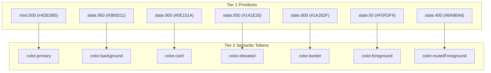

# Avora AI — Final UI Reference Direction & Product Visual Specification

> **Document class:** Visual & Interaction Reference Specification<br />
> **Canonical path:** `docs/UI-REFERENCE-DIRECTION.md`<br />
> **Authority:** Subordinate to `docs/PRD.md`, `docs/architecture.md`, `docs/ENGINEERING-RULES.md`, `docs/SECURITY.md`, and `docs/DESIGN-SYSTEM.md`<br />
> **Status:** Finalized UI Reference Target<br />
> **Created:** 2026-08-24<br />
> **Target Release Model:** Mobile-first Web & Android Standalone APK (V0/V1) → Native Apps (Campus Beta / Launch)

---

## 1. Purpose & Authority

This document synthesizes the visual, interaction, and structural patterns from all seven approved Avora Vercel prototype deployments into a single, authoritative reference document. It provides product designers, frontend engineers, and AI coding agents with an unambiguous visual target for the real Avora implementation across Web (`apps/web`), Mobile (`apps/mobile`), and UI packages (`packages/ui-web`, `packages/ui-mobile`).

### 1.1 Specification Hierarchy
Per `AGENTS.md` §2 and `docs/DESIGN-SYSTEM.md` §0.2, the implementation hierarchy is:
```
1. docs/PRD.md (Product Truth)
2. docs/architecture.md (System Architecture)
3. docs/ENGINEERING-RULES.md · docs/SECURITY.md (Engineering & Security Constraints)
4. docs/DESIGN-SYSTEM.md (Design Tokens & Component Rules)
5. docs/MASTER-ROADMAP.md (Stage & Milestone Plan)
6. docs/AVORA-TOOLCHAIN.md (Operational Toolchain)
7. docs/UI-REFERENCE-DIRECTION.md (This Document — Visual & Interaction Target)
```
Where a visual reference conflicts with an upstream document (such as hardcoding level names vs. `NN-01` structural adaptivity, or rendering ungrounded responses vs. `NN-11` verifiable citations), **the upstream governing document wins**.

---

## 2. Inventory of Evaluated Vercel Deployments

Seven live Vercel deployments were forensically inspected to extract the strongest UX and aesthetic patterns:

| Reference URL | Primary Surface / Feature | Observed Visual & Functional Strengths |
| :--- | :--- | :--- |
| **1. `https://avora-olive.vercel.app/`** | **Home Dashboard** | Header greeting with active semester badge, Upcoming Exam card with radial readiness ring, "Today's goal" 3-step checklist, "Next best action" recommendation, 6-tile quick actions grid, "Continue learning" progress bar, horizontal snap-scrolling subject cards, and live vertical timetable with animated "Now" pulse indicator. |
| **2. `https://avora-neon.vercel.app/welcome`** | **Welcome & Auth Landing** | Ambient emerald aura glows, custom geometric "A" monogram emblem in mint container with drop shadow, "Study Smarter. Stress Less." headline, 4 value-prop cards (Upload Notes, AI Study Assistant, Smart Quizzes, Exam Readiness), full-width rounded primary CTAs. |
| **3. `https://avora-neon.vercel.app/onboarding`** | **Personalization Intro** | Focused introductory onboarding screen with breathing glow logo, 3 core commitment badges ("Your timetable, always current", "Units, labs or programs — your way", "AI that knows what to study next"), dismissible note. |
| **4. `https://avora-pied-eight.vercel.app/onboarding`** | **Refined Onboarding Canvas** | 430px centered mobile canvas constraint, staggered entry animations (`animate-rise stagger-1` through `5`), glowing primary CTA button (`avora-cta-glow`). |
| **5. `https://avora-silk.vercel.app/`** | **Shell, Nav & Skeleton States** | Fixed floating glass bottom navigation bar (Home, Subjects, AI, Planner, Profile), ambient aurora background glow, smooth skeleton loading placeholders with rounded corners. |
| **6. `https://avora-iota.vercel.app/`** | **AI Tutor Surface** | Sticky frosted glass header with back button and subject switcher, verified grounding badge ("AI trained on your uploaded resources"), welcome progress card (Unit progress, study streak, resource count, quiz accuracy), 2-column suggested query prompt chips, fixed bottom input bar with radar context indicator ("Studying: CS3402 · Unit 3 · using 3 resources"), attachment clip, voice input icon, send button with glow. |
| **7. `https://avora-blond.vercel.app/`** | **Notes & Academic Structure** | Subject selector dropdown, syllabus coverage percentage pill, search & filter bar, horizontal pinned note carousel, hierarchical syllabus units list matching chosen onboarding structure, floating action button (FAB) for note capture. |

---

## 3. Comparative UX Analysis & Decision Register

```
┌──────────────────────────────────────────────────────────────────────────────────┐
│                             UX DECISION REGISTER                                 │
├──────────────────────────────────────────────────────────────────────────────────┤
│ RETAINED PATTERNS (The Avora Signature):                                         │
│ • Dark obsidian background (#080D11) with ambient emerald mint glow (primary/10) │
│ • Radial circular progress rings with tabular percentage counters               │
│ • Fixed floating glass bottom navigation bar with active icon glow pill          │
│ • Live vertical timetable with pulsating "Now" badge and remaining time countdown│
│ • Radar context pill in Tutor bar showing active subject + unit + resource count │
│ • Horizontal touch snap-scrolling subject and pinned note cards                  │
├──────────────────────────────────────────────────────────────────────────────────┤
│ IMPROVED PATTERNS (Evolution for Production):                                    │
│ • Dynamic structure labels: replace hardcoded "Unit" with student's actual tier │
│ • Verifiable citation chips: integrate chunk locator pills with grounding popup  │
│ • Design token binding: replace raw hex/px values with Tier 1/2 semantic tokens  │
│ • Empty & error states: replace generic blank views with actionable upload lures │
├──────────────────────────────────────────────────────────────────────────────────┤
│ REJECTED PATTERNS (Anti-Patterns Barred from Repository):                        │
│ • Fixed desktop-only layouts: mobile-first responsiveness mandatory (max-w-md)   │
│ • Unverified AI chat streams: raw text without citations strictly barred        │
│ • Flashy un-themed gradients: only restrained emerald/mint sheen permitted       │
└──────────────────────────────────────────────────────────────────────────────────┘
```

---

## 4. Consolidated Visual Language & Aesthetic Identity

Avora’s visual identity is **"Academic Neon Obsidian"**: a dark, focused, distraction-free environment engineered for late-night college study sessions, balanced by high-contrast mint accents and crisp typography.

1. **Deep Background Surfaces:** Grounded in rich black-slate tones (`#080D11` background, `#0E151A` card base, `#141E26` elevated surface).
2. **Emerald Mint Accent:** A single signature accent color (`#4DE5B5` / `hsl(161, 74%, 60%)`) used intentionally for primary CTAs, active indicators, progress completions, and AI badges.
3. **Ambient Atmospheric Sheen:** Subtle, high-blur ambient radial glows (`bg-primary/10 blur-3xl`) positioned behind hero cards and headers to give depth without visual clutter.
4. **Frosted Glass Elevation:** Headers and bottom navigation bars use frosted glass backdrop filters (`backdrop-blur-xl bg-card/85 border-border`) allowing underlying content to scroll smoothly beneath.
5. **Card Curvature Ramp:** Generous border radii (`rounded-2xl` for controls, `rounded-3xl` for standard cards, `rounded-[28px]` for hero modules) creating a friendly, modern touch interface.

---

## 5. Layout Architecture & Viewport Strategy

```
┌─────────────────────────────────────────────────────────────────┐
│                      VIEWPORT STRATEGY                          │
│                                                                 │
│   Mobile Viewport (< 640px):                                    │
│   • Full-width 100vw, px-4/px-5 gutters                         │
│   • Fixed bottom navigation bar (Home, Subjects, AI, etc.)      │
│   • Touch snap-scrolling carousels                              │
│                                                                 │
│   Tablet & Desktop Viewport (>= 640px):                         │
│   • Centered max-w-md (430px–480px) mobile frame canvas         │
│   • Subtle side borders (sm:border-x sm:border-border/60)       │
│   • Preserves high-density mobile ergonomics on large displays  │
│   • Future: 2-column split view for desktop study mode          │
└─────────────────────────────────────────────────────────────────┘
```

- **Canvas Constraint:** The primary interface renders inside a centered `max-w-[430px]` to `max-w-md` canvas, matching the physical ergonomics of standard Android devices (Redmi, Samsung Galaxy).
- **Safe Area Insets:** All fixed headers and footers incorporate `env(safe-area-inset-top)` and `env(safe-area-inset-bottom)` to prevent clipping on mobile notch and home-bar hardware.
- **Scroll Containment:** Horizontal card strips utilize `.no-scrollbar` with `snap-x snap-mandatory` for fluid finger swiping without visible desktop scrollbars.

---

## 6. Typography & Text Hierarchy

Avora employs **Geist Sans** (or Inter) for clean legibility and **Geist Mono** (or JetBrains Mono) for numbers, timetables, and code.

| Role | Font Family | Size | Weight | Tracking / Line Height | Usage Example |
| :--- | :--- | :--- | :--- | :--- | :--- |
| **Hero Title** | Sans | `34px` / `2.1rem` | Semibold (600) | `-0.035em` / `1.1` | "Let's personalize your semester." |
| **Section Title** | Sans | `22px`–`26px` | Semibold (600) | `-0.02em` / `1.15` | "Upcoming exam", "Welcome back, Arjun" |
| **Card Title** | Sans | `15px` | Semibold (600) | `-0.01em` / `1.2` | "Operating Systems", "Today's goal" |
| **Body Standard** | Sans | `13.5px`–`14px` | Regular (400) | `normal` / `1.4` | Syllabus topic descriptions, AI answers |
| **Caption / Label** | Sans | `11px`–`12px` | Medium (500) | `+0.02em` / `1.3` | "Semester 5 · Computer Science" |
| **Micro Badge** | Sans | `9.5px`–`10.5px`| Semibold (600) | `+0.12em` uppercase | "AI SEMESTER COMPANION", "NOW" |
| **Tabular Data** | Mono | `11px`–`15px` | Medium (500) | `tabular-nums` | Timetable hours (`09:00`), Scores (`68%`) |

---

## 7. Color & Design Token Mapping

All colors map strictly to `@avora/design-tokens` Tier 1 primitives and Tier 2 semantic tokens:



---

## 8. Core Component System Direction

### 8.1 Upcoming Exam Card
- **Anatomy:** Frosted dark card with ambient top-right glow, category pill (`Upcoming exam` + Sparkles icon), Exam Name (`Mid 1`), countdown pill (`7 days left` in accent color), and a prominent radial circular progress ring displaying readiness percentage (`68% Ready`).
- **Interaction:** Action banner at bottom ("Complete Unit 3 Part A today to reach 81% readiness") with full-width CTA ("Continue preparing").

### 8.2 Radial Circular Progress Ring
- **SVG Geometry:** 82px (large hero) or 40px (subject card) diameter with `-rotate-90` orientation.
- **Stroke Dynamics:** Subtle background stroke (`stroke-foreground/10`), vibrant primary stroke (`stroke-primary`) with rounded caps (`stroke-linecap="round"`), and smooth transition (`transition-[stroke-dashoffset] duration-700 ease-out`).
- **Inner Content:** Center-aligned tabular percentage value (`68%`) and micro-caption (`Ready`).

### 8.3 Quick Actions Grid (3-Column)
- **Tiles:** 6 square/rounded tiles (Upload Notes, Ask AI, Generate Quiz, Flashcards, Study Session, Attendance).
- **Style:** `bg-card/70 border-border`, top elevated icon badge with primary icon, centered 2-line title.
- **Feedback:** Tactile spring bounce on press (`active:scale-[0.97]`).

### 8.4 Live Timetable Timeline
- **Anatomy:** Vertical list with connected line spine (`absolute left-[46px] w-px bg-border`).
- **Time Column:** Fixed-width tabular mono text (`09:00`, `11:30`).
- **Current Class Card:** Active class highlighted with `border-primary/20 bg-primary/10`, pulsating ring indicator, and vibrant `Now` badge with live time remaining countdown (`48m left`).

### 8.5 AI Tutor Context Radar & Input Bar
- **Sticky Header:** Frosted glass header with subject title, verified grounding badge (`AI trained on your uploaded resources`), and back navigation.
- **Context Radar Pill:** Above the input field, a persistent status banner displays the active grounding scope: `Studying: CS3402 · Unit 3 · using 3 resources`.
- **Input Capsule:** Rounded capsule (`rounded-[26px] bg-card/85 border-border`) housing file attachment button, auto-expanding textarea, voice input button, and primary send button with glow.

---

## 9. Interaction & Motion Patterns

Avora avoids slow, distracting page transitions in favor of snappy, physical micro-interactions:

1. **Staggered Entry (`animate-rise`):** Key cards fade and slide up 10px on load with 70ms–100ms staggered delays, creating an organized, sequential reveal.
2. **Tactile Button Press:** Buttons and interactive cards compress slightly on touch (`active:scale-[0.98]` or `active:scale-95`) providing immediate physical feedback.
3. **Live Indicator Pulsing (`animate-pulse-ring`):** The "Now" timetable marker and AI active indicators utilize a subtle 2-second pulsating glow ring.
4. **Smooth Progress Fill:** Progress bars and radial circles animate from 0 to value over 500ms–700ms with an ease-out curve.

---

## 10. Responsive & Mobile Performance Standards

- **Low-End Hardware Optimization (`NFR-052`):** No heavy 3D canvases or unoptimized blur filters. Ambient glows use hardware-accelerated CSS `transform` and lightweight radial gradients.
- **Touch Targets:** Every clickable button, card, and icon maintains a minimum touch target bounding box of **44x44px** (`ENG-125`).
- **Offline / Flaky Network Behavior:** Skeletons maintain identical card bounding boxes to eliminate layout shifts (Cumulative Layout Shift = 0) when switching between offline cached data and live API responses.

---

## 11. Accessibility Standards (WCAG 2.1 AA)

- **Color Contrast:** All body text meets or exceeds **4.5:1** contrast ratio against card and background surfaces. Muted captions meet **3:1** for large text.
- **Screen Reader Navigation:** Non-text elements (radial progress rings, icon buttons, live badges) carry descriptive `aria-label` or `<span class="sr-only">` helper text.
- **Focus Indicators:** Interactive controls show high-visibility focus rings (`focus-visible:outline-2 focus-visible:outline-primary`) on keyboard tab navigation.

---

## 12. Implementation Bridge for Future Engineering Stages

When implementing Stage 12 and subsequent engineering groups, the reference UI translates into production packages as follows:

| UI Reference Surface | Owning Repository Package | Data / API Hook Boundary |
| :--- | :--- | :--- |
| **Welcome / Auth Screen** | `apps/web/app/(auth)/` | Supabase Auth OTP / OAuth Flow (`AuthPort`) |
| **Onboarding Flow** | `apps/web/app/(app)/onboarding/` | Academic Structure Onboarding Service (`AcademicStructurePort`) |
| **Home Dashboard** | `apps/web/app/(app)/dashboard/` | Student Home Aggregator Service (`StudentDashboardPort`) |
| **Study & Subject Notes** | `apps/web/app/(app)/subjects/` | Resource Extraction & Chunk Repositories (`ResourcePort`) |
| **AI Tutor Interface** | `apps/web/app/(app)/tutor/` | AI Gateway Tutor Port (`TutorAnswerInvocationPort`) |
| **Shared Primitives** | `packages/ui-web` & `ui-mobile` | Design Tokens (`@avora/design-tokens` Tier 1 & Tier 2) |

---

## 13. Summary Checklist for UI Implementation

- [x] Background is deep obsidian slate (`#080D11`) with subtle mint sheen.
- [x] Primary actions use emerald mint (`#4DE5B5`) with dark text on fill.
- [x] Numbers and times use tabular mono figures.
- [x] Academic hierarchy labels adapt dynamically to the student's curriculum (`NN-01`).
- [x] AI responses feature machine-resolved chunk citation chips (`NN-11`).
- [x] Layout is mobile-first, centered in a 430px canvas on wide screens.
- [x] Zero hardcoded color literals; all styling consumed via design tokens.
