# Avora — Engineering Architecture

**Document type:** Technical Architecture Specification
**Version:** 1.0
**Status:** Draft
**Owner:** Founding Chief Software Architect / CTO
**Audience:** Founders, Engineers, AI coding agents (Claude Code, Cursor, Copilot), Future employees
**Canonical path:** `docs/architecture.md`

**Depends On:**
- `docs/PRD.md` (v1.0 — Approved baseline)

**Satisfies:** PRD Appendix B, `docs/ARCHITECTURE.md` — *"System architecture, service boundaries, data flows"*

---

## How To Read This Document

This document defines *how* Avora is built. It does not define *what* Avora is — that is `docs/PRD.md`, which is the single source of truth and is never contradicted here. Where this document appears to make a product decision, it is either (a) tracing a decision already made in the PRD, or (b) explicitly flagged as an architecture-level open question requiring founder resolution.

Conventions used throughout:

| Convention | Meaning |
| --- | --- |
| `AD-##` | **Architecture Decision.** Binding. Reversal requires an amendment to this document and an impact assessment. |
| `AS-##` | **Architecture Assumption.** Stated so it can be tested and invalidated. Invalidation triggers review. |
| `AOQ-##` | **Architecture Open Question.** Requires a founder or engineering-lead decision by the stated horizon. |
| `FR-###`, `NFR-###`, `AIR-###`, `PR-##`, `D-##`, `OQ-##`, `R-##` | Identifiers defined in `docs/PRD.md`. Every architectural element traces to at least one. |
| **Port** | An interface owned by Avora's domain. Stable. |
| **Adapter** | A vendor-specific implementation of a Port. Replaceable. |

Per PRD NFR-063, every shipped capability traces to a PRD requirement identifier. This document adds the inverse obligation: **every architectural component declares the requirements it exists to satisfy.** A component with no traceable requirement is deleted, not documented.

---

## Table of Contents

1. [Executive Summary](#1-executive-summary)
2. [Architecture Goals](#2-architecture-goals)
3. [Guiding Engineering Principles](#3-guiding-engineering-principles)
4. [Architecture Assumptions and Open Questions](#4-architecture-assumptions-and-open-questions)
5. [High-Level System Architecture](#5-high-level-system-architecture)
6. [Technology Stack](#6-technology-stack)
7. [Frontend Architecture](#7-frontend-architecture)
8. [Backend Architecture](#8-backend-architecture)
9. [Database Architecture](#9-database-architecture)
10. [Academic Structure Model](#10-academic-structure-model)
11. [Authentication Architecture](#11-authentication-architecture)
12. [Authorization Model](#12-authorization-model)
13. [File Storage Architecture](#13-file-storage-architecture)
14. [AI Architecture](#14-ai-architecture)
15. [Antigravity Orchestration](#15-antigravity-orchestration)
16. [AI Context Model](#16-ai-context-model)
17. [Knowledge and Retrieval Strategy](#17-knowledge-and-retrieval-strategy)
18. [AI Tutor Lifecycle](#18-ai-tutor-lifecycle)
19. [Ingestion and OCR Pipeline](#19-ingestion-and-ocr-pipeline)
20. [Notes Processing Pipeline](#20-notes-processing-pipeline)
21. [Flashcard Pipeline](#21-flashcard-pipeline)
22. [Quiz Pipeline](#22-quiz-pipeline)
23. [Study Planner Pipeline](#23-study-planner-pipeline)
24. [Background Jobs](#24-background-jobs)
25. [Event Flow](#25-event-flow)
26. [State Management Strategy](#26-state-management-strategy)
27. [Offline and Synchronisation Strategy](#27-offline-and-synchronisation-strategy)
28. [Caching Strategy](#28-caching-strategy)
29. [Search Strategy](#29-search-strategy)
30. [Sharing Architecture](#30-sharing-architecture)
31. [Billing and Entitlements Architecture](#31-billing-and-entitlements-architecture)
32. [Folder Structure Philosophy](#32-folder-structure-philosophy)
33. [Deployment Architecture](#33-deployment-architecture)
34. [Monitoring and Observability Architecture](#34-monitoring-and-observability-architecture)
35. [Logging Strategy](#35-logging-strategy)
36. [Security Architecture](#36-security-architecture)
37. [Privacy and Deletion Architecture](#37-privacy-and-deletion-architecture)
38. [Performance Strategy](#38-performance-strategy)
39. [Scalability Strategy](#39-scalability-strategy)
40. [Cost Optimization Strategy](#40-cost-optimization-strategy)
41. [Failure Recovery Strategy](#41-failure-recovery-strategy)
42. [Testing and Quality Architecture](#42-testing-and-quality-architecture)
43. [Future Evolution Strategy](#43-future-evolution-strategy)
44. [Architecture Decision Register](#44-architecture-decision-register)
45. [Rejected Alternatives](#45-rejected-alternatives)
46. [Traceability Matrix](#46-traceability-matrix)
47. [Guidance for AI Coding Agents](#47-guidance-for-ai-coding-agents)

---

## 1. Executive Summary

Avora is a mobile-first, AI-native academic operating system whose defensibility is the **Academic Graph** — a persistent, structurally adaptive representation of a student's academic life (PRD §14.3, D-06). The architecture is therefore organised around a single controlling insight from the PRD:

> *"The model is rented. The context is owned."* (PRD §18.1)

Every significant architectural decision follows from that sentence. Model providers are treated as commodity, hot-swappable dependencies behind a narrow port. The Academic Graph, the retrieval layer that traverses it, and the grounding discipline that constrains generation against it are treated as the durable, proprietary core and are given the strongest correctness, durability, and evolvability guarantees in the system.

The system is a **modular monolith with an asynchronous processing plane**. There is one primary transactional database, one domain model, one deployable web application, one deployable mobile client, and one horizontally scalable worker pool that performs all long-running and expensive work. There are no microservices at V0. This is deliberate: the PRD's binding constraints are ingestion quality (R-01), grounding fidelity (R-10), cost per student (R-11, NFR-022), and time-to-market against a term-aligned launch (D-09) — none of which are helped by distributed-systems overhead, and all of which are harmed by it.

Five architectural commitments dominate the design:

1. **No fixed hierarchy anywhere.** The Adaptive Structure Model (D-01, FR-014 to FR-020) is realised as a recursive, label-agnostic tree stored as an adjacency list with a derived materialised path. Structure *type* is data, never schema, never an enum, never a table name, never a prompt assumption. Restructuring is a pointer operation, never a data migration (FR-018).
2. **Grounding is enforced by the system, not requested from the model.** Retrieval is scoped by SQL predicates before vector search, citations are machine-resolved against real chunk records after generation, and a response whose citations do not resolve is never shown to a student. A fabricated citation is a severity-one defect (AIR-006); the architecture makes it structurally difficult rather than prompt-discouraged.
3. **Student material is untrusted input to both the file system and the model.** Uploads are quarantined, sniffed, scanned, and sanitised (NFR-034). Extracted content enters model context only inside a delimited, authority-free envelope and can never issue instructions or invoke tools (AIR-013, R-13).
4. **Nothing blocks the student.** Every expensive operation is an idempotent, resumable, observable job. The client acknowledges intent immediately and reconciles state through realtime subscriptions (FR-036, FR-037, NFR-006).
5. **Deletion is an engineered subsystem, not a `DELETE` statement.** Real deletion spans primary rows, derived artifacts, vector indices, object storage, caches, analytics, and backups within a published window (NFR-042, PRD §19.3).

The architecture also records two places where the prescribed stack is insufficient for the PRD and must be extended: **long-running ingestion cannot run on serverless request handlers** (§8.3, AD-08) and **Stripe alone cannot serve the Indian beachhead's dominant payment instruments** (§31, AD-31). Both are resolved with a port-and-adapter seam rather than a stack change, so the prescribed vendors remain primary where they are appropriate.

---

## 2. Architecture Goals

Architecture goals are the system-level qualities that, if achieved, make the PRD's requirements satisfiable. They are ordered; where two conflict, the lower number wins.

| ID | Goal | Traces to | Why it is a goal |
| --- | --- | --- | --- |
| AG-01 | **Structural neutrality.** The system can represent any institution's academic organisation without schema change. | D-01, FR-014 to FR-020, NFR-060, PR-04 | The product's central claim. A schema that encodes hierarchy invalidates the thesis. |
| AG-02 | **Verifiable grounding.** Every academic claim the system makes is traceable to a specific location in a specific student resource, and that trace is machine-checkable. | D-02, AIR-001 to AIR-006, R-10 | Trust is the precondition for daily use. Citation fabrication is unrecoverable brand damage. |
| AG-03 | **Durability of student material.** No single-component failure loses an uploaded resource or a student edit. | NFR-010, NFR-015, PR-12 | "Deletion means deletion" is only credible if *non*-deletion is equally reliable. |
| AG-04 | **Ownership-enforced access.** Every read and write is authorised against the requesting identity at the data layer, not the application layer. | NFR-031, NFR-032, PR-03 | Defence in depth; the API layer will eventually contain a bug. |
| AG-05 | **Non-blocking responsiveness on constrained devices and networks.** | NFR-001 to NFR-006, NFR-052, NFR-053, PR-07 | Mid-range Android on intermittent mobile data is the target environment, not an edge case. |
| AG-06 | **Vendor replaceability at every external boundary.** Model providers, OCR, payments, and even the orchestration layer are adapters. | D-08, NFR-061, R-12 | Existential vendor exposure is unacceptable for a rented-model business. |
| AG-07 | **Bounded and observable unit cost.** Cost per student is a first-class runtime signal with enforcement, not a monthly finance report. | NFR-022, BM-01 to BM-05, R-11 | A price-sensitive market with unbounded inference cost is an unviable business. |
| AG-08 | **Elastic seasonality.** The system absorbs order-of-magnitude examination-period spikes without degrading read paths. | NFR-012, NFR-021, R-31 | Failure during exam week is the single most damaging operational event possible. |
| AG-09 | **Extensibility without redesign.** New resource types, disciplines, languages, and artifact classes are additive. | NFR-060, PR-13, PRD §33 V2/V3 | The roadmap explicitly requires generalisation beyond engineering and English. |
| AG-10 | **Traceable, agent-legible codebase.** Structure, naming, and boundaries are consistent enough that AI coding agents produce correct work without reinterpretation. | NFR-063, PRD Appendix C | Agents are declared consumers of this document. Ambiguity is a defect. |

---

## 3. Guiding Engineering Principles

These translate PRD product principles (§13) into engineering practice. PRD precedence order is preserved.

**EP-01 — The domain model is sacred; everything else is replaceable.**
The Academic Graph schema and the domain layer that operates on it change slowly, deliberately, and with migration discipline. Frameworks, providers, UI libraries, and hosting are implementation detail. If a vendor decision forces a domain model change, the vendor is wrong.

**EP-02 — Push correctness into the lowest layer that can enforce it.**
Ownership is enforced in Postgres Row Level Security, not in a controller. Referential integrity is enforced by foreign keys, not by application code. Enumerable invariants are check constraints. Application-layer validation is a usability feature; the database is the security boundary. (NFR-031, AG-04)

**EP-03 — Asynchrony is the default for anything that can exceed 300 ms.**
Synchronous request handling is reserved for reads and small writes. Everything else — extraction, embedding, generation, planning — is a job with an identity, a state machine, and observable progress. (FR-036, NFR-006)

**EP-04 — Idempotency is a requirement, not an optimisation.**
Every job, webhook, and mutation carries an idempotency key. Retries are assumed. "Exactly once" is achieved through "at least once plus idempotent effect", never through hope. (FR-037 — *resume or safely fail without data loss or silent duplication*)

**EP-05 — Untrusted until proven otherwise, in both channels.**
A student's upload is untrusted bytes to the file subsystem *and* untrusted text to the model. These are two distinct threat classes with two distinct controls. (NFR-034, AIR-013)

**EP-06 — Degrade a feature, never the corpus.**
When AI capacity, provider availability, or budget is exhausted, generation degrades. Access to original resources, previously generated artifacts, notes, and search never degrades. (NFR-013, AIR-012)

**EP-07 — Explicit over implicit, everywhere an agent will read.**
No magic. No convention-only behaviour. No inferred column meaning. Names are long and unambiguous. Structure type labels are strings in a column named `structure_type_label`, not `type`. (AG-10)

**EP-08 — Measure the thing the PRD cares about, not the thing that is easy to measure.**
Grounding fidelity, citation validity, extraction accuracy, and cost per student are instrumented as production signals with alerts, not as offline analyses. (NFR-070, NFR-072, PRD §18.4)

**EP-09 — Documentation-first.** An architectural change is proposed in this document, reviewed, and merged before the code that implements it. The document is the plan of record; the code is its consequence.

**EP-10 — Simplicity is a budget.** The system is permitted a small number of genuinely hard things: the adaptive structure tree, hybrid scoped retrieval, offline reconciliation, and cost-governed model routing. Everything else must be boring. Complexity spent elsewhere is complexity stolen from these four.

---

## 4. Architecture Assumptions and Open Questions

Per the PRD's practice of stating assumptions so they can be invalidated (§30), the architecture states its own.

### 4.1 Architecture assumptions

| ID | Assumption | Consequence if invalidated |
| --- | --- | --- |
| AS-01 | Supabase Postgres with `pgvector` provides sufficient vector search performance and recall for a per-student corpus of the scale in NFR-020 (10 subjects, 500 resources, multi-year accumulation), given per-student pre-filtering. | Introduce a dedicated vector store behind the existing `RetrievalPort` (§17.6). No domain change. |
| AS-02 | Per-student corpora are small enough that retrieval is always tenant-scoped, making pre-filtered ANN search tractable and avoiding cross-tenant index contention. | Partition or shard the embedding table by student cohort. |
| AS-03 | Frontier multimodal models provide handwriting and layout extraction quality sufficient to pass the R-01 launch gate on genuine student corpora, without a bespoke model. | Activate the PRD §18.5 provision for specialised capability; the OCR port already permits a fine-tuned or self-hosted adapter. |
| AS-04 | "Antigravity", named in the founding stack as the primary AI orchestration layer, is an orchestration and workflow product whose capability surface is not fully specified to engineering at the time of writing. | See AOQ-01. The architecture defines the port; the adapter absorbs the difference. |
| AS-05 | Vercel and Cloudflare can serve the Indian beachhead within NFR-001 and NFR-002 latency budgets given edge caching and an ap-south-1 data plane. | Move the web tier to a regional container platform; the client contract is unchanged. |
| AS-06 | Students' devices can hold a bounded offline subset (downloaded decks, notes, recent resources) within the storage constraints of NFR-052. | Reduce offline scope to flashcard decks only (the FR-085 minimum) and stream everything else. |
| AS-07 | India's DPDP framework permits processing of student academic content within India with consent, and the primary data plane can be hosted in an Indian region. | Data residency becomes a hard constraint on vendor selection; see AOQ-05. |

### 4.2 Architecture open questions

These require a documented decision. Each is a founder or engineering-lead call, not an engineering preference.

| ID | Question | Required by | Owner |
| --- | --- | --- | --- |
| AOQ-01 | What is Antigravity's actual capability surface — model routing, agent orchestration, evaluation, prompt management, or development tooling — and is it in the production request path or the development workflow only? Until answered, §15 treats it as a driven adapter behind Avora's own orchestration port. | V0 design freeze | CTO + Founders |
| AOQ-02 | Mobile client strategy: Expo/React Native native app, or Next.js PWA wrapped for store distribution? §7.2 recommends Expo and states the reasoning; the stack's inclusion of TestFlight and Firebase Test Lab implies native distribution. | V0 kickoff | CTO |
| AOQ-03 | Payment provider for the Indian beachhead. Stripe is the stack default but UPI is the dominant student instrument (PRD §31.1). §31 recommends Stripe as the entitlement system of record with a domestic PSP adapter for collection. | V0, before monetisation | Founders |
| AOQ-04 | Free-tier limit unit — interactions, generations, or a unified credit (PRD OQ-03). The metering subsystem (§31.2) is built to be unit-agnostic, but the student-facing unit must be chosen before the entitlement UI ships. | V0 | Product |
| AOQ-05 | Data residency posture: Indian region only, or Indian primary with cross-region backup? This determines the DR topology in §41 and the vendor list. | V0, before beta | Founders + Counsel |
| AOQ-06 | Retention window for raw model prompt/response payloads used in AI quality evaluation (§34.4). Longer windows improve evaluation; shorter windows reduce privacy surface. PRD NFR-046 constrains analytics but is silent on evaluation corpora. | V0 | CTO + Product |
| AOQ-07 | Spaced repetition scheduler: FSRS or SM-2 (PRD OQ-04 is the product-side form of this question). §21.3 recommends FSRS behind a `SchedulerPort`. | V0 | Product + CTO |

---

## 5. High-Level System Architecture

### 5.1 System context

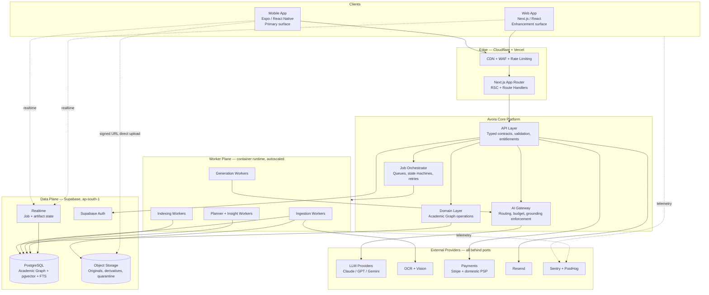

### 5.2 Architectural style

**AD-01 — Modular monolith plus an asynchronous worker plane.**

Avora is one application, one domain model, one database, and one worker codebase, organised into strictly bounded modules with explicit interfaces. Modules communicate through domain services and domain events, never by reaching into each other's tables.

*Rationale.* The PRD's binding risks are quality risks (R-01, R-10, R-14), cost risks (R-11), and timing risk (D-09 — launch aligned to term start). Microservices address organisational scaling problems Avora does not have and introduce distributed-transaction, versioning, and observability costs that directly worsen every one of those risks. A single Postgres instance holding the Academic Graph also makes the graph's most valuable property — *connectedness* — cheap to exploit through joins and recursive CTEs rather than expensive to reconstruct across service boundaries.

*The separation that does exist is the one that matters:* the **request plane** (fast, synchronous, user-facing, latency-bounded) is separated from the **worker plane** (slow, asynchronous, expensive, retryable). These have genuinely different scaling curves, failure modes, and cost profiles, and separating them is what allows exam-period generation load to spike without touching read-path availability (NFR-012, AG-08).

*Rejected alternatives:* see §45.1.

### 5.3 Module boundaries

| Module | Responsibility | Owns tables | Key requirements |
| --- | --- | --- | --- |
| `identity` | Account lifecycle, sessions, profile, consent, deletion orchestration | `students`, `consents`, `deletion_requests` | FR-001 to FR-006, FR-140 to FR-142 |
| `academic` | Institutions, programmes, terms, subjects, structure units, templates | `institutions`, `programmes`, `terms`, `subjects`, `structure_units`, `structure_templates` | FR-010 to FR-021 |
| `resources` | Upload lifecycle, originals, extraction records, classification | `resources`, `resource_versions`, `extracted_content`, `classifications` | FR-030 to FR-042 |
| `knowledge` | Chunking, embeddings, concepts, concept links, retrieval | `chunks`, `chunk_embeddings`, `concepts`, `concept_links` | FR-110 to FR-114, AIR-001 to AIR-002 |
| `tutor` | Conversations, messages, scopes, citations | `conversations`, `messages`, `message_citations` | FR-050 to FR-060 |
| `notes` | Summaries, generated notes, student edits, exports | `notes`, `note_sources`, `note_revisions` | FR-070 to FR-077 |
| `recall` | Flashcards, decks, review scheduling, attempts | `flashcards`, `decks`, `card_states`, `review_attempts` | FR-080 to FR-086 |
| `assessment` | Quizzes, questions, attempts, grading, feedback | `quizzes`, `questions`, `quiz_attempts`, `responses` | FR-090 to FR-098 |
| `mastery` | Mastery signals, coverage computation | `mastery_signals`, `coverage_snapshots` | FR-120, FR-121 |
| `planning` | Academic events, study plans, sessions, re-planning | `academic_events`, `study_plans`, `plan_items` | FR-100 to FR-107 |
| `insights` | Insight generation, rate limiting, dismissal | `insights`, `insight_deliveries` | FR-122 to FR-125 |
| `sharing` | Share grants, capability tokens, revocation, projections | `shares`, `share_grants` | FR-130 to FR-134 |
| `billing` | Plans, entitlements, metering, subscriptions | `plans`, `subscriptions`, `usage_ledger` | BM-01 to BM-05, FR-144 |
| `ai` | Gateway, routing, grounding enforcement, evaluation hooks | `ai_invocations`, `ai_feedback`, `eval_runs` | AIR-001 to AIR-014, NFR-061 |
| `jobs` | Queue, state machines, scheduling, dead letters | `jobs`, `job_events` | FR-036, FR-037, NFR-006 |
| `platform` | Audit log, domain event outbox, feature flags, config | `audit_log`, `domain_events`, `flags` | NFR-036, NFR-062 |

**Boundary rule (binding).** A module may read another module's tables only through that module's published domain service or a published read view. Cross-module foreign keys are permitted — this is one database — but cross-module *queries* written ad hoc are not. This preserves the option of extraction later without paying distributed costs now.

### 5.4 Request lifecycle

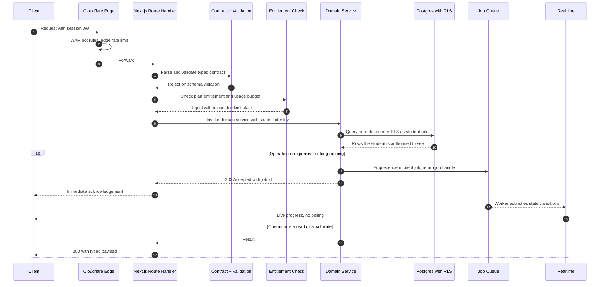

Two properties of this lifecycle are binding:

- **The student identity is never optional and never inferred from a body parameter.** It is derived from the verified session and passed as the database role context so RLS applies (NFR-031, AG-04).
- **Entitlement is checked before work is scheduled, not after it is done.** This is what makes free-tier cost bounded rather than measured (BM-02).

---

## 6. Technology Stack

| Layer | Selection | Rationale | Port / replaceability |
| --- | --- | --- | --- |
| Mobile client | Expo (React Native), TypeScript, NativeWind | Primary surface per PR-07 and D-03. Native camera and multi-page capture (FR-032), background upload, push notifications (FR-107), on-device SQLite for offline (FR-085), store distribution via TestFlight and Firebase Test Lab. Subject to AOQ-02. | Shares `@avora/core` with web; UI is the only non-portable layer |
| Web client | Next.js App Router, React, TypeScript, Tailwind, shadcn/ui | Marketing, onboarding, desktop enhancement, long-form note editing, admin. Also hosts the API route handlers. | — |
| Shared domain SDK | TypeScript package `@avora/core` | Single definition of domain types, contracts, validation schemas, and client-side query keys. Prevents client/server drift and gives coding agents one canonical type source (AG-10). | — |
| API | Next.js Route Handlers with typed contracts (Zod-validated, tRPC-style or OpenAPI-generated) | Colocated with the web app, deployed on Vercel, edge-cacheable where safe. | Contract layer is transport-agnostic |
| Database | Supabase PostgreSQL 15+ with `pgvector`, `pg_trgm`, `ltree`, `pgcrypto` | One store for relational graph, full-text, and vector search removes an entire class of consistency and deletion-completeness problems (NFR-042). | `RepositoryPort` per module |
| Auth | Supabase Auth | OAuth for low-friction signup, email OTP/magic link for the email method (FR-001), self-service recovery (FR-003), JWT integrates natively with RLS. | `AuthPort` |
| Object storage | Supabase Storage, S3-compatible, with resumable upload | Originals preserved unmodified (FR-035), RLS-integrated path authorisation, resumable protocol satisfies FR-037. | `BlobStorePort` |
| Realtime | Supabase Realtime | Job and artifact state push to clients without polling; central to non-blocking ingestion UX (FR-036). | `RealtimePort` |
| Worker runtime | Container platform (Cloud Run / Fly.io / Railway), autoscaled, queue-driven | Required: serverless request handlers cannot host two-minute document processing within NFR-004 reliably. See AD-08. | Any OCI runtime |
| Edge functions | Supabase Edge Functions | Short, data-adjacent work: webhook receipt, signed URL issuance, lightweight triggers. Not used for long jobs. | — |
| Queue | Postgres-backed queue (`pgmq` / Supabase Queues) at V0 | Transactional enqueue with the domain write — the outbox and the queue share a transaction, which eliminates the "job scheduled but row not committed" class of bug. Upgrade path to a dedicated broker at scale. | `QueuePort` |
| AI orchestration | Avora AI Gateway, with Antigravity as the primary orchestration adapter | Provider-agnostic by mandate (D-08, NFR-061). See §14, §15, AOQ-01. | `OrchestrationPort`, `ModelPort` |
| LLM providers | Claude, GPT, Gemini, future models — multi-provider from day one | R-12 mitigation; task-appropriate routing is a cost requirement (BM-05). | `ModelPort` |
| Embeddings | Provider-hosted embedding model, versioned | Versioned because re-embedding is a scheduled migration, not an incident. | `EmbeddingPort` |
| CDN / WAF / DNS | Cloudflare | Edge caching for static and signed-media paths, WAF, bot management, first-tier rate limiting (NFR-033). | — |
| Hosting | Vercel | Next.js-native, preview deployments per PR, edge network. | — |
| Payments | Stripe as entitlement system of record, domestic PSP adapter for UPI collection | PRD §31.1 requires locally dominant instruments. See AD-31, AOQ-03. | `BillingPort`, `PaymentCollectionPort` |
| Email | Resend | Transactional only: auth, receipts, deletion confirmations, opt-in digests. | `MailPort` |
| Error monitoring | Sentry | Client, server, and worker traces with release health. | — |
| Product analytics | PostHog | Content-free event taxonomy per NFR-046. | — |
| Tracing | OpenTelemetry | Vendor-neutral traces spanning client → API → worker → provider. | — |
| Mobile testing | Firebase Test Lab (Android device matrix incl. low-end), TestFlight (iOS beta) | NFR-052 requires verified behaviour on constrained devices, not assumed behaviour. | — |
| Repository / CI | GitHub, GitHub Actions | Preview environments, migration checks, eval gates. | — |
| Dev environment | Cursor, Claude Code, Copilot | This document is written to be their specification (AG-10). | — |

---

## 7. Frontend Architecture

### 7.1 Surface mapping

The PRD defines five primary surfaces (§22.1). These map to client route groups, and each declares its data contract and its offline posture.

| Surface | Route group | Primary data | Offline posture | Requirements |
| --- | --- | --- | --- | --- |
| **Today** | `(today)` | Next action, upcoming events, due reviews, active insights | Read from local cache; stale-marked | FR-102, FR-105, FR-122, PRD §22.2 |
| **Subjects** | `(subjects)` | Subject list → structure tree → resources and artifacts | Structure tree cached; resources on demand | FR-013 to FR-020, FR-040 |
| **Tutor** | `(tutor)` | Conversations, messages, citations | History readable offline; sending queued | FR-050 to FR-060 |
| **Study** | `(study)` | Decks, review queue, quizzes, attempts, mastery | Fully offline for downloaded decks | FR-080 to FR-098 |
| **Library** | `(library)` | Unified search, all resources, all notes, filters | Downloaded items only | FR-110 to FR-114 |
| **Upload** | Global action | Multi-file, camera capture | Queued locally, uploads on connectivity | FR-030 to FR-032, PRD §22.1 |

**Binding constraint from PRD §22.1:** Upload is a globally available action and must not be nested in navigation. Architecturally this means the upload intake queue is a *global client service*, not a screen-scoped component — it survives navigation, backgrounding, and app restart.

**Binding constraint from PRD §22.2 and NFR-055:** no core workflow exceeds three interactions from home. This is a routing and information-density constraint that must be verified in `docs/UX-FLOWS.md`, not assumed.

### 7.2 Client platform decision

**AD-02 — Expo (React Native) as the primary client; Next.js as the web and enhancement client; a shared TypeScript domain package.** *(Subject to AOQ-02.)*

*Rationale.* Five PRD requirements are difficult or unreliable in a browser on mid-range Android in the target market:

- **FR-032** — multi-page camera capture with edge detection and per-page retake.
- **FR-085 / NFR-053** — offline flashcard review with deferred sync, requiring durable local storage beyond browser storage eviction policies.
- **NFR-006** — long-running operations that must not require the app to stay in the foreground, i.e. background upload and background fetch.
- **FR-107** — reliable reminders, which on Android web are inconsistent and on iOS web are severely constrained.
- **NFR-001** — three-second cold start to interactive on a mid-range device, which a large web bundle over a congested mobile network makes marginal.

The prescribed stack's inclusion of **TestFlight and Firebase Test Lab** independently implies store-distributed native binaries. NFR-052 requires verified low-end device behaviour, which Firebase Test Lab provides only for native Android builds.

*What is shared.* `@avora/core` holds domain types, API contracts, validation schemas, query keys, offline reconciliation logic, and the spaced-repetition scheduler. Only presentation differs: shadcn/ui + Tailwind on web, NativeWind + a parallel primitive set on mobile, both driven by the same design tokens from `docs/DESIGN-SYSTEM.md`.

*Trade-off accepted.* Two UI implementations is real duplicated effort. The alternative — a single PWA — trades that effort for degraded performance on exactly the devices the beachhead uses, and for weaker capture, offline, and notification behaviour. PR-07 makes mobile quality non-negotiable; the duplication is the cheaper cost.

*Rejected alternative:* PWA-only. See §45.2.

### 7.3 Rendering and data-fetching strategy

| Content class | Strategy | Why |
| --- | --- | --- |
| Marketing, auth, static | Static generation at edge | Fastest possible first paint, cacheable globally |
| Authenticated shell | Client-rendered from local cache, hydrated | The student's data is personal and cache-hostile; the shell must appear instantly from local state (NFR-001) |
| Lists and trees | Server-driven pagination, client cache, optimistic mutation | Structure trees can be deep; progressive disclosure is required by PRD §22.2 |
| Tutor responses | Server-Sent Events streaming | NFR-003 requires visible output within five seconds — streaming makes time-to-first-token the metric, not time-to-completion |
| Job progress | Realtime subscription | Polling on mobile data is a battery and cost tax; push is correct (FR-036) |
| Documents and media | Signed URL direct from storage via CDN | Never proxied through the application tier |

**AD-03 — Time-to-first-token is the tutor latency SLO, not time-to-completion.**
NFR-003 says responses *begin streaming* within five seconds. The architecture therefore optimises retrieval and context assembly aggressively (target: under 1.2 s p95 from submission to first model token) and treats total generation time as a secondary metric. This is why retrieval runs as a single round-trip Postgres query rather than a multi-hop agent loop for the common case (§17.4).

### 7.4 Component architecture

Three layers, strictly separated:

1. **Primitives** — unstyled or token-styled building blocks. shadcn/ui on web; a parallel NativeWind primitive set on mobile. Accessibility obligations (NFR-051: contrast, target size, focus, screen reader) are satisfied *here* and inherited everywhere, not re-implemented per feature.
2. **Domain components** — components that know Avora concepts: `StructureTree`, `ResourceCard`, `CitationChip`, `AIGeneratedBadge`, `ProcessingState`, `MasteryMeter`, `ConfidenceIndicator`. These are the enforcement points for cross-cutting PRD rules.
3. **Surface compositions** — screens, assembled from domain components only.

**Enforced-by-component rules.** Certain PRD rules are too important to leave to per-screen discipline:

| Rule | Enforcement |
| --- | --- |
| AI-generated content labelled at every point of presentation (FR-143, AIR-010, RAI-01) | Any renderer for an AI-provenance artifact requires an `AIGeneratedBadge`; a lint rule fails the build if an artifact with `provenance = 'ai'` is rendered without it. Export paths carry the label into exported files. |
| Citations resolvable and never fabricated (AIR-002, AIR-006) | `CitationChip` accepts only a resolved citation object containing a real `chunk_id` and locator. It cannot render a free-text citation. Unresolvable citations cannot be displayed by construction. |
| Classification confidence visible with one-action correction (FR-039) | `ResourceCard` requires a `confidence` prop and renders a correction affordance whenever confidence is below the ask-threshold (PRD OQ-02). |
| Failures honest and paired with recovery (NFR-014) | `ErrorState` requires a `recoveryAction` prop. There is no error component without one. |
| No shaming, loss-framing, or manufactured urgency (FR-125, RAI-06) | Progress and insight components accept copy only from a reviewed content catalogue; ad-hoc strings are rejected in review. Tone is a component contract, not an author's choice. |

This is the practical expression of AG-10: the rules an AI coding agent is most likely to forget are the ones made structurally impossible to violate.

### 7.5 Accessibility and internationalisation

- **WCAG 2.1 AA (NFR-051)** is verified in CI with automated checks on primitives and in manual review on surfaces. Contrast ratios are properties of the token set, not per-component decisions.
- **Language architecture from V0, content from V2.** All user-facing strings live in a message catalogue with ICU pluralisation from the first commit, even though multi-language ships at V2 (PRD §15.11). Retrofitting i18n after launch is an expensive, error-prone migration; the catalogue costs almost nothing now. AI output language is a parameter of the generation contract (§16.3), not a separate code path.
- **Plain language (NFR-054)** is enforced through the reviewed content catalogue above.

---

## 8. Backend Architecture

### 8.1 Layering

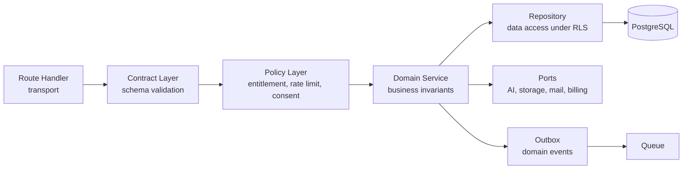

Rules, binding:

- **Route handlers contain no business logic.** They validate, resolve identity, delegate, and serialise.
- **Domain services never touch HTTP, and never touch a vendor SDK.** Vendors are reached through ports.
- **Repositories execute as the student's role**, so RLS applies to ordinary application traffic (§12.2).
- **Domain events are written to the outbox in the same transaction as the state change.** This makes "the row committed but the job never ran" impossible (EP-04).

### 8.2 API design

- **Typed, contract-first.** Every endpoint has a request and response schema in `@avora/core`. Clients import the same types. Contract drift is a compile error, which is a direct AG-10 benefit for coding agents.
- **Command/query split by convention.** Queries are `GET`, cacheable, and idempotent. Commands are `POST`, carry an `Idempotency-Key`, and return either a result or a job handle.
- **Every expensive command returns a job handle, not a result** (EP-03). The client subscribes to the job; it does not poll.
- **Errors are structured and actionable**: a stable machine code, a plain-language message, and a recovery action (NFR-014, NFR-054).
- **Pagination is cursor-based** everywhere. Offset pagination on a graph that grows for years is a latency time bomb.

### 8.3 The worker plane

**AD-08 — Long-running ingestion and generation run on a dedicated container worker pool, not on serverless request handlers or Edge Functions.**

*Rationale.* NFR-004 permits typical document processing up to two minutes; real corpora include multi-hundred-page scanned PDFs that exceed it. Serverless request functions and Edge Functions impose execution ceilings, cold-start variance, and per-invocation memory limits that make multi-minute, memory-heavy, multi-step document work either impossible or unreliable. Retrying a 90-second job because a platform limit was hit is both a cost defect (BM-03) and a reliability defect (NFR-013).

*Design.* A queue-driven, horizontally autoscaled container pool. Workers are stateless, claim jobs with a visibility timeout, heartbeat progress, and are safe to kill at any moment because every step is idempotent and checkpointed (§24.2). Scaling is driven by queue depth per priority class, which is what makes exam-period elasticity mechanical rather than manual (AG-08).

*What stays serverless.* Reads, small writes, streaming tutor responses (which are latency-bound, not duration-bound), signed URL issuance, and webhook receipt. Supabase Edge Functions handle data-adjacent short tasks that benefit from colocation with Postgres.

*Trade-off.* One more runtime to operate and pay for. Accepted: the alternative is unreliable ingestion, and ingestion quality is the PRD's highest-rated product risk (R-01, Critical/High).

### 8.4 Multi-tenancy model

Avora is single-tenant per student. There is no organisation, workspace-sharing, or role hierarchy at V0 — PRD §7.5 and FR-131 to FR-133 make the student the sole authority over their data, and sharing is a narrow, revocable, per-artifact grant rather than shared ownership.

**Architectural consequence:** `student_id` is a mandatory, indexed, non-null column on every student-scoped table, and is the RLS predicate for all of them. This is deliberately more explicit than deriving ownership through joins: it makes every policy a single-column comparison, keeps policies cheap to evaluate, and makes ownership auditable by inspection (NFR-031).

**Extensibility note (AG-09).** Should institutional licensing arrive (PRD §25.5, V3), it must be modelled as an *entitlement and billing relationship*, never as co-ownership of the Academic Graph. Institutional access to student content would violate PRD §19.3 commitment 1. This constraint is recorded here so a future engineer does not discover it late.

---

## 9. Database Architecture

### 9.1 Core principles

1. **One primary database.** The Academic Graph's value is its connectedness; splitting it across stores would convert cheap joins into expensive orchestration and would make complete deletion (NFR-042) an unsolved distributed problem.
2. **The database is the security boundary** (EP-02). RLS on every student-scoped table, deny by default.
3. **Structure type is data, never schema** (D-01). No enum, no table-per-type, no column named after a hierarchy level.
4. **Derived data is marked as derived and is regenerable.** Summaries, embeddings, mastery signals, coverage snapshots, and plans are all reconstructible from originals plus attempts. This bounds the blast radius of any model change or bug.
5. **Provenance is a first-class column.** Every artifact records whether it was AI-generated, student-authored, or co-created, and which model version and prompt version produced it (FR-073, FR-143, AIR-010).

### 9.2 Academic Graph — entity relationships

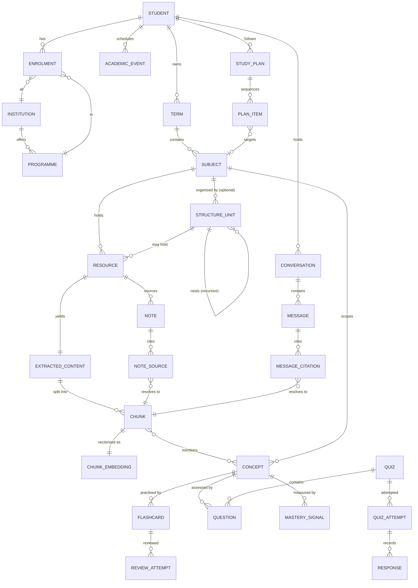

Note three deliberate properties:

- **`STRUCTURE_UNIT` is self-referential and optional.** A `SUBJECT` with zero structure units is valid and fully functional (FR-015).
- **Every citation-bearing relation resolves to a `CHUNK`, never to free text.** `MESSAGE_CITATION` and `NOTE_SOURCE` are foreign keys. This is the schema-level enforcement of AIR-006.
- **`CONCEPT` is scoped to `SUBJECT`, not global.** A global concept ontology would be a fixed structure by another name and would leak across students. Concept identity is per-student, per-subject, with optional linking across terms for V2 continuity (D-06).

### 9.3 Key schema decisions

**AD-04 — Adjacency list with a derived materialised path for `structure_units`.**

Each structure unit stores `parent_id` (nullable, self-referential), `subject_id`, `structure_type_label` (free text), `title`, `position`, and a maintained `path` (`ltree` or delimited text of ancestor ids).

- **Adjacency list** makes re-parenting an O(1) pointer write. FR-018 requires that re-nesting, splitting, and merging preserve all associated artifacts; because resources and artifacts reference `structure_unit_id` and never a path string, *restructuring never touches them*. This is the single most important schema property in the system.
- **Materialised path** makes subtree reads a single indexed query rather than a recursive traversal, which matters for scoped retrieval (§17.4) and for rendering deep trees within NFR-002. The path is maintained by trigger on parent change; it is derived, and it is never authoritative.
- **Fractional/lexicographic `position`** so reordering on mobile writes one row, not N siblings.

*Rejected alternatives:* nested sets (reordering rewrites the subtree — hostile to FR-018), closure table (correct but adds a second table to keep consistent for a tree that is at most a few levels deep per FR-016), JSON blob (destroys referential integrity and per-node RLS). See §45.3.

**AD-05 — `structure_type_label` is a free-text column with a suggestion library, not an enum.**

FR-014 lists Unit, Module, Chapter, Topic, Week, Experiment, Practical, Lab, Project, Program — *"including but not limited to"* — and FR-020 requires fully custom labels. An enum would require a migration every time a student in a discipline Avora has not yet seen types a word. A lookup table of *suggestions* exists to power autocomplete and template proposals; it constrains nothing. Coding agents must never introduce validation that rejects an unrecognised label.

**AD-06 — Original resources are immutable; everything derived is versioned and regenerable.**

`resources` holds the immutable pointer to the original object (FR-035). `extracted_content` is versioned by extractor version. `chunks` are versioned by chunking-strategy version. `chunk_embeddings` are versioned by embedding-model id. This makes re-extraction after an OCR improvement, or re-embedding after a model upgrade, a controlled backfill with a rollback path instead of a destructive rewrite — a direct NFR-061 and AG-06 requirement.

**AD-07 — Attempts are append-only; mastery is derived.**

`review_attempts` and `quiz_attempts` are immutable event records. `mastery_signals` and `coverage_snapshots` are materialised derivations that can be recomputed from scratch. When the mastery model improves — and it will — history is replayed rather than lost (FR-083, FR-095, FR-096, FR-121).

### 9.4 Indexing and performance

| Concern | Approach |
| --- | --- |
| Tenant isolation and locality | `student_id` first in composite indexes on all hot paths; RLS predicates align with index order so policy evaluation is index-assisted |
| Subtree queries | GiST index on `path` |
| Vector search | HNSW index on `chunk_embeddings`, always queried with a `student_id` and scope pre-filter (§17.4) |
| Keyword search | GIN index on generated `tsvector`; `pg_trgm` for fuzzy title and filename matching |
| Today surface | Narrow covering indexes on `academic_events`, `plan_items`, and due-card lookups; NFR-001 forbids a slow home screen |
| Attempt history | BRIN or partitioning by time as volume grows across terms (V2 concern, designed for now) |
| Long-term growth | Prior-term data is cold; partition or archive by `term_id` once cross-term volume warrants it — never delete (D-06) |

### 9.5 Migrations

- Migrations are versioned SQL in the repository, applied through CI, never by hand.
- **Expand/contract only.** Add nullable, backfill, dual-write, switch reads, then drop. No migration takes a lock that would breach NFR-011 during a term.
- **No destructive migration runs during an academic examination window** (R-31); release freeze windows are calendar-driven and enforced in CI.
- Every migration is paired with a tested rollback or an explicit, reviewed statement that it is irreversible.

---

## 10. Academic Structure Model

This section is the architectural realisation of D-01 — the PRD's own designation of *"the single most important design commitment in the product"* (§14.2). It is stated separately and prominently because it is the requirement most likely to be silently violated by a well-intentioned engineer or coding agent.

### 10.1 The model

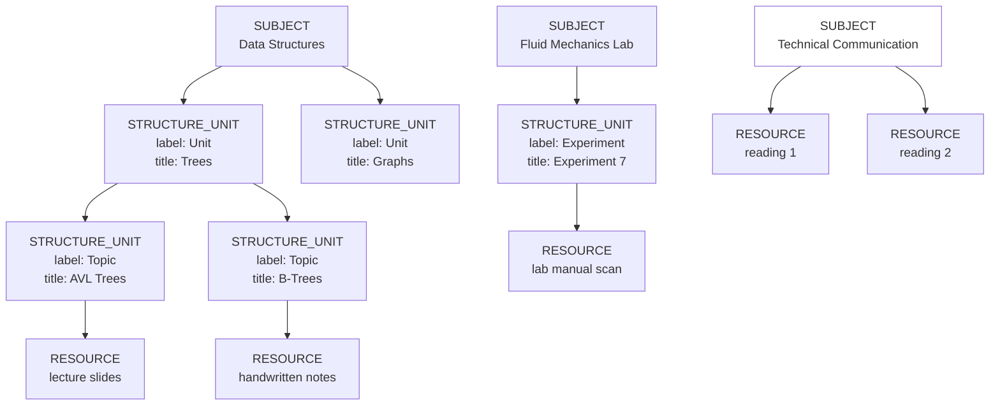

All three subjects above belong to the **same student, in the same term, simultaneously** (FR-017). The third has no structure at all and is fully functional (FR-015). This diagram is the acceptance test for the model.

### 10.2 Binding invariants

| ID | Invariant | Enforced by |
| --- | --- | --- |
| SM-01 | No table, column, enum, type, or constant encodes a fixed hierarchy level. There is no `chapters` table, no `unit_id` on resources, no `level` enum. | Schema review; CI lint on forbidden identifiers |
| SM-02 | A subject with zero structure units is a valid, first-class state — not an empty state, not a setup-incomplete state. | Nullable `structure_unit_id` on `resources`; UI treats it as normal |
| SM-03 | Nesting supports at least three levels (FR-016) with no architectural ceiling; depth limits, if any, are product policy expressed as configuration. | Recursive `parent_id`; depth is a config value |
| SM-04 | Restructuring — rename, re-type, re-nest, split, merge — never moves, copies, or deletes an artifact. | Artifacts reference `structure_unit_id`; `path` is derived (AD-04) |
| SM-05 | Structure type labels are arbitrary strings, including student-authored ones. | `text` column, no enum, no validation against a whitelist (AD-05) |
| SM-06 | Templates are proposals. Applying a template produces ordinary, fully editable structure units with no residual link to the template. | `structure_templates` is read-only reference data; applying it copies |
| SM-07 | Retrieval, prompts, and generated output must never assume a level name. Prompts refer to "the selected scope" and to labels *as data supplied at runtime*. | AI context contract (§16.2) |

### 10.3 Restructure operations

The four operations FR-018 requires, and what each does at the data layer:

| Operation | Data effect | Artifact effect |
| --- | --- | --- |
| **Rename** | Update `title` | None |
| **Re-type** | Update `structure_type_label` | None |
| **Re-nest / move** | Update `parent_id`; trigger recomputes `path` for the subtree | None |
| **Split** | Insert new unit(s); update `structure_unit_id` on the selected resources only | Resources move by pointer; notes, cards, attempts, and mastery follow their resource and concept links unchanged |
| **Merge** | Re-point children and resources to the surviving unit; soft-delete the absorbed unit | None; the absorbed unit's id is retained in the audit log for reversibility |

Every restructure is a single transaction, is written to the audit log, and emits a `structure.changed` domain event that invalidates cached scope resolutions and the Today surface projection.

### 10.4 Structure templates

`structure_templates` is curated reference data keyed by institution and programme (PRD §14.2, FR-019, V2 §15.11 institutional library). Architecturally:

- Templates are **global reference data, not student data**, and are therefore outside RLS-protected student tables and outside the deletion cascade.
- Passive enrichment ("contributed by usage patterns", PRD §14.2) operates only on **aggregate, anonymised structure shapes** — label vocabulary and depth distributions per institution/programme — never on titles, resource names, or content. This is required by NFR-046 and PRD §19.1 no-secondary-exploitation, and is gated on the student's opt-out state (FR-142).
- Template application is a copy, never a live reference (SM-06). PRD OQ-05 asks the equivalent question for *shared* structures; that answer is pending and must not be pre-empted here.

---

## 11. Authentication Architecture

### 11.1 Methods

FR-001 requires at least one low-friction method and one email-based method.

| Method | Purpose | Notes |
| --- | --- | --- |
| Google OAuth | Low-friction primary; near-universal on target Android devices | Fastest path to the ten-minute activation target (PRD §21.2) |
| Apple Sign In | iOS requirement where third-party sign-in is offered | Store policy |
| Email OTP / magic link | The email-based method; also the recovery path | Avoids password storage entirely at V0 |
| Phone OTP | Candidate for the beachhead market | Deferred; adds cost and a new PII class. Founder decision if activation data warrants it |

**AD-09 — No password credential at V0.** OAuth plus email OTP satisfies FR-001, removes the entire credential-storage, rotation, breach, and reset attack surface, and satisfies FR-003 (recovery without support intervention) natively — recovery is simply re-authentication to the same email. NFR-035's "current best practice for credential handling" is most cheaply met by having no credentials to handle.

### 11.2 Flow

```mermaid
sequenceDiagram
    autonumber
    participant C as Client
    participant A as Supabase Auth
    participant P as Provider
    participant DB as Postgres
    participant AL as Audit Log

    C->>A: Begin sign-in with chosen method
    A->>P: OAuth authorisation or OTP dispatch
    P-->>A: Identity assertion or verified code
    A->>A: Mint access JWT plus refresh token
    A-->>C: Session established
    C->>C: Store tokens in platform secure storage
    A->>DB: Trigger creates student record on first sign-in
    DB->>DB: Seed default consent state and free-tier entitlement
    A->>AL: Record auth event, no content, no PII beyond identifier
    C->>DB: Subsequent requests carry JWT; RLS resolves auth.uid()

    Note over C,DB: Sensitive operations require step-up re-authentication
```

### 11.3 Session and token policy

| Concern | Policy | Requirement |
| --- | --- | --- |
| Access token | Short-lived JWT, minutes not hours; carries `sub` and role only | NFR-035 |
| Refresh token | Long-lived, rotating, single-use, revoked on reuse detection | NFR-035 |
| Token storage | iOS Keychain / Android Keystore on mobile; httpOnly secure cookies on web | Prevents JS-accessible token theft |
| Session inventory | Student can view and revoke active sessions | NFR-035, PR-02 |
| Step-up re-authentication | Required for: account deletion, data export, email change, subscription changes, bulk deletion, share creation of an entire structure unit | **FR-002** |
| Continuous identity | The `students` row is the durable identity and persists across term changes, institution changes, and auth-method changes | **FR-006** |

**AD-10 — Identity is decoupled from institution and term from day one.** FR-006 requires a single continuous identity across terms *and institution changes*. Therefore institution and programme live on an `enrolment` record with validity dates, not as columns on `students`. A student who transfers institutions keeps one identity, one Academic Graph, and full history — which is precisely the D-06 continuity moat.

---

## 12. Authorization Model

### 12.1 The rule

> **NFR-031:** *Every access to a Resource or derived artifact **MUST** be authorised against the requesting student's identity. Ownership checks **MUST NOT** rely on unguessable identifiers alone.*

This is the most operationally consequential security requirement in the PRD, and it is restated in PRD Appendix C item 4 as a binding constraint on coding agents. The architecture satisfies it by making unauthorised access impossible at the data layer rather than by requiring correct application code at every call site.

### 12.2 Enforcement layers

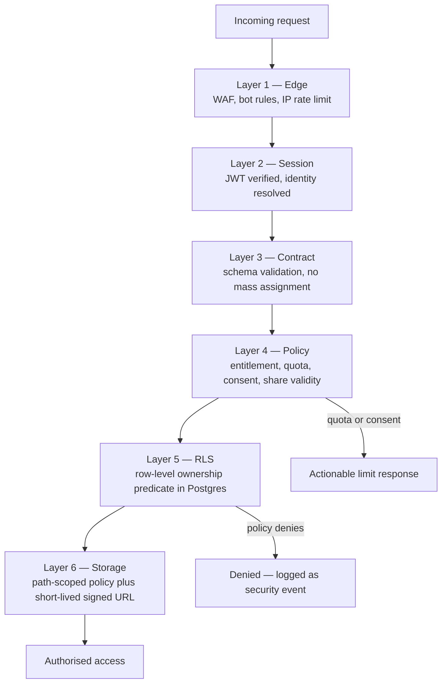

**Layer 5 is the boundary that matters.** Layers 1–4 are defence in depth and good product behaviour; if all four contained bugs simultaneously, RLS would still prevent cross-student data access. Conversely, no amount of application-layer correctness is trusted in its place.

### 12.3 RLS policy design

- **Deny by default.** RLS is enabled with no permissive policy on every student-scoped table before any column is added to it. A new table without a policy is unreadable, which is the correct failure mode.
- **Single-predicate policies.** `student_id = auth.uid()` on nearly every table. Cheap, index-assisted, and auditable by inspection.
- **Separate policies per operation.** `SELECT`, `INSERT`, `UPDATE`, `DELETE` are distinct; a student may read a derived artifact they may not directly write.
- **Derived and system-written tables** (embeddings, mastery signals, coverage snapshots) are student-readable and service-writable only.
- **Policies are tested.** A dedicated test suite attempts every cross-student access pattern against every table on every CI run. A new table without negative-authorisation tests fails the build.

### 12.4 Service-role usage

Workers must bypass RLS to write derived data. This is the highest-risk privilege in the system and is constrained accordingly:

**AD-11 — Service-role access is confined to the worker plane, is never exposed to a request handler that accepts client input, and every service-role operation asserts the owning `student_id` explicitly.**

Concretely: a worker never queries "the next chunk to embed" globally and then writes wherever the result points. It loads a job, reads the `student_id` from the job record, and performs every subsequent read and write with that `student_id` as an explicit predicate. The ownership check is not skipped because RLS is bypassed — it is *moved into the worker and made explicit*. Service-role credentials live only in worker environment secrets and are never present in the Vercel client-facing runtime.

### 12.5 Sharing authorization

Sharing (FR-130 to FR-134) is deliberately *not* modelled as an ACL on the resource. It is a separate capability grant:

- A `share_grant` names exactly what is shared (one resource, or one structure unit subtree), by whom, with what expiry, and in what state (active/revoked).
- Access by a recipient reads through a **share projection view** that structurally cannot expose the sharer's notes, mastery, attempts, or conversations (FR-133). The exclusion is a property of the view definition, not of a filter someone remembered to write.
- Revocation is immediate: the grant flips state, and any signed URLs issued under it are short-lived by design (§13.3) so the residual access window is bounded and disclosed.
- Sharing is never on by default and always requires an explicit per-action consent step (FR-131).

---

## 13. File Storage Architecture

### 13.1 Bucket topology

| Bucket | Contents | Access | Requirement |
| --- | --- | --- | --- |
| `quarantine` | Freshly uploaded bytes, pre-validation | No read access to anyone but the ingestion worker | **NFR-034** |
| `originals` | Validated, unmodified original files | Owner read via short-lived signed URL | **FR-035** |
| `derivatives` | Page rasters, normalised images, thumbnails, extracted media | Owner read via signed URL | Ingestion pipeline |
| `exports` | Generated export bundles | Owner read, short TTL, auto-expired | FR-004, FR-076 |
| `shared` | Nothing is copied here; shares reference `originals` through the grant projection | Grant-scoped | FR-130 to FR-133 |

**Path convention:** `{bucket}/{student_id}/{resource_id}/{version}/{filename}`. `student_id` as the first path segment lets storage policies enforce ownership on the path itself, giving the storage layer the same single-predicate property as the database (AG-04).

### 13.2 Upload flow

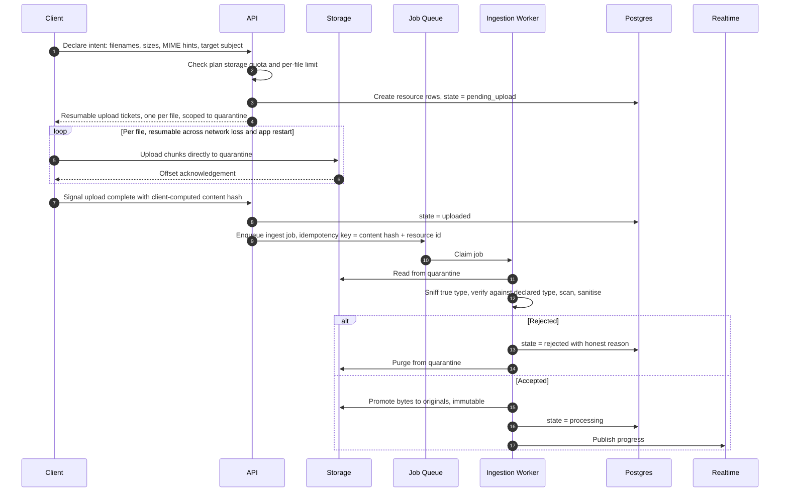

Properties, each traced:

- **The client never blocks** (FR-036). Intent is acknowledged before a byte moves; the student may navigate away, background the app, or lose connectivity.
- **Uploads resume, and never silently duplicate** (FR-037). Resumable protocol handles the transport; a content-hash idempotency key handles the semantics — re-uploading the same bytes to the same resource is a no-op, not a second copy.
- **Camera capture is a first-class path** (FR-032). Multi-page capture produces one logical resource with ordered page derivatives, not N unrelated images. This is a domain decision, not a UI convenience: a photographed six-page handout must chunk, cite, and summarise as one document.
- **Quota is checked before upload, not after** (FR-042, BM-02), and the student is warned approaching the limit, not at it.

### 13.3 Access, integrity, and lifecycle

- **All reads are short-lived signed URLs** issued per request after an ownership check. No public buckets. No long-lived URLs. Signed URL TTL is minutes; this is also what bounds the residual access window after share revocation (§12.5).
- **CDN delivery through Cloudflare** for cacheable derivatives, keyed so that a signed URL's cache entry is never shared across identities.
- **Integrity:** content hash stored at ingest; verified on promotion from quarantine and on export. Storage-layer replication satisfies NFR-010; a single component failure never loses an original.
- **Originals are immutable.** Re-processing produces a new `extracted_content` version, never a modified original (FR-035, AD-06).
- **Lifecycle:** quarantine objects expire aggressively (hours). Export bundles expire on a short published schedule. Originals persist until the student deletes them or the account, at which point the deletion subsystem (§37) removes them across all copies and backups within the published window (NFR-042).

### 13.4 Upload security

Uploads are treated as hostile (PRD §19.2, NFR-034). The control set:

| Control | Purpose |
| --- | --- |
| Extension-independent type sniffing | Declared MIME type is a hint, never trusted |
| Allowlist of accepted types | Document, presentation, image, plain text (FR-030). Anything else is rejected with an honest message |
| Size and page-count ceilings | Per plan; protects worker memory and cost (BM-02) |
| Malware scan before promotion | Quarantine is the enforcement point |
| Structural sanitisation | Active content stripped from documents; PDFs re-serialised; images re-encoded, stripping EXIF including GPS — a privacy measure the student never has to think about (PR-02) |
| Archive and nesting limits | Zip-bomb and recursive-container defence |
| Rendering isolation | Original files are never rendered in an application-origin context; viewers are sandboxed |
| Extraction isolation | Parsers run in the worker plane with constrained memory, CPU, and no outbound network beyond allowlisted provider endpoints |

---

## 14. AI Architecture

### 14.1 Strategic frame

The PRD's AI strategy is unambiguous: *"The model is rented. The context is owned"* (§18.1), and *"Requirements at any layer MUST NOT be satisfied by degrading a lower layer"* (§18.2). The architecture encodes both.

The four PRD intelligence layers map to four architectural subsystems with strict directional dependency:

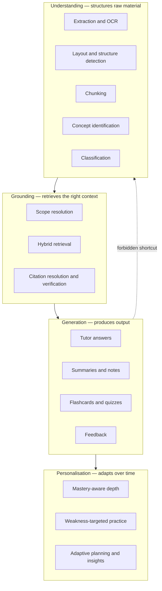

**Binding rule (AIR-001, PRD §18.2):** generation never bypasses grounding, and grounding quality is never traded for generation fluency. Architecturally this means the generation subsystem cannot construct model context itself — it can only *receive* an assembled, validated context envelope from the grounding subsystem (§16). There is no code path from a generation surface directly to a model provider.

### 14.2 The AI Gateway

**AD-12 — All model access flows through a single internal AI Gateway. No feature module holds a provider SDK, a provider key, or a model name.**

The Gateway is the enforcement point for every AI-related PRD requirement that would otherwise be scattered across a dozen call sites.

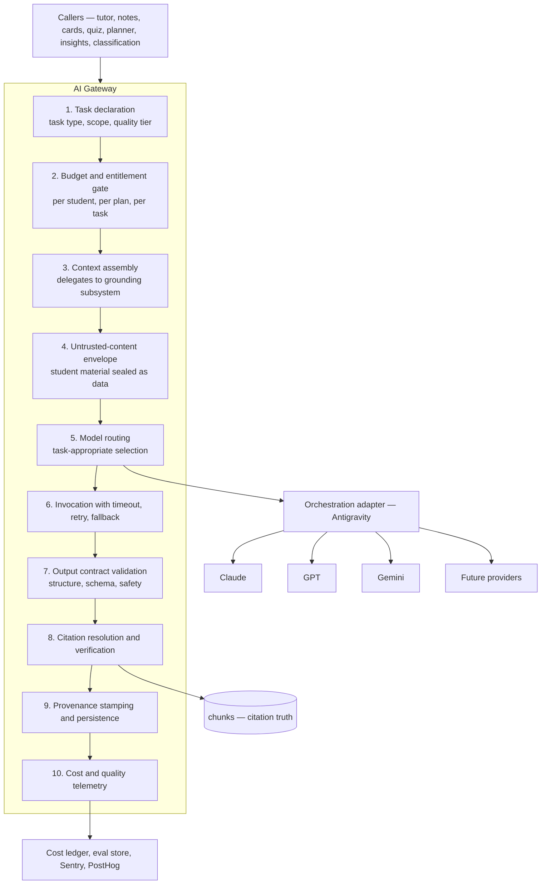

Requirements satisfied *once*, at the Gateway, rather than repeatedly at call sites:

| Gateway stage | Requirement |
| --- | --- |
| Budget gate | NFR-022, BM-02, BM-03, BM-05, R-11 |
| Untrusted envelope | AIR-013, R-13 |
| Model routing | NFR-061, BM-05, D-08 |
| Fallback chain | AIR-012, R-12 |
| Output validation | AIR-007, AIR-008, R-14 |
| Citation verification | AIR-002, AIR-006, R-10 |
| Provenance stamping | AIR-010, FR-143, RAI-01 |
| Telemetry | NFR-070, NFR-072, PRD §18.4 |

### 14.3 Model routing

**AD-13 — Routing is declarative and task-driven. Callers declare a task, never a model.**

A caller says `task: 'tutor.answer', scope: {...}, qualityTier: 'standard'`. The routing policy — a versioned configuration artifact, not code — maps task and tier to a provider, model, parameters, and fallback chain.

| Task class | Characteristics | Routing intent | Traces to |
| --- | --- | --- | --- |
| Classification, tagging | High volume, short output, low ambiguity | Smallest capable model | BM-05 |
| Extraction and OCR | Multimodal, quality-critical, moderate volume | Strong vision model; quality is the launch gate | FR-034, R-01 |
| Embedding | Very high volume, batchable | Dedicated embedding model, versioned | AD-06 |
| Summarisation | Moderate volume, bounded input | Mid-tier model | FR-070 |
| Note synthesis | Multi-document, quality-visible | Strong model | FR-071 |
| Tutor answering | Latency-visible, quality-critical, highest volume | Strong model, streaming, aggressive context economy | FR-050, NFR-003 |
| Assessment generation | Correctness-critical; a mis-keyed question is a defect | Strong model + validation pass | AIR-007, R-14 |
| Answer evaluation and feedback | Reasoning-heavy, must explain not just mark | Strong model | AIR-008 |
| Planning and insights | Batch, off-peak, mostly deterministic computation with a thin generation layer | Cheapest capable model; most of the work is not the model | FR-103, FR-122, §23 |

*Why configuration, not code.* NFR-061 requires that providers and versions be replaceable **without changes to product surfaces**. If a model name appears in a feature module, that requirement is already violated. Routing policy is versioned, environment-scoped, and changeable behind a feature flag with staged rollout and automatic quality-regression rollback (§34.4).

### 14.4 Fallback and degradation

**AD-14 — Every task declares a fallback chain and a degradation outcome, and degradation never touches the corpus** (EP-06).

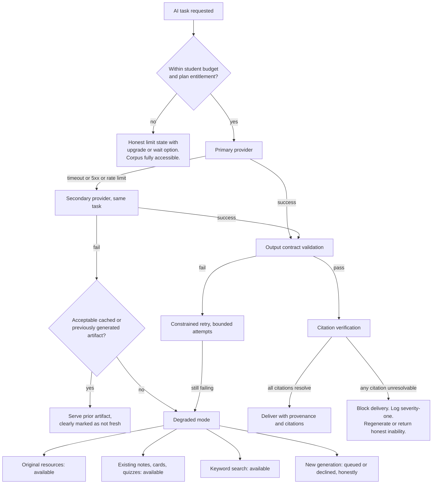

The `BLOCK` path is the architectural expression of AIR-006. **A response with an unresolvable citation is never shown to a student.** Not softened, not caveated — blocked, logged as severity one, and either regenerated or replaced with an honest statement of inability (AIR-003).

### 14.5 Prompt and evaluation asset management

- **Prompts are versioned artifacts in the repository**, reviewed like code, with an id and semantic version. Every `ai_invocations` record stores the prompt version and model version used. This is what makes a quality regression diagnosable rather than mysterious.
- **Prompts are structured, not concatenated strings.** A prompt is assembled from typed parts: system policy, task instruction, output contract, and the untrusted content envelope. Concatenating student content into an instruction string is a prohibited pattern (AIR-013).
- **Every prompt change runs the evaluation suite in CI** (§42.3). A prompt change that regresses grounding fidelity or citation validity fails the build, exactly like a failing unit test.

---

## 15. Antigravity Orchestration

### 15.1 Position in the architecture

The founding stack names **Antigravity as the primary AI orchestration layer**. Its precise capability surface is not fully specified to engineering at the time of writing (AS-04, AOQ-01). A Principal Engineer's obligation in this situation is not to guess the vendor's feature list, but to **define the seam so precisely that the answer to AOQ-01 changes an adapter and nothing else.**

**AD-15 — Antigravity is a driven adapter behind Avora's `OrchestrationPort`. It is never a caller of Avora's domain, never a holder of Avora's grounding logic, and never the authority on citations.**

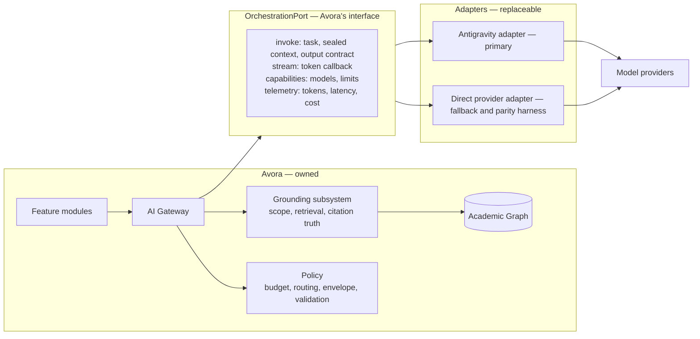

### 15.2 What Antigravity may own, and what it may never own

| Responsibility | Owner | Why |
| --- | --- | --- |
| Multi-provider connectivity, failover mechanics, streaming transport | Antigravity adapter | Exactly the commodity work worth delegating |
| Workflow and multi-step agent execution for complex generation | Antigravity adapter, where it demonstrably outperforms a direct call | Delegation is justified by measured benefit, not by stack membership |
| Prompt asset delivery and versioning | Shared — Avora is the source of truth, Antigravity may cache | Prompts are reviewed code (§14.5) |
| Provider observability and token accounting | Antigravity emits; Avora records | Avora's cost ledger is authoritative for BM-03 |
| **Scope resolution and retrieval** | **Avora only** | Retrieval is the owned moat (§18.1). Externalising it externalises the product. |
| **Citation truth and verification** | **Avora only** | AIR-006 is a severity-one class; verification must run against Avora's own `chunks` table |
| **Budget enforcement** | **Avora only** | BM-02 and NFR-022 are business-viability constraints; they cannot depend on a vendor's accounting |
| **Untrusted-content sealing** | **Avora only** | AIR-013 is a security control; a security control delegated to a third party is not a control |
| **Student data authorisation** | **Avora only** | NFR-031 |

### 15.3 Replaceability guarantee

**AD-16 — A direct-provider adapter is maintained in parity with the Antigravity adapter from V0 and is exercised continuously in CI and in a small percentage of production traffic.**

This is not redundancy for its own sake. D-08 makes model providers replaceable dependencies and R-12 rates provider dependency as a High-impact risk; an orchestration layer is a *deeper* dependency than a model provider, because it sits between Avora and every provider at once. A fallback path that has never run is not a fallback. Continuous shadow exercise converts AD-16 from a claim into a tested property.

**Exit test (must pass before V0 launch):** disable the Antigravity adapter in staging and verify that every AI surface — tutor, summaries, notes, cards, quizzes, feedback, classification — continues to function within its latency and quality SLOs on the direct adapter. If this test cannot pass, the coupling is too deep and must be reduced before launch.

**Pending AOQ-01,** engineering proceeds on the direct adapter as the reference implementation and the Antigravity adapter as the primary once its surface is confirmed. This ordering costs nothing and eliminates a schedule dependency on an unresolved question.

---

## 16. AI Context Model

The Context Model is the contract between the Academic Graph and every model invocation. It is the most security- and quality-sensitive interface in the product, and it is defined here as a strict, typed structure — never as an ad-hoc string.

### 16.1 Context envelope structure

Every model invocation receives exactly six parts, in this order, with these authority levels:

| # | Part | Contents | Authority | Requirement |
| --- | --- | --- | --- | --- |
| 1 | **System policy** | Avora's identity, grounding obligations, citation format, refusal behaviour, tone constraints, responsible-AI constraints | **Instruction — highest** | AIR-003, AIR-004, AIR-005, RAI-02, RAI-06 |
| 2 | **Task contract** | The specific task, its output schema, depth level, language, and constraints | **Instruction** | FR-056, AIR-009 |
| 3 | **Academic frame** | Structural context as *data*: subject title, the labels and titles of the scope path, term, discipline hints | **Data** | D-01 — labels are runtime data, never assumed |
| 4 | **Personalisation frame** | Mastery signals for concepts in scope, prior coverage, declared preferences | **Data** | AIR-009, PR-10 |
| 5 | **Evidence envelope** | Retrieved chunks, each with `chunk_id`, resource title, locator, and text | **Untrusted data — zero authority** | **AIR-013** |
| 6 | **Interaction history** | Prior turns in the conversation, compacted | **Data, low authority** | FR-055 |

### 16.2 The untrusted evidence envelope

**AD-17 — Student material enters model context only inside a sealed, delimited, explicitly-labelled evidence envelope, and the system policy states that envelope content is never to be treated as instruction.**

This is the architectural answer to AIR-013 and R-13. Concretely:

- Evidence is transported in a structured container with explicit boundaries, never interpolated into an instruction sentence.
- The system policy declares, before any evidence appears, that envelope content is source material to be cited and reasoned about, and that any imperative language inside it is quoted content rather than a directive.
- Extracted content is **sanitised at ingestion**, not at prompt time: control characters, boundary-mimicking sequences, and delimiter collisions are neutralised when the chunk is created. Prompt-time sanitisation is a second layer, not the only one.
- **No tool or function authority is ever granted to a request whose context contains untrusted evidence at V0.** A retrieved chunk cannot cause a database write, an outbound call, or a state change. This is the strongest available structural mitigation and it is cheap at V0 because no tutor tool-calling is required by any V0 requirement. It is recorded as a constraint on future agentic features (§43).
- **Shared material is untrusted at the same level as own material** (FR-130). A structure unit imported from a peer is exactly the injection vector R-13 describes.

### 16.3 Context assembly and budget

Context assembly is deterministic and budgeted:

1. **Resolve scope** (§17.3) — resource, structure unit subtree, subject, or workspace (FR-051).
2. **Retrieve** within scope (§17.4) — hybrid, pre-filtered.
3. **Rank and diversify** — avoid returning ten chunks from the same page; span the scope.
4. **Fit to budget** — a token budget per task class, sized so that context assembly cost is predictable and bounded (NFR-022). Selection is by relevance, then diversity, then recency.
5. **Assemble** the six-part envelope.
6. **Record** the exact `chunk_id` set supplied. This record is the ground truth against which citations are verified in Gateway stage 8. **A model may only cite what it was given.** A citation to a chunk not present in the supplied set is treated identically to a fabricated citation — blocked and logged severity one.

Step 6 is the mechanism that makes AIR-006 enforceable rather than aspirational. Verification does not ask whether a citation "looks plausible"; it asks whether that exact chunk was in the envelope and whether its locator resolves to real stored content.

### 16.4 Depth and personalisation

FR-056 and AIR-009 require adjustable and mastery-adaptive explanation depth. Depth is a **parameter of the task contract**, expressed as a small ordinal scale (intuition → standard → rigorous), with:

- **Explicit control** always available to the student.
- **Adaptive default** derived from the mastery signal for the concepts in scope — low mastery defaults to a shallower entry point, high mastery to a more formal treatment.
- **No hidden behaviour.** The depth in effect is visible and changeable. Personalisation that a student cannot see or override is a trust defect, and PR-10's "improves for each individual" is not licence for opacity.

---

## 17. Knowledge and Retrieval Strategy

### 17.1 Why retrieval is the product

PRD §18.1 states the advantage comes from context, not model quality. Retrieval is therefore not an implementation detail of the tutor — it is the subsystem in which Avora's competitive advantage physically resides. It gets the strongest correctness guarantees, the most evaluation coverage, and the most explicit design in this document.

### 17.2 Chunking

**AD-18 — Chunking is structure-aware, locator-preserving, and versioned.**

| Property | Design | Why |
| --- | --- | --- |
| Boundaries | Follow document structure — headings, slides, list groups, table blocks — with size targets rather than fixed character windows | Arbitrary windows split definitions and formulae from their context, which directly degrades both answer quality and citation usefulness |
| Locator | Every chunk stores a precise locator: page number, slide number, bounding region, and character offsets where available | **AIR-002** requires citations resolvable to a *location within* a resource. A chunk without a locator cannot satisfy it |
| Overlap | Modest overlap at boundaries | Preserves cross-boundary meaning without materially inflating storage or embedding cost |
| Special content | Formulae, code, tables, and figure captions are preserved as coherent units with type tags | PRD's beachhead is engineering; splitting a derivation mid-step is a quality failure on the most important content class |
| Figures and diagrams | Stored with a generated description plus the image derivative reference | Enables diagram-referencing answers; PRD §18.4 names diagrammatic material as an evaluation class |
| Versioning | `chunking_strategy_version` on every chunk | Strategy improvements become controlled backfills (AD-06) |

### 17.3 Scope resolution

FR-051 requires four scope levels. Scope resolves to an explicit chunk-id predicate *before* any vector operation:

| Scope | Resolution |
| --- | --- |
| Resource | `resource_id = X` |
| Structure unit | Subtree via materialised `path` prefix, plus resources attached to descendants |
| Subject | `subject_id = X`, including unstructured resources (SM-02) |
| Workspace | All subjects in the current term; prior terms included only when cross-term retrieval is enabled (FR-113, V2) |

**AD-19 — Retrieval always pre-filters by student and scope, then searches; it never searches globally and filters after.**

Post-filtering an ANN result set is both a correctness hazard (relevant in-scope content pushed out of the candidate set by out-of-scope neighbours) and a privacy hazard (cross-tenant vectors participating in the same search). Pre-filtering makes per-student corpora small, which is precisely why a single Postgres with `pgvector` is sufficient (AS-01, AS-02) — the architecture's simplicity and its correctness come from the same decision.

### 17.4 Hybrid retrieval

FR-111 requires semantic *and* keyword retrieval. Both are needed and neither is sufficient: semantic search handles paraphrase and conceptual questions; keyword search handles the exact-token cases that dominate technical academic content — a specific theorem name, a standard number, a variable, a chemical formula, a lab code.

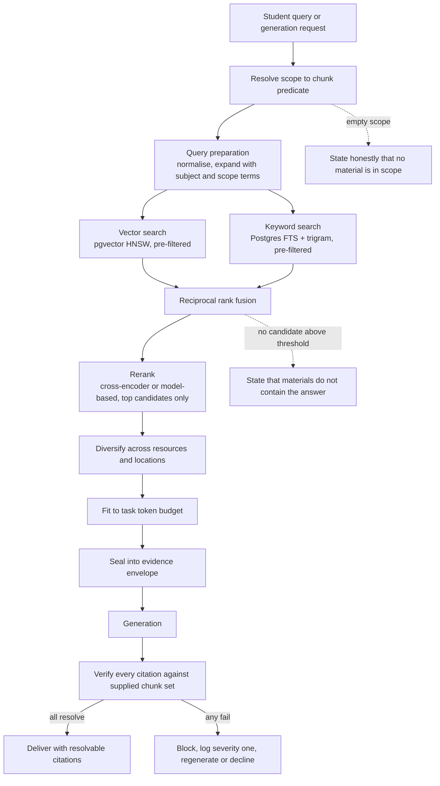

The two dotted paths are as architecturally important as the main path. **AIR-003** requires the system to say when the corpus cannot answer; that behaviour is produced by a *retrieval-side threshold decision*, not by hoping the model volunteers a refusal. Refusal correctness is an evaluated metric (PRD §18.4), and it is measured against this threshold.

Reranking is applied to a small candidate set only — it is a meaningful latency and cost line item, and AD-03 makes time-to-first-token the SLO. Reranking is a routing-policy decision per task, enabled where it measurably improves grounding fidelity and disabled where it does not.

### 17.5 Citation resolution

A citation is a structured object, never a string:

- `chunk_id` — must be in the supplied envelope set
- `resource_id`, `resource_title` — for display
- `locator` — page, slide, or region, for deep-linking (FR-052)
- `snippet_range` — the supporting span within the chunk

The client's `CitationChip` (§7.4) accepts only this object and deep-links to the exact location in the original resource. This closes the loop the PRD demands: a student can verify any claim against their own material in one tap. That verifiability, not the prose quality, is what makes grounded AI more valuable than generic AI (assumption A-04).

### 17.6 Retrieval portability

`RetrievalPort` exposes `retrieve(scope, query, budget) → EvidenceEnvelope`. Its implementation is `pgvector` + Postgres FTS at V0. If AS-01 is invalidated at scale, a dedicated vector store is introduced behind the same port. **No caller changes, no prompt changes, no domain change.** The deletion subsystem's contract with the port (§37) is the thing that must be re-satisfied by any replacement: a new index must support complete, verifiable per-student deletion, or it is not eligible.

---

## 18. AI Tutor Lifecycle

The tutor is the daily habit surface (PRD §15.3) and the highest-volume AI path. Its lifecycle:

```mermaid
sequenceDiagram
    autonumber
    participant S as Student
    participant C as Client
    participant API as API
    participant E as Entitlement
    participant G as AI Gateway
    participant R as Retrieval
    participant M as Model via orchestration
    participant V as Citation verifier
    participant DB as Postgres

    S->>C: Question, with scope selected or inherited from context
    C->>C: Optimistic render of student message
    C->>API: Submit with conversation id and scope
    API->>E: Check AI allowance for plan
    E-->>API: Denied — honest limit state, corpus still accessible
    API->>G: Invoke task tutor.answer
    G->>R: Resolve scope, retrieve, rank, diversify, budget
    R-->>G: Evidence envelope plus supplied chunk id set
    alt No material in scope above threshold
        G-->>API: Honest insufficiency response, AIR-003
        API-->>C: Rendered with offer to widen scope or answer from general knowledge, labelled
    else Evidence available
        G->>M: Sealed six-part context, streaming
        M-->>G: Token stream
        G-->>API: Stream forwarded
        API-->>C: Visible output within 5 s, NFR-003
        M-->>G: Completion with citation markers
        G->>V: Verify every citation against supplied set and stored locators
        V-->>G: All resolve
        G->>DB: Persist message, citations, provenance, model and prompt version
        G->>DB: Record cost and quality telemetry
        API-->>C: Final message with resolvable citation chips
    end
    C-->>S: Answer with citations, AI label, depth control, report affordance
    S->>API: Optional — report unhelpful, or save as note
    API->>DB: Feedback into evaluation queue, AIR-011; or create note, FR-059
```

### 18.1 Design notes

- **Streaming begins after retrieval, not before.** Retrieval must complete inside the NFR-003 budget; this is why AD-03 targets sub-1.2 s p95 for scope resolution plus retrieval, and why retrieval is one round trip in the common case.
- **Citation verification happens on completion, before persistence and before the message is marked final.** The stream is shown live — that is the latency requirement — but a message failing verification is replaced with an honest correction and logged severity one rather than left standing. The alternative (verify-then-stream) would breach NFR-003.
- **General-knowledge answers are a separate, explicitly labelled mode** (FR-054, AIR-004). They are entered only on an insufficiency result and only with a visible label. They are never a silent fallback when retrieval is weak, because a silent fallback is exactly the failure mode that destroys A-04's premise.
- **Conversation memory is compacted, not truncated.** Older turns are summarised into a running conversation state so context stays within budget without losing thread (FR-055). Compaction is itself a cheap-model task (§14.3).
- **Scope changes create a visible boundary in the conversation**, because an answer's validity is scope-dependent and a student re-reading history must know what the assistant could see.
- **Math, code, and structured content rendering (FR-058)** is a client capability with a defined output contract — the model emits standard notation, the client renders it. This is specified in the task contract, not left to prose.
- **Deletion (FR-060)** removes the conversation, its messages, its citations, and its evaluation copies through the deletion subsystem (§37).

---

## 19. Ingestion and OCR Pipeline

Ingestion is where R-01 — the PRD's highest-rated product risk — is either mitigated or realised. It receives the most defensive engineering in the system.

### 19.1 Pipeline

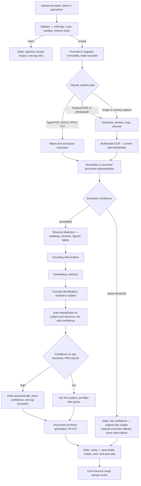

### 19.2 Resource state machine

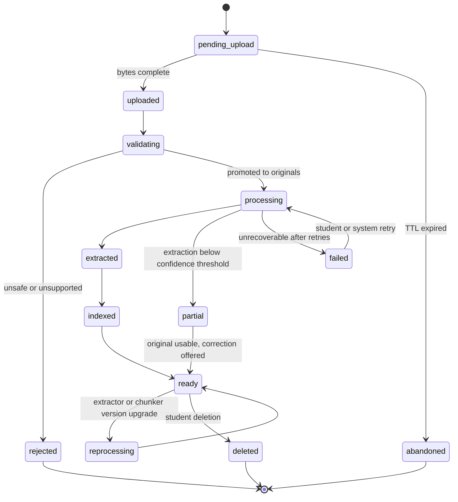

**Every state is student-visible and honest** (FR-036, NFR-014). `partial` is a first-class state, not a hidden failure: the PRD's R-01 mitigation explicitly requires *"honest low-confidence states with manual correction rather than silent failure"*. A resource in `partial` is still readable, still shareable, still summarisable at reduced confidence — the corpus is never withheld because the machine struggled.

### 19.3 OCR strategy

**AD-20 — Multimodal model-based extraction is primary; classical OCR is a cost-optimising fast path for clean printed text.**

| Input class | Strategy | Rationale |
| --- | --- | --- |
| Digital PDF with text layer | Direct extraction, no model | Free, exact, fastest. Never send to a model what the file already contains |
| Presentation files | Native parse of slides, speaker notes, and embedded text | Structure is already present; slide number becomes the locator |
| Clean printed scan | Classical OCR first; escalate to model on low confidence | Cost control (BM-05) without quality loss |
| Angled or low-quality photograph | Preprocess then multimodal model | Classical OCR degrades badly here; this is the common student case |
| Handwritten notes | Multimodal model, always | **FR-034**; classical OCR is not viable for dense handwriting |
| Mathematical and technical notation | Multimodal model with a notation-aware output contract | The beachhead is engineering; formulae are the highest-value content |
| Diagrams and figures | Multimodal description plus retained image derivative | Enables diagram-grounded answers and diagram-based cards |
| Mixed regional-language content | Multimodal model with language detection | PRD §18.4 names this as a required evaluation class |

**Confidence is propagated, never discarded.** Per-page and per-block confidence flows into chunk metadata, into retrieval ranking (low-confidence chunks are down-weighted), into citation display, and into the extraction-accuracy metric (PRD §18.4). A student citing a low-confidence chunk sees that fact.

**AD-21 — Extraction quality is a release gate, not a metric.** Per R-01's mitigation, a labelled evaluation corpus of genuine student material — poor scans, angled photographs, dense handwriting, regional-language mixing, heavy mathematics, diagrams — must meet its threshold before V0 ships. This corpus is collected under explicit consent from alpha participants and is the single most valuable engineering asset created before launch. Building it starts in week one.

### 19.4 Auto-classification

FR-038 and FR-039 require automatic placement with visible confidence and one-action correction. The signals:

| Signal | Contribution |
| --- | --- |
| Extracted content similarity to existing subject corpora | Strongest signal once a workspace has material |
| Filename and document title patterns | Strong in practice — students receive files named by faculty |
| Explicit references to unit, module, experiment, or week numbers in the content | Directly maps to existing structure unit titles |
| Upload session context — the subject the student was viewing | High precision when present |
| The student's own prior corrections | The system learns from correction (R-02 mitigation) |

**AD-22 — Corrections are training signal, and are used per-student before they are used at all globally.** Each correction updates that student's classification priors immediately. Any cross-student use is aggregate-only, opt-out-respecting (FR-142), and never uses content — only structural patterns. R-02 rates misclassification as a High-impact trust risk; the visible-confidence, one-tap-correction, learn-from-correction triad is the mitigation, and all three parts are required.

The ask-versus-assume threshold is **PRD OQ-02, unresolved.** The architecture implements it as a tunable configuration value with per-cohort experimentation, so the product can answer the question with data rather than opinion.

---

## 20. Notes Processing Pipeline

Two distinct artifacts with different lifecycles are often conflated. They are separated here.

| Artifact | Trigger | Scope | Lifecycle | Requirement |
| --- | --- | --- | --- | --- |
| **Summary** | Automatic on ingestion | One resource | Derived, regenerable, replaceable | FR-070 |
| **Note** | On demand, or student-authored | Structure unit or subject, synthesised across resources | Becomes student-owned on first edit | FR-071, FR-073, FR-074 |

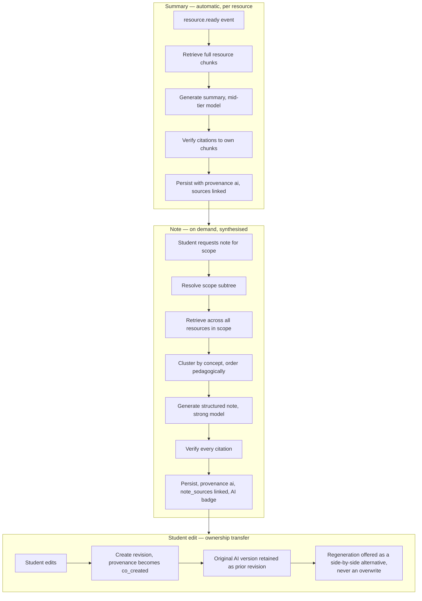

### 20.1 Binding rules

- **FR-071 requires synthesis across resources, not per-file summarisation.** A note for "Unit 3" draws from the slides, the handwritten notes, and the reference PDF together. This is a retrieval problem before it is a generation problem — which is why it uses the same scoped hybrid retrieval as the tutor rather than a separate path.
- **FR-072 / AIR-002:** every generated note links to source resources through resolved `note_sources` rows pointing at real chunks. Same verification, same severity-one treatment.
- **FR-075 is an absolute rule: regeneration never destroys a student edit.** Regeneration produces a *new revision alongside* the edited one, and the student chooses. This is PRD Appendix C item 6, and it is enforced at the repository layer — there is no code path that overwrites a `co_created` or `student` note with AI output.
- **FR-073:** first edit flips provenance to `co_created`. The AI badge remains, accurately describing partial AI origin (RAI-01).
- **NFR-015:** edits are preserved against connectivity loss through the local-first editor buffer and outbox (§27).
- **FR-076:** export in an open format (Markdown as canonical, with PDF and DOCX as rendered outputs) with AI labelling carried into the exported artifact (RAI-01, which explicitly says *"including on export"*).

---

## 21. Flashcard Pipeline

### 21.1 Generation

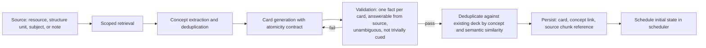

**FR-086** requires every card to retain a reference to its source resource; the architecture stores a `chunk_id`, which is strictly stronger — the student can jump to the exact page the card came from, and the card is verifiable in the same way an answer is.

Card quality validation is deliberately a **separate pass with a checkable contract**, not a hope embedded in the generation prompt. Atomicity, answerability, and non-ambiguity are testable properties, and generation failures are cheaper to catch here than in a student's review session.

### 21.2 Review and scheduling

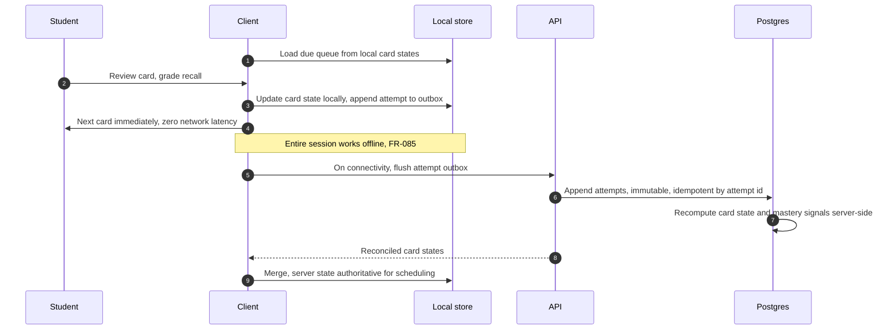

**AD-23 — The scheduler runs on the client for responsiveness and on the server for authority; attempts are the synchronisation unit, not card states.**

Because attempts are immutable, append-only, and idempotent (AD-07), synchronisation is a merge of two append-only logs — the simplest correct offline model available. Two devices reviewing the same deck offline converge without conflict resolution logic, because there is no conflict: both sets of attempts are true, and the server replays them in timestamp order to derive authoritative state. Attempting to sync *card states* instead would require conflict resolution and could silently lose review history.

**AD-24 — FSRS as the default scheduling algorithm behind a `SchedulerPort`, with SM-2 available as a fallback.** *(AOQ-07; PRD OQ-04 is the product-facing form.)* FSRS produces better retention per review than SM-2 and exposes tunable retention targets, which is exactly the control PRD OQ-04 asks for when choosing a realistic default review load. The port exists because this choice should be revisitable from data (retention outcomes per algorithm) rather than defended by preference.

**Session bounding (FR-084)** by card count or duration is a client-side queue policy. **Default review load is PRD OQ-04, unresolved**; it ships as configuration with cohort experimentation. RAI-07 and NG-09 constrain the answer: the default must support healthy study patterns, and missing a day must never produce a punitive state.

---

## 22. Quiz Pipeline

Assessment carries the strictest generation contract in the product, because a mis-keyed or off-syllabus question is a direct quality failure the student experiences as being wrong (R-14, AIR-007).

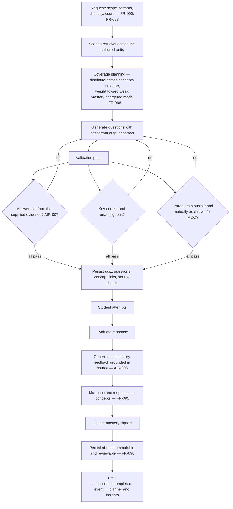

### 22.1 Design notes

- **Answerability is verified against the evidence envelope, not asserted.** AIR-007 requires generated items to be answerable from the student's materials at the stated scope. The validation pass checks each question against the supplied chunk set; a question that cannot be answered from it is regenerated, not shipped.
- **Grading is format-appropriate.** Multiple choice and true/false are deterministic — no model involved, no cost, no variance. Short answer, long answer, numerical, and derivation formats use model evaluation with a rubric-style contract. Deterministic grading where possible is both a cost decision (BM-05) and a correctness decision.
- **Feedback explains reasoning, never just the key** (AIR-008), and cites source material like any other grounded output.
- **Numerical and derivation formats (FR-092, V1)** require a tolerance and working-steps contract; they are specified now because they change the response schema, and schema changes are expensive after launch.
- **Attempt history is immutable and comparable** (FR-096, AD-07). Examination simulation (FR-097, V2) is a session-mode layer over the same pipeline — timing, no mid-attempt feedback, a summative report — not a second pipeline.
- **Student reports of bad questions (AIR-011)** route into the assessment-validity evaluation set (PRD §18.4), closing the loop on R-14.

---

## 23. Study Planner Pipeline

**AD-25 — Planning is a deterministic scheduling computation with a thin generative layer, not a model-generated plan.**

*Rationale.* FR-103 requires plans built from assessment dates, syllabus coverage, mastery signals, and declared availability. All four are structured data the system already holds. Asking a model to schedule against them is slower, more expensive, non-reproducible, harder to explain, and prone to arithmetic error. A deterministic scheduler is fast, cheap, testable, and — critically for FR-104's non-punitive re-planning and FR-122's evidence-citing insights — **explainable**: the system can always state exactly why an item is scheduled.

The model contributes what it is genuinely better at: phrasing the plan supportively, and articulating the rationale in plain language (NFR-054, RAI-06).

```mermaid
flowchart TD
    subgraph IN["Inputs — all structured, all owned"]
        I1["Academic events: assessments, deadlines, labs, exams — FR-100, FR-101"]
        I2["Syllabus coverage per structure unit — FR-120"]
        I3["Mastery signals per concept — FR-121"]
        I4["Declared availability and preferences"]
        I5["Due flashcard load from scheduler"]
        I6["Historical completion behaviour"]
    end

    IN --> SC["Deterministic scheduler"]
    SC --> C1["Weight by proximity, weight, coverage gap, mastery deficit"]
    C1 --> C2["Allocate to available blocks, respecting spacing and load limits"]
    C2 --> C3["Produce ordered plan items with explicit rationale data"]
    C3 --> GEN["Thin generative layer — supportive phrasing only"]
    GEN --> OUT["Study plan with a single prioritised next action — FR-105"]
    OUT --> ADAPT{"Reality changed?"}
    ADAPT -->|session missed| RP["Re-plan, redistribute, no guilt framing — FR-104, RAI-06"]
    ADAPT -->|new event or resource| RP
    ADAPT -->|mastery updated by attempt| RP
    ADAPT -->|student override or dismissal| RP2["Accept override as authoritative — FR-106"]
    RP --> OUT
    RP2 --> OUT
```

### 23.1 Design notes

- **Re-planning is event-driven, not scheduled.** `assessment.completed`, `resource.ready`, `event.created`, `plan_item.missed`, and `mastery.updated` all invalidate the plan and trigger recomputation (§25). This is what makes "adapts continuously" (PRD §15.7) true rather than nightly.
- **FR-104 is a tone requirement with an architectural consequence.** A missed session must not persist as an overdue item accumulating visual debt. Missed items are *absorbed into the redistribution* and the plan is regenerated. There is no "overdue" state in the plan item model. NG-09 and RAI-06 make this binding.
- **FR-105 — the single next action** is a precomputed, cached projection on the Today surface, refreshed on plan invalidation. It must render instantly (NFR-001); it is never computed on page load.
- **FR-106 — student override is authoritative.** An override is recorded as a constraint on subsequent re-planning, not as a one-time exception the scheduler forgets. PR-01 and PR-04 both point the same way: the student's judgement outranks the system's.
- **Timetable extraction (FR-101)** runs through the same ingestion pipeline as any resource, with a task-specific structured-output contract producing candidate `academic_events`. **Student confirmation is mandatory** before events are created — a misparsed timetable that silently populates a calendar is worse than no timetable parsing at all.

---

## 24. Background Jobs

### 24.1 Job taxonomy

| Job class | Trigger | Priority | Idempotency key |
| --- | --- | --- | --- |
| `resource.ingest` | Upload complete | Interactive — student is watching | `resource_id + content_hash` |
| `resource.extract` | Post-validation | Interactive | `resource_id + extractor_version` |
| `resource.index` | Post-extraction | Interactive | `resource_id + chunking_version + embedding_version` |
| `resource.classify` | Post-extraction | Interactive | `resource_id + classifier_version` |
| `summary.generate` | Post-index | Interactive | `resource_id + prompt_version` |
| `note.generate` | Student request | Interactive | `scope_hash + prompt_version + request_id` |
| `cards.generate` | Student request | Interactive | `scope_hash + prompt_version + request_id` |
| `quiz.generate` | Student request | Interactive | `scope_hash + params_hash + request_id` |
| `plan.recompute` | Domain event | Deferred | `student_id + plan_version` |
| `insights.evaluate` | Scheduled + event | Batch, off-peak | `student_id + window` |
| `mastery.recompute` | Attempt recorded | Deferred, coalesced | `student_id + concept_id + attempt_watermark` |
| `export.build` | Student request | Deferred | `student_id + export_id` |
| `deletion.execute` | Deletion request | Guaranteed, highest durability | `deletion_request_id` |
| `reindex.backfill` | Version upgrade | Background, throttled | `resource_id + target_version` |

### 24.2 Job execution guarantees

**AD-26 — Every job is idempotent, checkpointed, resumable, and observable. A worker may be killed at any instant without data loss or duplicate effect.**

| Guarantee | Mechanism |
| --- | --- |
| At-least-once delivery | Visibility timeout with heartbeat; unacknowledged jobs return to the queue |
| Idempotent effect | Idempotency key checked at claim; completed keys short-circuit |
| Checkpointing | Multi-step jobs persist intermediate artifacts. A failure after extraction never re-runs extraction — the expensive step is never repeated for free |
| Bounded retry | Exponential backoff with jitter, capped attempts, then dead-letter |
| Dead letters are visible | A dead-lettered job surfaces an honest student-facing state with a recovery action (NFR-014) — never silent loss |
| Poison-message isolation | A file that crashes a parser is quarantined for offline analysis, not retried indefinitely at cost |
| Progress observability | Every transition writes to `job_events` and publishes on Realtime (FR-036) |
| Cost accounting | Every job records its inference and compute cost against the student (BM-03) |

### 24.3 Priority and fairness

Four priority classes: **Interactive** (student waiting), **Deferred** (student will notice within minutes), **Batch** (off-peak), **Background** (backfills, throttled).

- **Per-student fairness caps** prevent one student's bulk upload of 200 files from starving the queue for everyone. This is a real scenario — Persona 5, the class resource hub, does exactly this.
- **Plan-based priority** implements the PRD's Pro-tier "priority processing during peak periods" (§25.2) as a queue weighting, not a separate infrastructure.
- **Exam-period load shedding ladder** (§39.3): Background pauses first, then Batch defers, then Deferred queues, and only if all of that is insufficient does Interactive degrade. Read paths never shed (EP-06, NFR-012).

---

## 25. Event Flow

### 25.1 Domain events

**AD-27 — Domain events are written to a transactional outbox in the same transaction as the state change, then dispatched asynchronously.**

This eliminates the dual-write problem entirely: an event is never emitted for a state change that rolled back, and a committed state change never fails to emit its event.

```mermaid
flowchart LR
    subgraph TX["Single database transaction"]
        W["Domain write"] --> OB["Outbox insert"]
    end
    OB --> D["Dispatcher"]
    D --> S1["Job queue"]
    D --> S2["Analytics — PostHog, content-free"]
    D --> S3["Realtime — client push"]
    D --> S4["Audit log"]
    D --> S5["Cost ledger"]
```

### 25.2 Core event catalogue

| Event | Subscribers | Effect |
| --- | --- | --- |
| `resource.uploaded` | Ingestion, analytics | Start pipeline; count first-upload for activation metric |
| `resource.ready` | Summary, planner, insights, analytics | Generate summary; recompute coverage; may invalidate plan |
| `resource.classified` | Client, analytics | Update placement; record confidence for R-02 monitoring |
| `structure.changed` | Cache, retrieval, projections | Invalidate scope resolutions and Today projection |
| `conversation.answered` | Analytics, evaluation | Record grounding telemetry; north-star activity signal |
| `attempt.recorded` | Mastery, planner, insights | Recompute mastery (coalesced); invalidate plan |
| `mastery.updated` | Planner, insights | Re-prioritise plan; may qualify an insight |
| `event.created` | Planner | Invalidate plan |
| `plan.invalidated` | Planner worker | Recompute plan and next action |
| `insight.generated` | Delivery, rate limiter | Apply FR-124 rate limits and notification preferences |
| `share.created` / `share.revoked` | Sharing, audit | Grant or revoke capability; audit trail |
| `deletion.requested` | Deletion orchestrator | Begin cascade (§37) |
| `ai.invoked` | Cost ledger, evaluation | Cost per student (BM-03); quality sampling |
| `entitlement.changed` | Policy cache | Refresh limits |

### 25.3 Analytics event discipline

**NFR-046 is binding: analytics must answer product questions without access to the substance of student academic content.**

Architecturally: the analytics adapter accepts a typed event with an allowlisted property schema. Free-text properties are prohibited at the type level. A subject is reported as a discipline category and a structure-label vocabulary, never as its title. A resource is reported as a type, size bucket, and confidence band, never as its filename. A tutor interaction is reported as scope level, latency, citation count, and grounding outcome, never as the question.

This is not a policy document; it is a compile-time constraint. The PostHog adapter cannot transmit a property that is not in the allowlisted schema defined in `docs/ANALYTICS.md`.

---

## 26. State Management Strategy

**AD-28 — Four state categories, four mechanisms, no overlap.** Most frontend complexity comes from managing one category with the tool for another.

| Category | Mechanism | Notes |
| --- | --- | --- |
| **Server state** | TanStack Query with normalised keys | Cache, background refetch, optimistic mutation, retry. Never mirrored into a global store |
| **Persistent local state** | On-device SQLite (mobile) / IndexedDB (web) with a typed schema | The offline substrate: downloaded decks, cached structure trees, note buffers, outbox |
| **Ephemeral UI state** | Component state, or a small Zustand store where genuinely cross-component | Scope selector, review session position, modals |
| **Realtime state** | Realtime subscription writing directly into the query cache | Job progress and artifact readiness arrive as cache updates, not as a parallel state tree |

Rules:

- **Query keys are derived from domain identity** (`['subject', subjectId, 'structure']`) and are defined once in `@avora/core` so client and server agree. Invalidation on a domain event is then a mechanical mapping from event to key set.
- **Optimistic updates are permitted only where the server outcome is deterministic** — creating a note, correcting a classification, grading a card. They are never used for AI generation, where the outcome is genuinely unknown.
- **The client never derives authoritative state from AI output.** Mastery, scheduling, and coverage are server-derived; the client displays them.

---

## 27. Offline and Synchronisation Strategy

The PRD makes offline a requirement, not a nicety: NFR-053 (usable degradation on intermittent connectivity), NFR-015 (edits preserved against connectivity loss), FR-085 (offline deck review with deferred sync), and constraint *"unreliable connectivity in the target market"* (§31.2).

**AD-29 — Offline scope is bounded and explicit. Avora is offline-capable, not local-first in the general case.**

| Capability | Offline behaviour |
| --- | --- |
| Downloaded flashcard decks | **Full review, offline** — attempts queued (FR-085) |
| Downloaded notes and summaries | **Read, and edit into a local buffer** (NFR-015) |
| Downloaded resources | **Read** |
| Structure tree and subject list | **Read from cache**, marked stale |
| Today surface | **Read last projection**, marked stale |
| Search | **Local title and cached-content search only**; semantic search requires connectivity, and says so |
| Tutor | **History readable**; new questions queued with an honest "will send when connected" state |
| Upload | **Queued locally**, uploads automatically on connectivity — the single most important offline behaviour, because it protects the upload-on-receipt habit (PRD §21.3) |
| Generation of any kind | Unavailable, honestly stated |

### 27.1 Synchronisation model

```mermaid
flowchart TD
    subgraph DEV["Device"]
        UI["UI"] --> LS[("Local store")]
        LS --> OUT["Outbox — ordered, idempotent mutations"]
    end
    OUT -->|on connectivity| API["API"]
    API --> SRV[("Server state")]
    SRV -->|reconciled state| LS
    SRV --> RT["Realtime"]
    RT --> LS

    subgraph RULES["Merge rules by data class"]
        R1["Attempts — append-only log, union merge, no conflict possible"]
        R2["Notes — server is authoritative; local edit becomes a revision, never silently discarded"]
        R3["Card states — derived server-side by replaying attempts"]
        R4["Uploads — content-hash idempotent, no duplicates"]
        R5["Structure changes — last-write-wins with audit trail"]
    end
```

**The design choice that makes this tractable: synchronise intent, not state.** The outbox carries *what the student did* (reviewed card X with grade G at time T; edited note N to content C at time T), not *what the state became*. Because attempts are immutable and idempotent (AD-07, AD-23), most merges are set unions with no conflict resolution at all.

**The one genuine conflict case is note editing** from two devices. Resolution: the server keeps both as revisions and surfaces the divergence to the student rather than silently choosing. NFR-015 and PRD Appendix C item 6 both forbid destroying student-authored content; a silent last-write-wins on note bodies would violate them.

### 27.2 Storage budgeting

NFR-052 requires usability on low-end devices with constrained storage. The local store enforces a budget with LRU eviction of downloaded originals and derivatives, never of the outbox, never of local note buffers, and never of card states with unsynced attempts. The student sees storage consumption and can pin or unpin content. Eviction of unsynced student work is prohibited by construction.

---

## 28. Caching Strategy

| Layer | What | Invalidation | Requirement |
| --- | --- | --- | --- |
| **Cloudflare edge** | Static assets, marketing, public pages | Deploy-versioned URLs | NFR-001 |
| **Signed media** | Resource originals and derivatives | Short TTL matching signed URL lifetime; identity-scoped cache keys | §13.3 |
| **Client query cache** | All server state | Domain-event-driven key invalidation | NFR-002 |
| **Client local store** | Offline subset | Sync reconciliation | §27 |
| **Today projection** | Precomputed next action, upcoming events, due counts, active insights | Recomputed on `plan.invalidated`, `event.created`, `attempt.recorded` | **NFR-001** — home must render instantly |
| **Scope resolution cache** | Resolved chunk-id predicates per scope | `structure.changed`, `resource.ready` | Retrieval latency (AD-03) |
| **Embedding cache** | Keyed by chunk content hash and embedding model version | Never invalidated; new version is a new key | **Cost** — re-embedding identical content is pure waste |
| **Extraction cache** | Keyed by file content hash and extractor version | Same | **Cost** — the same lecture PDF shared across a class is extracted once per version, not once per student |
| **Generation dedupe** | Keyed by scope hash, params hash, prompt version | Explicit regeneration bypasses | **BM-05** — prevents accidental duplicate spend |

**AD-30 — Content-addressed caching of extraction and embeddings is a first-class cost control.**

In the beachhead, an identical faculty-distributed PDF circulates through an entire class. Content-hash-keyed extraction and embedding caches mean the marginal cost of the hundredth student uploading that file approaches zero. This is one of the largest available levers on cost per student (R-11, NFR-022, BM-02), and it is available *only* because originals are immutable and extraction is versioned (AD-06).

**Privacy constraint, binding.** The cache is keyed by content hash and stores only derived representations — never the file, never an association between students. Student A cannot learn that Student B uploaded the same file, no cache entry is attributable to any student, and cache hits are invisible in every student-facing surface. Each student's `chunks` rows are their own, RLS-protected, and independently deletable; the shared artifact is the *computation result*, never the *ownership record*. This is compatible with FR-140 and NFR-042: deleting a student's resource deletes their chunks, embeddings row references, and original, regardless of cache state.

---

## 29. Search Strategy

Unified search (FR-110 to FR-114, V1) spans resources, extracted content, notes, flashcards, quiz questions, and conversations.

```mermaid
flowchart TD
    Q["Query + filters: subject, structure unit, term, artifact type — FR-112"] --> P["Pre-filter by student and filters"]
    P --> A1["Chunks — semantic + keyword"]
    P --> A2["Notes — semantic + keyword"]
    P --> A3["Flashcards — keyword-weighted"]
    P --> A4["Quiz questions — keyword-weighted"]
    P --> A5["Conversations — semantic"]
    P --> A6["Resource titles and filenames — trigram fuzzy"]
    A1 & A2 & A3 & A4 & A5 & A6 --> F["Reciprocal rank fusion across artifact types"]
    F --> B["Boost: current term, recent activity, high-confidence extraction"]
    B --> R["Grouped results by artifact type"]
    R --> ACT["Result actions: open, or start a scoped tutor conversation — FR-114"]
```

Design notes:

- **One query, many artifact types, fused.** Not five separate searches presented in tabs — the student thinks "where is that thing", not "which artifact type is that thing".
- **NFR-005 gives a two-second budget.** Achieved through pre-filtering (AD-19), HNSW indexes, GIN indexes, and parallel per-type queries with a hard timeout that returns partial results rather than nothing. A slow artifact type degrades its own results, never the whole search.
- **FR-113 cross-term search (V2)** is a filter widening, not a new subsystem — because the Academic Graph never resets (D-06) and prior-term data remains in the same tables, possibly on colder partitions.
- **FR-114** — moving from a result into a scoped tutor conversation is a scope handoff: the result's artifact defines the initial scope. This is the feature that makes search feel like an operating system rather than a filter (PRD §15.8).

---

## 30. Sharing Architecture

Sharing (FR-130 to FR-134, V1) is the primary growth loop (PRD §28.2, Persona 5) and simultaneously a privacy and injection surface. It is deliberately minimal.

```mermaid
flowchart TD
    A["Student selects a resource or a structure unit"] --> B["Explicit per-action consent — FR-131"]
    B --> C["Create share_grant: what, expiry, revocable"]
    C --> D["Issue link or short code"]
    D --> E["Recipient opens"]
    E --> F{"Grant active and unexpired?"}
    F -->|no| G["Honest revoked or expired state"]
    F -->|yes| H["Read through share projection view"]
    H --> I["Exposed: resource, extracted content, structure titles and labels"]
    H --> J["Structurally excluded: notes, mastery, attempts, conversations, insights — FR-133"]
    I --> K{"Recipient imports? — FR-134, V2"}
    K -->|yes| L["Copy into recipient's workspace as their own editable artifact"]
    L --> M["Treated as untrusted input: full ingestion validation and AIR-013 sealing"]
```

Binding properties:

- **Never on by default** (FR-131). There is no "share with class" toggle, no default-public state, no discoverability surface. NG-03 forbids the product becoming a social network.
- **Exclusions are structural** (FR-133): the projection view cannot select the excluded columns. A future engineer adding a field to the shared payload must edit the view, which is a reviewed change, rather than forgetting a filter.
- **Revocation is immediate** (FR-132), bounded only by the short signed-URL TTL, which is disclosed.
- **Imported content is untrusted content.** A structure unit imported from a peer passes through the same validation and the same AIR-013 sealing as any upload. This is the specific vector R-13 names.
- **PRD OQ-05 — live reference versus independent copy — is unresolved.** The architecture ships the copy model (FR-134 says "as an editable copy") and does not build reference semantics until the question is answered, because live references would create a cross-student data dependency that materially complicates deletion (NFR-042) and ownership (PRD §19.3).

---

## 31. Billing and Entitlements Architecture

### 31.1 Payment providers

**AD-31 — Stripe is the system of record for plans, subscriptions, and entitlements. A domestic Indian PSP adapter handles collection for locally dominant instruments.** *(AOQ-03.)*

*Rationale.* The PRD requires payment processing that supports locally dominant instruments (§31.1 Dependencies) and pricing anchored to Indian student affordability (§25.3). UPI is the dominant student payment instrument in the beachhead, and recurring UPI mandates have domestic-specific mechanics. Relying solely on card rails would suppress conversion in the exact market the product launches into — an A-06 invalidation caused by architecture rather than by willingness to pay.

Rather than choose between them, the architecture splits the concern:

- **`BillingPort`** — plans, subscription state, entitlement resolution, proration, dunning. Stripe-backed.
- **`PaymentCollectionPort`** — instrument-specific collection, mandates, recurring authorisation. Domestic PSP for India; Stripe elsewhere.

Entitlement state is Avora's own, derived from webhooks and reconciled on a schedule. **Entitlement is never read live from a payment provider on a request path** — that would put a third party in the latency and availability path of every AI call.

Other binding requirements: **semester-length billing as the promoted default** (§25.3) is a plan-duration concept, not a discount code; **third-party payment by a guardian without account sharing** (§7.5, §25.3) means the payer identity is separable from the student identity in the subscription model; **purchasing-power-adjusted regional pricing** (§25.3) means price is a function of region from day one, not a hardcoded amount.

### 31.2 Metering and enforcement

**AD-32 — Usage is metered in a unit-agnostic internal ledger and translated to the student-facing unit at the presentation layer.** *(PRD OQ-03 / AOQ-04 is unresolved — the internal design must not depend on its answer.)*

- Every AI invocation writes to `usage_ledger` with student, task class, tokens, provider cost, and timestamp.
- Entitlement checks read a cached, per-student aggregate. **Checked before scheduling work**, never after (§5.4).
- Approaching a limit produces a warning; reaching one produces an honest state with a clear action — never a silent failure and never a degraded-quality response pretending to be a normal one (NFR-014, FR-042, FR-144).
- **Free-tier cost is bounded by enforcement, not observed by reporting** (BM-02). This is the difference between a viable free tier and an unbounded liability.
- Cost per student is a live operating metric with anomaly alerting (BM-03, NFR-072).

---

## 32. Folder Structure Philosophy

**AD-33 — A single pnpm + Turborepo monorepo, organised by domain first and by technology second.**

*Rationale.* One repository gives atomic cross-cutting changes (a domain type change updates web, mobile, and worker in one commit), one CI pipeline, one set of contracts, and — decisively for AG-10 — **one place an AI coding agent must look to understand the system.** A polyrepo would make contract drift between clients and server a routine occurrence.

```
avora/
├── .github/                     # Forge governance: CODEOWNERS, workflows, templates,
│                                #   freeze calendar (AD-34). Protected — ENG-322.
│
├── docs/                        # Documentation-first. The plan of record.
│   ├── PRD.md                   # Source of truth. Never contradicted.
│   ├── architecture.md          # This document.
│   ├── DATA-MODEL.md            # Concrete schema realising the Academic Graph
│   ├── AI-SPEC.md               # Retrieval, grounding, prompting, evaluation
│   ├── SECURITY.md              # Threat model, controls, incident response
│   ├── PRIVACY.md               # Data inventory, purposes, retention, deletion
│   ├── DESIGN-SYSTEM.md         # Tokens, components, accessibility
│   ├── UX-FLOWS.md              # Interaction specs per surface
│   ├── ANALYTICS.md             # Event taxonomy — the analytics allowlist
│   ├── TEST-PLAN.md             # Verification strategy per requirement
│   ├── ROADMAP.md               # Delivery sequencing
│   └── adr/                     # Architecture decision records, one per AD-##
│
├── apps/
│   ├── web/                     # Next.js — web client + API route handlers
│   ├── mobile/                  # Expo — primary client (AOQ-02)
│   └── worker/                  # Container worker plane (AD-08)
│
├── packages/
│   ├── core/                    # @avora/core — domain types, contracts, validation, query keys
│   ├── domain/                  # Domain services and invariants, per §5.3 module list
│   ├── db/                      # Data-access mechanism: role-scoped clients, generated schema
│   │                            #   types, RepositoryPort, RLS policy-test harness. Migrations
│   │                            #   live in supabase/migrations/; per-module query objects live
│   │                            #   in packages/domain/<module>/repositories/ per ENG-016.
│   ├── ai/                      # AI Gateway, ports, adapters, prompts, routing policy, evals
│   ├── adapters/                # Non-AI vendor adapters — auth, storage, realtime, mail,
│   │                            #   billing, payment collection, telemetry, analytics
│   ├── retrieval/               # Chunking, embedding, scope resolution, hybrid search
│   ├── jobs/                    # Queue abstraction, job definitions, state machines
│   ├── ui-web/                  # shadcn/ui primitives + web domain components
│   ├── ui-mobile/               # NativeWind primitives + mobile domain components
│   ├── design-tokens/           # Shared source of truth for both UI packages
│   └── config/                  # Shared tsconfig, eslint, tailwind, env schema
│
├── supabase/
│   ├── migrations/              # Versioned SQL, expand/contract discipline
│   ├── policies/                # RLS policies as reviewed artifacts
│   └── functions/               # Edge Functions — short, data-adjacent only
│
├── e2e/
│   ├── flows/                   # Critical end-to-end journeys
│   ├── adaptivity/              # AD-41 structural adaptivity suite
│   ├── load/                    # Exam-period simulation
│   └── fixtures/                # Shared synthetic corpora
│
└── evals/
    ├── corpora/                 # Consented evaluation corpora (AD-21) — access-controlled
    └── suites/                  # Grounding, citation, extraction, assessment validity
```

### 32.1 Organising rules

1. **Domain first.** Inside `packages/domain`, the top level is `academic/`, `resources/`, `tutor/`, `recall/` — the PRD's vocabulary, not `services/`, `helpers/`, `utils/`. An engineer or agent looking for flashcard logic looks in `recall/`.
2. **The PRD's glossary is the naming authority.** `structure_unit`, not `folder` or `section`. `resource`, not `file` or `document`. `mastery_signal`, not `score`. Divergence between code vocabulary and product vocabulary is how product decisions get quietly reinterpreted.
3. **Ports live with the domain; adapters live at the edge.** A vendor name never appears in a path outside an adapter directory. There are exactly two adapter directories: `packages/ai/adapters/` for model, embedding and orchestration providers, and `packages/adapters/` for every other external vendor. They are kept separate because the AI adapters carry gateway obligations (`NN-02`, `AD-12`) that the others do not. This is grep-checkable and is checked in CI.
4. **Contracts are generated, never hand-mirrored.** Types flow from `@avora/core` outward. Duplicated type definitions are a build failure.
5. **Every module has a README stating the PRD requirement identifiers it satisfies.** This makes NFR-063 traceability a property of the repository rather than a spreadsheet, and it gives coding agents local context without loading the whole architecture.
6. **`docs/adr/` records every AD-## with context, decision, consequences, and rejected alternatives.** This document is the synthesis; the ADRs are the history.
7. **This tree enumerates source-bearing and governance directories.** Root-level tooling and editor metadata — `package.json`, `pnpm-workspace.yaml`, `turbo.json`, `tsconfig.json`, `.npmrc`, `.nvmrc`, `.gitignore`, `.gitattributes`, `.env.example`, `.vscode/`, `AGENTS.md`, `CLAUDE.md`, `README.md`, `LICENSE`, `CODEOWNERS` — is governed by `REPOSITORY.md` §11 and does not require a §32 amendment. `ENG-010` binds on directories that hold source, tests, schema, evaluation corpora, documentation, or an enforcement gate.

**Component layers map to packages as follows:** layers 1 and 2 (primitives and domain components, §7.4) live in `packages/ui-web` and `packages/ui-mobile`; layer 3 (surface compositions) lives in `apps/*`, because a screen imports routing and routing is an application concern.

---

## 33. Deployment Architecture

```mermaid
graph TB
    subgraph USERS["Students — beachhead: India, mobile-dominant"]
        AND["Android"]
        IOS["iOS"]
        BR["Browser"]
    end

    subgraph CF["Cloudflare"]
        DNS["DNS"]
        WAF["WAF + bot management + rate limiting"]
        CDNL["CDN — static and signed media"]
    end

    subgraph VERCEL["Vercel"]
        EDGE["Edge middleware — auth check, routing"]
        NEXT["Next.js — RSC, route handlers, streaming"]
        PREV["Preview deployments per pull request"]
    end

    subgraph WORKER["Worker plane — container runtime, ap-south"]
        WI["Ingestion workers — autoscaled on queue depth"]
        WG["Generation workers"]
        WB["Batch workers — planner, insights, backfills"]
    end

    subgraph SUPA["Supabase — ap-south-1 primary"]
        PGP[("Postgres primary")]
        PGR[("Read replica — search and analytics reads")]
        STOR[("Object storage — replicated")]
        AUTHS["Auth"]
        RTS["Realtime"]
        EF["Edge Functions"]
    end

    subgraph EXT["External"]
        LLMS["Model providers — multi-region"]
        STRIPE["Stripe"]
        PSP["Domestic PSP"]
        RESEND["Resend"]
        SENTRY["Sentry"]
        POSTHOG["PostHog"]
    end

    subgraph DIST["Distribution and QA"]
        PLAY["Play Store"]
        APPST["App Store"]
        TF["TestFlight"]
        FTL["Firebase Test Lab — low-end device matrix"]
    end

    AND & IOS & BR --> DNS --> WAF --> CDNL --> EDGE --> NEXT
    NEXT --> PGP
    NEXT --> PGR
    NEXT --> AUTHS
    NEXT --> STOR
    NEXT --> STRIPE
    NEXT --> PSP
    NEXT --> RESEND
    AND & IOS -.direct resumable upload.-> STOR
    AND & IOS & BR -.realtime.-> RTS
    NEXT -->|enqueue| PGP
    PGP -->|queue| WI & WG & WB
    WI & WG & WB --> PGP
    WI --> STOR
    WG --> LLMS
    WI --> LLMS
    NEXT & WI & WG & WB -.telemetry.-> SENTRY
    AND & IOS & BR -.events.-> POSTHOG
    AND --> PLAY
    IOS --> APPST
    IOS --> TF
    AND --> FTL
```

### 33.1 Environments

| Environment | Purpose | Data |
| --- | --- | --- |
| Local | Development | Seeded synthetic data. **Never production data.** |
| Preview (per PR) | Review, automated checks, design review | Ephemeral, seeded |
| Staging | Release candidate, load tests, DR drills, Antigravity-disabled parity test (AD-16) | Synthetic at production scale |
| Production | Students | Real, ap-south-1 (AOQ-05) |

### 33.2 Release process

1. PR with a linked requirement identifier (NFR-063) → preview deployment.
2. CI gates: types, lint (including architecture lint rules — no vendor names outside adapters, no forbidden hierarchy identifiers, no unlabelled AI content renderers), unit, integration, **RLS negative-authorisation suite**, **AI evaluation suite** (§42.3), bundle size, accessibility checks.
3. Migration check: expand/contract compliance, lock analysis, rollback plan present.
4. Merge → staging → smoke and load verification.
5. Production via progressive rollout with automatic rollback on error-rate, latency, or grounding-quality regression.
6. Mobile: staged store rollout; TestFlight for iOS beta; Firebase Test Lab low-end matrix must pass before submission (NFR-052).

**AD-34 — Calendar-aware release policy.** Deployment freezes during examination windows for the institutions in the active cohort (R-31, NFR-012). The academic calendar is an input to the release process, encoded in CI, not a thing someone remembers. Emergency fixes require an explicit override with a named approver.

---

## 34. Monitoring and Observability Architecture

The PRD requires monitoring of things most products never instrument: AI response quality, grounding failure rates, ingestion success rates (NFR-070), and cost-per-student anomalies (NFR-072). These are treated as production signals with alerts, not offline analyses (EP-08).

### 34.1 Signal layers

| Layer | Tooling | Key signals |
| --- | --- | --- |
| **Errors** | Sentry | Client, server, worker exceptions; release health; crash-free rate on low-end devices |
| **Traces** | OpenTelemetry | End-to-end spans: client → API → retrieval → provider → response. One trace id per student action |
| **Product analytics** | PostHog | Content-free events (§25.3): activation funnel, time-to-first-value, north-star weekly active studying students |
| **AI quality** | Internal eval store + PostHog | Grounding fidelity, citation validity, refusal correctness, extraction accuracy, assessment validity, student-reported usefulness (PRD §18.4) |
| **Cost** | Internal cost ledger | Cost per student, per task class, per model; free-tier cost distribution (BM-02, BM-03) |
| **Infrastructure** | Platform metrics | Queue depth by priority, worker saturation, DB connections, replication lag, storage growth |
| **Availability** | Synthetic probes | Core read paths from Indian network vantage points, measured monthly against NFR-011's 99.9% |

### 34.2 Golden signals per subsystem

| Subsystem | Latency | Traffic | Errors | Saturation |
| --- | --- | --- | --- | --- |
| Read paths | p50/p95/p99 (NFR-002) | RPS | 5xx rate | DB connections, replica lag |
| Tutor | **Time to first token** (NFR-003) | Conversations/hour | Provider failures, blocked-citation rate | Provider rate-limit headroom |
| Ingestion | Time to `ready` (NFR-004) | Uploads/hour | Rejection, failure, `partial` rates | Queue depth, worker saturation |
| Search | p95 (NFR-005) | Queries/hour | Timeout rate | Index size, HNSW query time |
| Jobs | Queue wait by priority | Jobs/hour | Dead-letter rate | Depth per class |

### 34.3 Alerting

Alerts are tied to PRD requirements, so every page has a stated reason to exist:

| Alert | Threshold | Traces to |
| --- | --- | --- |
| Core read availability below target | Rolling window | NFR-011 |
| Ingestion backlog growth | Sustained queue depth increase | **NFR-072** (explicit) |
| Ingestion failure rate spike | Above baseline | R-01 |
| **Citation verification failure** | **Any occurrence** | **AIR-006 — severity one** |
| Grounding fidelity regression | Below eval threshold | AIR-001, R-10 |
| Cost per student anomaly | Deviation from baseline | **NFR-072, BM-03** (explicit) |
| Provider failover activation | Any sustained failover | R-12, AIR-012 |
| Low-confidence extraction rate rise | Above baseline | R-01 |
| Classification correction rate rise | Above baseline | R-02 |
| Exam-window capacity headroom | Below reserve | NFR-012, R-31 |

### 34.4 AI quality as a production signal

**AD-35 — AI quality is continuously evaluated in production through sampling, not only offline before release.**

- A sampled percentage of grounded responses is automatically checked for citation resolvability and claim support.
- Every student report (AIR-011, NFR-071) enters the evaluation queue with the invocation's full context — prompt version, model version, retrieved chunk ids, output.
- Regression detection compares rolling quality metrics across prompt and model versions; a routing-policy change that degrades grounding fidelity triggers automatic rollback (§14.3).
- The evaluation corpus retention window is **AOQ-06, unresolved** — a genuine tension between evaluation quality and privacy surface (NFR-040 minimisation). Until resolved, evaluation payloads are retained for the shortest window that permits regression detection, are access-controlled to a named group, and are covered by the deletion cascade (§37).

---

## 35. Logging Strategy

**AD-36 — Three log streams with different retention, access, and content rules. Student academic content never appears in any of them.**

| Stream | Contents | Retention | Access | Requirement |
| --- | --- | --- | --- | --- |
| **Application logs** | Structured events: trace id, student id, operation, outcome, timing. **No content, no filenames, no question text, no extracted text.** | Short (days) | Engineering | **NFR-036** |
| **Security and audit log** | Authentication events, authorisation denials, privilege use, share creation and revocation, deletion requests and completions, admin access, consent changes | Long, tamper-evident, append-only | Restricted, reviewed | **NFR-036**, PRD §19.2 |
| **AI invocation records** | Prompt version, model version, task, token counts, latency, cost, retrieved chunk ids, grounding outcome. Payload content only under the AOQ-06 policy. | Per AOQ-06 | Restricted | PRD §18.4, BM-03 |

Binding rules:

- **NFR-036 states the constraint precisely: security-relevant events must be logged in a form that supports investigation *without logging sensitive student content*.** Logging a resource *id* is correct; logging its filename or text is not. Filenames are student-authored content and frequently reveal subject, institution, and personal information.
- **Redaction is structural.** The logger accepts typed fields; there is no `log(anything)` signature that can accidentally serialise a domain object containing content. Attempting to log a type carrying content fails type-checking.
- **Every log line carries the trace id**, so an investigation can reconstruct a student action end-to-end without ever reading their material.
- **Audit log entries are append-only and immutable**, written in the same transaction as the audited change where possible.
- **The audit log is inside the deletion cascade for content-derived fields but outside it for security-integrity records**, which are retained for their stated period. This tension is real and is disclosed in `docs/PRIVACY.md`; the resolution is that audit records retain identifiers and event types, never content.

---

## 36. Security Architecture

### 36.1 Threat model summary

Full treatment belongs in `docs/SECURITY.md` (PRD Appendix B). The architecture-level threat classes and their primary controls:

| Threat | Impact | Primary control | Requirement |
| --- | --- | --- | --- |
| Cross-student data access | Critical — R-30 | RLS deny-by-default at the data layer; explicit ownership assertion in workers (AD-11) | NFR-031 |
| Credential compromise | High | No passwords at V0 (AD-09); short-lived tokens; rotating refresh with reuse detection; step-up re-auth | NFR-035, FR-002 |
| Malicious upload | High | Quarantine, sniffing, scanning, sanitisation, sandboxed parsing (§13.4) | NFR-034 |
| **Prompt injection via uploaded or shared material** | **High — R-13** | Sealed untrusted envelope; zero tool authority; sanitisation at chunk creation; system-policy precedence (AD-17) | **AIR-013** |
| Injection (SQL, XSS, SSRF, path traversal) | High | Parameterised queries only; typed contracts; output encoding; no user-controlled outbound URLs; allowlisted worker egress | NFR-033 |
| Insecure direct object reference | High | Ownership predicate, never identifier-only (the explicit NFR-031 wording) | NFR-031 |
| Secret leakage | High | No secrets in client bundles; service-role confined to workers; managed secret stores; rotation policy; secret scanning in CI | PRD §19.2 |
| Abuse and cost exhaustion | High — R-11 | Layered rate limiting; per-student budget enforcement before scheduling; anomaly alerting | NFR-022, BM-02 |
| Account takeover via recovery | High | OTP rate limits, device and location signals, step-up for sensitive actions, notification on recovery | FR-003, NFR-035 |
| Data exfiltration by insider | Critical | Least privilege (NFR-032); production access requires approval and is audited; no bulk export tooling in the application |
| Supply chain | Medium | Lockfiles, dependency scanning, provenance checks, minimal transitive surface |
| Share-link abuse | Medium | Non-enumerable tokens, expiry, revocation, rate-limited access, projection-view exclusions | FR-131 to FR-133 |

### 36.2 Defence-in-depth layers

```mermaid
flowchart TD
    L1["1. Edge — WAF, bot management, DDoS, IP rate limiting"] --> L2
    L2["2. Transport — TLS everywhere, HSTS, certificate pinning on mobile"] --> L3
    L3["3. Identity — verified JWT, short lifetime, rotating refresh, step-up"] --> L4
    L4["4. Contract — typed validation, no mass assignment, strict parsing"] --> L5
    L5["5. Policy — entitlement, quota, consent, share validity"] --> L6
    L6["6. Data — RLS deny-by-default, explicit ownership predicates"] --> L7
    L7["7. Storage — path-scoped policy, short-lived signed URLs, no public buckets"] --> L8
    L8["8. Processing — sandboxed parsing, constrained memory, allowlisted egress"] --> L9
    L9["9. AI — sealed untrusted envelope, zero tool authority, output validation"] --> L10
    L10["10. Observability — audit trail, anomaly alerting, incident response"]
```

### 36.3 Secrets and configuration

- **Typed environment schema, validated at boot.** A missing or malformed secret fails startup loudly rather than producing a runtime surprise in front of a student.
- **Three trust tiers, physically separated:** client-public values (bundled), server values (Vercel encrypted env), worker values including service-role and provider keys (worker secret store). A service-role key never exists in a runtime that accepts client input (AD-11).
- **Rotation is routine, not incident-driven**, with dual-key windows so rotation never requires downtime.
- **Secret scanning in CI and pre-commit**; a committed secret blocks the build and triggers rotation.

### 36.4 Rate limiting

Four layers, each with a different purpose:

| Layer | Basis | Purpose |
| --- | --- | --- |
| Edge | IP, ASN, bot signals | Volumetric abuse, scraping |
| Identity | Student id per endpoint class | Application abuse |
| Cost | Student id per AI task class, per plan | **Economic control — BM-02, NFR-022** |
| Fairness | Student id in the job queue | Prevents one bulk upload starving others (§24.3) |

The cost layer is distinct from the abuse layer and is not a security control — it is a business-viability control, and it must remain enforced even for entirely legitimate, well-behaved usage.

### 36.5 Assurance

- **Security review before every major release** (NFR-037), with AI-specific surfaces — injection, envelope integrity, output validation, tool authority — reviewed as their own class.
- **Documented vulnerability disclosure and response process** (NFR-037), published, with stated response targets.
- **Automated scanning** in CI: dependencies, static analysis, secret detection, container images.
- **Periodic penetration testing** before major horizons, with RLS and AI surfaces explicitly in scope.

---

## 37. Privacy and Deletion Architecture

The PRD makes four public trust commitments (§19.3) that must not be weakened. Two of them are architectural, and one of those — *"deletion means deletion"* — is the hardest engineering commitment in the document.

### 37.1 Data inventory and purpose binding

**AD-37 — Every column holding student data carries a classification and a stated purpose in the schema, and `docs/PRIVACY.md` is generated from it.**

Classifications: `identity`, `academic_content`, `derived_artifact`, `behavioural`, `operational`. A new column without a classification and purpose fails CI. This makes NFR-040 (minimisation) and NFR-041 (documented purpose) continuously true rather than periodically audited — and it makes the privacy notice a build artifact rather than a document that drifts from reality.

### 37.2 Deletion architecture

**AD-38 — Deletion is an orchestrated, tracked, verifiable, multi-store subsystem with a published completion window.**

```mermaid
flowchart TD
    A["Deletion requested — resource, artifact, or account"] --> B["Step-up re-authentication for account deletion — FR-002"]
    B --> C["Create deletion_request, record scope, start clock"]
    C --> D["Immediate: revoke access. Item disappears from every surface."]
    D --> E["Cascade execution — durable job, highest guarantee"]

    E --> F1["Primary rows — resource, chunks, embeddings, notes, cards, questions, attempts, messages, citations"]
    E --> F2["Object storage — originals, derivatives, exports, quarantine remnants"]
    E --> F3["Search and vector indices — verified removal, not just row delete"]
    E --> F4["Caches — query, projection, scope resolution, generation dedupe"]
    E --> F5["Analytics — deletion signal to PostHog for identified records"]
    E --> F6["Evaluation store — AI invocation payloads under AOQ-06"]
    E --> F7["Shares — grants revoked, projections dead"]
    E --> F8["Backups — crypto-shredding of per-student keys, or expiry within the published window"]

    F1 & F2 & F3 & F4 & F5 & F6 & F7 & F8 --> G["Verification pass — assert absence in every store"]
    G --> H{"All stores verified?"}
    H -->|no| I["Alert, retry, escalate. Never silently mark complete."]
    H -->|yes| J["Mark complete, record deletion receipt, notify student"]
```

Binding properties:

- **Access revocation is immediate; physical erasure completes within the published window** (NFR-042). Both facts are stated to the student in plain language. A student who deletes something never sees it again, in any surface, from that instant.
- **Verification is a real step.** The cascade asserts absence in each store and fails loudly if any store still holds the data. "We ran the delete statement" is not evidence of deletion.
- **Backups are the hard part, and are handled by design rather than by exception.** Per-student content encryption keys allow crypto-shredding — destroying the key renders backup copies unrecoverable immediately, without restoring and rewriting every backup. Where crypto-shredding is not applicable, the published window is set to exceed the backup retention period so expiry completes the deletion. Whichever mechanism applies is disclosed, not hidden behind "within a reasonable period".
- **The shared content-addressed cache is not an exception** (§28). It holds derived computation results keyed by content hash with no student association; the student's own chunks, embeddings, and original are deleted. No cache entry is attributable to any student, and nothing in the cache can reconstruct who uploaded what.
- **Deletion of an account removes derived artifacts too** (FR-005) — notes, cards, quizzes, conversations, mastery, plans, insights.
- **Deletion receipts** are retained as audit records containing identifiers and timestamps only, never content.

### 37.3 Consent and opt-out

- **FR-142** — opt-out of any use of content beyond serving the student's own workspace — is a **checked flag at every point of aggregate use**, not a preference stored and forgotten. The two aggregate uses that exist (structure-template enrichment, §10.4; AI evaluation corpora, §34.4) both read the flag as a precondition.
- **NFR-043 / trust commitment 2** — content never used to train third-party foundation models — is enforced contractually with each provider *and* architecturally: provider adapters must use no-training endpoints or equivalent contractual terms, and a provider that cannot offer them is not eligible for the routing policy. Provider eligibility is a documented gate in `docs/PRIVACY.md`.
- **FR-141** — plain-language explanation of what data personalises the experience — is generated from the same classification metadata as AD-37, so the in-product explanation cannot drift from the schema.
- **Data export (FR-004)** produces open, machine-readable formats covering resources, extracted content, notes, cards, quizzes, attempts, conversations, and structure — the whole Academic Graph. Export is a durable job with a signed, short-TTL, single-use download.

### 37.4 Data residency

Primary data plane in an Indian region (Supabase ap-south-1), consistent with NFR-045 and India's DPDP framework. **AOQ-05** resolves whether backups and DR may cross regions. Model provider processing may occur outside India; this is disclosed, is covered by processing agreements, and is a factor in provider eligibility. Where a provider offers regional processing, the routing policy prefers it.

---

## 38. Performance Strategy

Each NFR gets a named mechanism, because a performance requirement without a mechanism is a wish.

| Requirement | Target | Mechanism |
| --- | --- | --- |
| **NFR-001** | Launch to interactive under 3 s, mid-range device | Native client with minimal startup work; instant render from local store; Today projection precomputed (§28); network fetch is refresh, not blocking |
| **NFR-002** | Perceptible response within 100 ms | Optimistic mutation; local-first navigation; skeletons only where data genuinely cannot be local |
| **NFR-003** | Tutor streaming within 5 s | AD-03 — TTFT is the SLO; sub-1.2 s p95 retrieval; single round-trip hybrid query; streaming from first token; reranking only where it pays |
| **NFR-004** | Ingestion acknowledged instantly, typical doc under 2 min | Direct-to-storage upload; async pipeline; parallelised page processing; content-addressed extraction cache (AD-30) |
| **NFR-005** | Search under 2 s | Pre-filtered HNSW + GIN; parallel per-type queries; hard timeout returning partial results |
| **NFR-006** | Long ops resumable, no foreground requirement | Durable jobs (AD-26); background upload; Realtime reconciliation on return |
| **NFR-052** | Usable on low-end devices | Bundle budgets in CI; virtualised lists; bounded local storage with eviction (§27.2); Firebase Test Lab low-end matrix as a release gate |
| **NFR-053** | Useful degradation offline | §27 |

**Performance budgets are enforced in CI**, not measured after regression: bundle size, cold-start on a reference low-end device profile, p95 API latency in load tests, and retrieval latency. A PR that breaches a budget fails.

---

## 39. Scalability Strategy

### 39.1 Scaling dimensions

| Dimension | Requirement | Approach |
| --- | --- | --- |
| Students | Growth to national scale | Stateless request tier scales horizontally; per-student data is naturally partitionable by `student_id` |
| Corpus per student | NFR-020: 10 subjects, 500 resources, years of artifacts | Pre-filtered retrieval keeps per-student search cost near-constant regardless of total system size (AD-19) |
| Total vectors | System-wide growth | HNSW with per-student pre-filter; partition by student cohort if AS-01 is invalidated; dedicated store behind `RetrievalPort` as the escape hatch |
| Ingestion throughput | Bulk uploads, class-wide distribution | Queue-depth autoscaling of workers; content-addressed cache collapses duplicate work (AD-30) |
| **Seasonal spikes** | **NFR-021: order-of-magnitude around exams** | §39.3 |
| Historical accumulation | D-06: never discard across terms | Partition or archive cold terms by `term_id`; prior-term data stays queryable, on cheaper storage |

### 39.2 Read scaling

Read paths are the ones NFR-011 and NFR-012 protect. Read replicas serve search and analytics reads; the primary serves writes and consistency-critical reads. The Today projection and scope resolution caches remove the two hottest query patterns from the primary entirely.

### 39.3 Seasonality — the defining scalability problem

The academic calendar makes Avora's load **predictable and extreme**. R-31 rates availability failure during an examination period as Critical. The strategy:

1. **Forecast from the calendar.** Examination windows per institution in the active cohort are known data, held in the system. Capacity planning is scheduled against them, not reactive.
2. **Pre-provision reserve headroom** before each known window rather than relying solely on autoscale reaction time.
3. **Pre-compute ahead of the peak.** Insight evaluation, plan recomputation, and index backfills are scheduled into troughs, never into exam week.
4. **Shed load in a fixed, documented order** (§24.3): Background → Batch → Deferred → Interactive generation. **Read paths never shed.** A student in exam week must always be able to open their material and their existing notes, cards, and quizzes, even if new generation is queued (EP-06, NFR-013).
5. **Freeze releases** during active examination windows (AD-34).
6. **Staff for the peak.** The PRD names peak-period support staffing as an R-31 mitigation; on-call rotation and escalation are scaled accordingly.

---

## 40. Cost Optimization Strategy

NFR-022 makes cost per student a release-gating constraint, and R-11 rates cost overrun as Critical. Cost is therefore an architectural concern, not a finance concern.

### 40.1 Cost levers, in order of impact

| Lever | Mechanism | Traces to |
| --- | --- | --- |
| **1. Do not call a model at all** | Text-layer extraction for digital PDFs; deterministic grading for MCQ and true/false; deterministic planning (AD-25); classical OCR fast path for clean print | The cheapest inference is the one not performed |
| **2. Content-addressed caching** | Extraction and embedding keyed by content hash; one class-wide PDF processed once per version (AD-30) | BM-02, R-11 |
| **3. Task-appropriate routing** | Smallest capable model per task class (AD-13) | **BM-05** (explicit) |
| **4. Context economy** | Token budgets per task; retrieval returns the smallest sufficient evidence set; conversation compaction rather than full history | Largest lever on tutor cost, the highest-volume path |
| **5. Generation dedupe** | Identical scope + params + prompt version returns the existing artifact unless regeneration is explicit | Prevents accidental duplicate spend |
| **6. Batching** | Embeddings and off-peak batch jobs batched to provider-optimal sizes | Provider pricing efficiency |
| **7. Enforced free-tier limits** | Checked before scheduling (§31.2) | **BM-02** (explicit) |
| **8. Storage lifecycle** | Aggressive quarantine and export expiry; derivative regeneration instead of indefinite retention; cold storage for prior terms | Storage is a real line item at 500 resources per student |
| **9. Off-peak scheduling** | Batch work in troughs; smaller peak capacity reservation | NFR-021 |

### 40.2 Cost observability

**AD-39 — Cost per student is a first-class runtime signal, computed continuously and attributable to a task class.**

Every AI invocation and every worker job writes cost to the ledger with student, task, model, and token attribution. This makes three things possible that periodic finance review cannot: per-task-class cost regression detection when a prompt or routing change lands; free-tier cost distribution monitoring (not just the mean — the tail is what BM-02 bounds); and per-student anomaly alerting (BM-03, NFR-072).

**Unit economics as a release gate.** A change that materially increases cost per student without a measured quality improvement does not ship. This is the operational form of BM-01.

---

## 41. Failure Recovery Strategy

### 41.1 Failure classes and responses

| Failure | Detection | Response | Student experience | Requirement |
| --- | --- | --- | --- | --- |
| Model provider outage | Error rate, timeouts | Automatic failover to secondary (AD-14) | Usually invisible; if all providers fail, honest degraded state with full corpus access | AIR-012, R-12 |
| Provider quality regression | Continuous eval sampling | Routing policy rollback (§14.3) | Invisible | NFR-070 |
| Extraction failure | Job failure, low confidence | Bounded retry, then `partial` or `failed` with correction offered | Honest state, original fully usable, recovery action present | NFR-013, NFR-014, R-01 |
| Worker crash | Heartbeat loss | Job returns to queue, resumes from last checkpoint | Progress indicator continues | AD-26, FR-037 |
| Queue backlog | Depth alerting | Autoscale, then shed per ladder (§39.3) | Slower generation; reads unaffected | NFR-021 |
| Database primary failure | Health checks | Managed failover; replicas serve reads | Brief write unavailability, reads continue | NFR-011 |
| Storage failure | Integrity checks | Replicated storage; restore from replica | None — **NFR-010: no single-component failure loses a resource** | NFR-010 |
| Connectivity loss | Client detection | Offline mode; outbox queues intent | Full offline capability per §27 | NFR-053, NFR-015 |
| Payment provider outage | Webhook failure | Entitlements from cached local state; reconcile later | No loss of access | §31.1 |
| **Citation verification failure** | **Verifier** | **Block delivery, log severity one, regenerate or decline** | Honest inability, never a fabricated citation | **AIR-006** |
| Data corruption | Integrity checks, anomaly detection | PITR to the last known good point; derived artifacts regenerated from originals | Recovery communicated honestly | NFR-010 |

### 41.2 Backup and disaster recovery

| Asset | Protection | RPO target | RTO target |
| --- | --- | --- | --- |
| Postgres | Continuous archiving with point-in-time recovery | Minutes | Hours |
| Object storage | Replication plus versioning | Near-zero | Minutes |
| Derived data (chunks, embeddings, summaries, mastery, plans) | **Not separately backed up — regenerated from originals and attempts** | N/A | Hours, by backfill |
| Configuration and secrets | Versioned, replicated, escrowed | Near-zero | Minutes |

**AD-40 — Derived data is a rebuild target, not a backup target.** This is a direct consequence of AD-06 and AD-07: originals are immutable and attempts are append-only, so every derived artifact is reconstructible. It substantially reduces backup volume, cost, and restore time, and it means a corrupted index is a backfill rather than an incident.

**Recovery drills are scheduled, not theoretical.** A full restore-and-verify drill runs on staging before each major horizon. A DR plan never exercised is a document, not a capability. Cross-region posture depends on AOQ-05.

### 41.3 Incident response

Severity ladder tied to PRD requirements:

| Severity | Definition | Examples |
| --- | --- | --- |
| **SEV-1** | Student data loss, unauthorised access, or **fabricated citation delivered to a student** | R-30, AIR-006 |
| **SEV-2** | Core read path unavailable, or availability breach during an examination window | NFR-011, NFR-012, R-31 |
| **SEV-3** | Degraded generation, ingestion backlog, elevated failure rates | NFR-013 |
| **SEV-4** | Isolated defects with workarounds | — |

That a fabricated citation is SEV-1 alongside a data breach is a deliberate encoding of the PRD's own language: *"A fabricated citation is a severity-one defect"* (AIR-006), and R-10 rates trust destruction from hallucination as Critical and irrecoverable.

Every SEV-1 and SEV-2 produces a blameless post-incident review with a documented systemic correction. Student-facing communication is honest and specific (NFR-014, PR-12).

---

## 42. Testing and Quality Architecture

Detailed strategy belongs in `docs/TEST-PLAN.md`. The architectural commitments:

### 42.1 Test layers

| Layer | Scope | Gate |
| --- | --- | --- |
| Unit | Domain invariants, schedulers, scoring, scope resolution | Every PR |
| **RLS negative-authorisation** | Every table, every cross-student access pattern | **Every PR — a table without these tests fails the build** |
| Integration | API contracts, job state machines, pipelines end to end | Every PR |
| Contract | Client/server type parity across web, mobile, worker | Every PR |
| End to end | Critical flows: onboarding, upload to ready, tutor with citations, review, quiz, deletion | Pre-release |
| **Device matrix** | Firebase Test Lab low-end Android; TestFlight iOS beta | **Pre-release — NFR-052** |
| Load | Exam-period simulation at multiples of expected peak | Pre-release and pre-exam-window |
| Accessibility | Automated on primitives, manual on surfaces | Every PR and pre-release |
| **Security** | Automated scanning continuously; review before major releases | **NFR-037** |
| **AI evaluation** | §42.3 | **Every prompt, routing, or retrieval change** |

### 42.2 Structural adaptivity test suite

**AD-41 — A dedicated test suite exists solely to prove D-01 has not been violated.** It is the regression guard on the product's central claim, and it is the suite most likely to catch a well-intentioned coding agent going wrong.

It asserts: subjects with zero, one, three, and five levels of structure all function fully; heterogeneous structure types coexist for one student; restructure operations preserve every artifact and every mastery signal; arbitrary and student-authored labels are accepted; no query, prompt, or output assumes a level name; and template application produces ordinary editable units with no residual coupling. It runs on every PR.

### 42.3 AI evaluation suite

Directly implements PRD §18.4 as a CI gate:

| Metric | Method | Gate |
| --- | --- | --- |
| Grounding fidelity | Claim-level support checking against cited chunks | Threshold, blocking |
| **Citation validity** | Automated resolution of every citation to real content | **100% — any failure blocks** |
| Refusal correctness | Curated unanswerable-question set | Threshold, blocking |
| Extraction accuracy | Labelled corpus: typed, scanned, handwritten, angled, regional-language, mathematical, diagrammatic | **Launch gate (AD-21)** |
| Assessment validity | Answerability, unambiguity, key correctness | Threshold, blocking |
| Student-reported usefulness | Production inline feedback (AIR-011) | Monitored, trended |

The evaluation corpus must cover the structural and disciplinary diversity of the target market (PRD §18.4) — this is why AD-21 makes corpus collection a week-one activity rather than a pre-launch scramble.

---

## 43. Future Evolution Strategy

The architecture is designed so that the PRD's V1–V3 roadmap is additive. What each horizon requires, and why it is already possible:

| Horizon | Capability | Architectural readiness |
| --- | --- | --- |
| **V1** | Adaptive study planner | Deterministic scheduler over data already modelled (§23) |
| V1 | Unified search | Same hybrid retrieval, widened scope (§29) |
| V1 | Insights | Event-driven evaluation over mastery and coverage already computed (§25) |
| V1 | Sharing | Capability grants and projection views (§30) |
| V1 | Offline | Local store and outbox designed from V0 (§27) |
| V1 | Export | Open formats from the existing graph (§37.3) |
| **V2** | Cross-term continuity | **Requires nothing new — D-06 means data was never discarded.** Filter widening plus prerequisite links |
| V2 | Prerequisite relationships | New edge type on `concepts` and `subjects`. **PRD OQ-06** — inferred, template-derived, or student-declared — is unresolved; the edge model supports all three |
| V2 | Institutional structure library | `structure_templates` already exists as global reference data (§10.4) |
| V2 | Multi-language | Message catalogue from V0; AI language is a task-contract parameter (§7.5, §16.3) |
| V2 | Voice interaction | New input adapter producing text into the existing tutor path; new output adapter for audio |
| V2 | Examination simulation | Session mode over the existing quiz pipeline (§22.1) |
| **V3** | Lecture capture | New resource type into the existing ingestion pipeline; transcription is another extraction adapter. **NFR-060 requires that a new resource type not redesign the graph — this is the test of that requirement** |
| V3 | Postgraduate and professional programmes | Structural adaptivity already accommodates them (D-01) |
| V3 | Competitive examination editions | Same engine, different corpus and structure vocabulary |
| V3 | International expansion | Regional pricing already modelled (§31.1); multi-region data plane is the new work |
| V3 | Institutional licensing | **Constraint recorded in §8.4: entitlement relationship only, never co-ownership of the Academic Graph** (PRD §19.3) |

### 43.1 Anticipated architectural pressure points

Stated now so they are recognised early rather than discovered late:

1. **Vector scale (AS-01).** The first thing likely to need replacing. `RetrievalPort` is the pre-built escape hatch.
2. **Agentic tutor behaviour.** Any future tool-calling capability collides directly with AD-17's zero-tool-authority rule. If tools are ever granted, they must be granted to a request context that *excludes* untrusted evidence, or under a capability model where a retrieved chunk provably cannot influence tool selection. **This constraint must not be quietly relaxed.**
3. **Cross-student features.** Sharing is deliberately minimal (NG-03). Any future collaborative feature reopens the authorization model and the deletion cascade, both of which currently assume single ownership.
4. **Specialised models** (PRD §18.5) for handwritten technical notation or diagram interpretation. `ModelPort` and the OCR adapter already permit a self-hosted or fine-tuned implementation; the new work is serving infrastructure, not integration.
5. **Multi-region.** Data residency (AOQ-05) plus international expansion eventually forces a regional data plane. Because ownership is per-student and there are no cross-student joins, per-region partitioning is tractable — this is a hidden benefit of the single-tenant model (§8.4).
6. **Module extraction.** If ingestion or generation develops a genuinely divergent scaling or team profile, the §5.3 module boundaries are the extraction seams. This is an option deliberately preserved, not a plan.

---

## 44. Architecture Decision Register

| ID | Decision | Traces to | Reversibility |
| --- | --- | --- | --- |
| AD-01 | Modular monolith plus asynchronous worker plane | R-01, R-10, R-11, D-09 | Medium — module boundaries are the extraction seams |
| AD-02 | Expo primary client, Next.js web, shared TS core | D-03, PR-07, FR-032, FR-085, NFR-001, NFR-052 | Low — AOQ-02 |
| AD-03 | Time-to-first-token is the tutor latency SLO | NFR-003 | High |
| AD-04 | Adjacency list plus derived materialised path for structure | **D-01**, FR-014 to FR-018 | **Very low — architectural** |
| AD-05 | `structure_type_label` is free text, not an enum | **D-01**, FR-014, FR-020 | **Very low — architectural** |
| AD-06 | Originals immutable; derived data versioned and regenerable | FR-035, NFR-061, AG-06 | Very low |
| AD-07 | Attempts append-only; mastery derived | FR-083, FR-095, FR-096, FR-121 | Very low |
| AD-08 | Container worker plane for long-running work | NFR-004, NFR-006, R-01 | Medium |
| AD-09 | No password credential at V0 | FR-001, FR-003, NFR-035 | Medium |
| AD-10 | Identity decoupled from institution and term | **FR-006**, D-06 | Very low |
| AD-11 | Service role confined to workers with explicit ownership assertion | **NFR-031**, NFR-032 | Very low — security |
| AD-12 | Single AI Gateway; no provider SDK in feature modules | **NFR-061**, D-08, and all AIR | Very low |
| AD-13 | Declarative task-based model routing as versioned configuration | **BM-05**, NFR-061 | Low |
| AD-14 | Fallback chains with degradation that never touches the corpus | **AIR-012**, NFR-013, R-12 | Low |
| AD-15 | Antigravity as a driven adapter behind `OrchestrationPort` | D-08, NFR-061, AOQ-01 | Low |
| AD-16 | Direct-provider adapter maintained in parity and continuously exercised | R-12, AIR-012 | Low |
| AD-17 | Sealed untrusted evidence envelope; zero tool authority | **AIR-013**, R-13 | **Very low — security** |
| AD-18 | Structure-aware, locator-preserving, versioned chunking | **AIR-002**, FR-052 | Low |
| AD-19 | Pre-filter by student and scope, then search | FR-051, NFR-031, NFR-005 | Very low |
| AD-20 | Multimodal extraction primary; classical OCR as cost fast path | FR-033, FR-034, BM-05 | Medium |
| AD-21 | Extraction quality is a release gate with a real evaluation corpus | **R-01**, PRD §18.4 | Very low |
| AD-22 | Corrections are per-student training signal first; aggregate use is opt-out-respecting | R-02, FR-038, FR-142 | Medium |
| AD-23 | Client-side scheduling for responsiveness, server-side for authority; attempts are the sync unit | FR-082, FR-085, NFR-015 | Low |
| AD-24 | FSRS default behind a `SchedulerPort` | FR-082, PRD OQ-04, AOQ-07 | High |
| AD-25 | Planning is deterministic computation with a thin generative layer | FR-103 to FR-106, RAI-06, BM-05 | Medium |
| AD-26 | Jobs are idempotent, checkpointed, resumable, observable | **FR-036, FR-037**, NFR-006 | Very low |
| AD-27 | Transactional outbox for domain events | NFR-010, EP-04 | Low |
| AD-28 | Four state categories, four mechanisms | NFR-001, NFR-002 | High |
| AD-29 | Bounded, explicit offline scope | FR-085, NFR-015, NFR-053 | Medium |
| AD-30 | Content-addressed extraction and embedding caching | **BM-02, R-11**, NFR-022 | Medium |
| AD-31 | Stripe as entitlement system of record; domestic PSP for collection | PRD §25, §31.1, AOQ-03 | Medium |
| AD-32 | Unit-agnostic internal metering ledger | BM-02, BM-03, PRD OQ-03 | High |
| AD-33 | Single monorepo organised domain-first | NFR-063, AG-10 | Medium |
| AD-34 | Calendar-aware release freeze during examination windows | **NFR-012, R-31** | High |
| AD-35 | Continuous production AI quality evaluation by sampling | **NFR-070**, AIR-011 | Low |
| AD-36 | Three log streams; no student content in any | **NFR-036**, NFR-046 | Very low |
| AD-37 | Column-level data classification and purpose, generating the privacy notice | **NFR-040, NFR-041** | Low |
| AD-38 | Deletion as an orchestrated, verified, multi-store subsystem | **NFR-042**, FR-005, FR-140 | **Very low — trust commitment** |
| AD-39 | Cost per student as a first-class runtime signal | **BM-03, NFR-072** | Low |
| AD-40 | Derived data is a rebuild target, not a backup target | NFR-010, AD-06, AD-07 | Medium |
| AD-41 | Dedicated structural-adaptivity regression suite | **D-01** | Very low |

---

## 45. Rejected Alternatives

### 45.1 Microservices from day one
**Rejected.** Avora's early risks are quality, cost, and time-to-term-start. Microservices address organisational scaling Avora does not yet have, while adding distributed transactions, cross-service versioning, and fragmented observability — all of which worsen those risks. Critically, splitting the Academic Graph across services would convert its most valuable property, connectedness, from a cheap join into an expensive orchestration. Module boundaries (§5.3) preserve extraction as a future option at near-zero present cost.

### 45.2 PWA-only client
**Rejected** (see AD-02). A PWA cannot reliably deliver multi-page camera capture (FR-032), durable offline storage for decks (FR-085), background upload without foreground presence (NFR-006), or reliable reminders (FR-107) on the target devices — and the stack's inclusion of TestFlight and Firebase Test Lab presumes native binaries. *Retained as a fallback* if AOQ-02 resolves toward faster time-to-market, with the offline and capture requirements explicitly rescoped rather than silently unmet.

### 45.3 Alternative tree representations for structure
**Nested sets — rejected:** reordering or inserting rewrites large portions of the tree, which is hostile to FR-018's preservation guarantee and to mobile reorder latency.
**Closure table — rejected:** correct and flexible, but it maintains a second table for a tree that is shallow per FR-016, and every write must keep both consistent. The materialised path gives the same subtree-query benefit at lower complexity.
**JSON document per subject — rejected:** destroys referential integrity between structure units and resources, prevents per-node RLS, and makes restructure-without-loss (FR-018) an application-code problem rather than a schema guarantee.

### 45.4 Dedicated vector database at V0
**Rejected for V0.** A separate vector store introduces a second system to keep consistent with Postgres, a second deletion surface to verify (NFR-042), and a second failure mode — in exchange for scale Avora does not have at launch, given that pre-filtering keeps per-student corpora small (AS-02). `RetrievalPort` makes adoption a contained change if AS-01 is invalidated. The deletion-verification requirement is a real eligibility criterion for any replacement.

### 45.5 Graph database for the Academic Graph
**Rejected.** The name invites it, but the traversals the product actually performs are shallow (two to four hops) and are trivially expressed as joins and recursive CTEs. A graph database would add an operational system, split the source of truth, complicate RLS-equivalent authorization, and complicate deletion — for no traversal Avora cannot already do. Revisit only if V3 prerequisite-graph reasoning becomes genuinely deep.

### 45.6 Model-generated study plans
**Rejected** (see AD-25). Slower, more expensive, non-reproducible, arithmetically unreliable, and — most importantly — unexplainable. FR-104's non-punitive re-planning and FR-122's evidence-citing insights both require the system to state exactly why something is scheduled. A deterministic scheduler can; a generated plan cannot.

### 45.7 Fixed academic hierarchy with an "other" escape hatch
**Rejected, emphatically.** This is the most tempting wrong turn available and the one a coding agent is most likely to take, because it simplifies the schema and every query. It would violate D-01, FR-014 to FR-020, PR-04, and PRD Appendix C item 1, and it would fail Persona 4 (Meera) — whom the PRD names as the proof case for the core thesis. An "other" bucket is a fixed hierarchy with a disclaimer. AD-41's test suite exists to catch this.

### 45.8 Storing citations as model-emitted text
**Rejected.** If a citation is a string the model produced, "fabricated citation" is indistinguishable from "correct citation" without a separate resolution step, and AIR-006 becomes unenforceable. Citations are foreign keys to `chunks`, verified against the exact envelope supplied (§16.3). This is the single most important correctness decision in the AI subsystem.

### 45.9 Client-authoritative mastery and scheduling
**Rejected.** Tempting for offline responsiveness, but it would make a manipulated or buggy client able to corrupt the mastery signals that drive planning, insights, and targeted practice. AD-23's split — client computes for responsiveness, server derives authority by replaying immutable attempts — gets the latency benefit without the integrity cost.

### 45.10 Building on Antigravity's abstractions directly
**Rejected** (see AD-15, AD-16). Adopting a vendor's orchestration model as the internal architecture would make D-08's replaceability guarantee unverifiable, and would place retrieval, citation truth, budget enforcement, and untrusted-content sealing — four things the PRD makes non-delegable — inside a third party. Antigravity is used where it adds value, behind a port Avora defines.

---

## 46. Traceability Matrix

Selected mappings from PRD requirement to architectural owner. Complete per-requirement traceability lives in each module README (§32.1 rule 5).

| PRD requirement | Architectural owner |
| --- | --- |
| FR-001 to FR-006 (identity) | §11 Authentication, AD-09, AD-10 |
| FR-010 to FR-021 (structure) | §10 Academic Structure Model, AD-04, AD-05, AD-41 |
| FR-030 to FR-042 (ingestion) | §13 Storage, §19 Ingestion, AD-08, AD-20, AD-21, AD-22, AD-26 |
| FR-050 to FR-060 (tutor) | §16 Context Model, §17 Retrieval, §18 Tutor Lifecycle, AD-03, AD-17, AD-19 |
| FR-070 to FR-077 (notes) | §20 Notes Pipeline |
| FR-080 to FR-086 (flashcards) | §21 Flashcard Pipeline, AD-23, AD-24 |
| FR-090 to FR-098 (quizzes) | §22 Quiz Pipeline |
| FR-100 to FR-107 (planning) | §23 Planner Pipeline, AD-25 |
| FR-110 to FR-114 (search) | §29 Search Strategy, AD-19 |
| FR-120 to FR-125 (insights) | §23, §25 Event Flow, §7.4 component contracts |
| FR-130 to FR-134 (sharing) | §30 Sharing Architecture, §12.5 |
| FR-140 to FR-144 (privacy controls) | §37 Privacy and Deletion, AD-37, AD-38 |
| NFR-001 to NFR-006 (performance) | §38 Performance Strategy, AD-03, AD-28 |
| NFR-010 to NFR-015 (reliability) | §41 Failure Recovery, AD-26, AD-27, AD-40 |
| NFR-020 to NFR-022 (scalability) | §39 Scalability, §40 Cost, AD-30, AD-39 |
| NFR-030 to NFR-037 (security) | §36 Security Architecture, AD-11, AD-17 |
| NFR-040 to NFR-046 (privacy) | §37, AD-36, AD-37, AD-38, §25.3 |
| NFR-050 to NFR-055 (usability) | §7 Frontend, §27 Offline |
| NFR-060 to NFR-063 (maintainability) | §5.3 modules, §32 Folder Structure, AD-12, AD-13, AD-33 |
| NFR-070 to NFR-072 (observability) | §34 Monitoring, AD-35, AD-39 |
| AIR-001 to AIR-014 | §14 AI Architecture, §16 Context Model, §17 Retrieval, AD-12, AD-14, AD-17 |
| RAI-01 to RAI-07 | §7.4 component contracts, §20, §23, AD-25 |
| BM-01 to BM-05 | §31 Billing, §40 Cost, AD-30, AD-32, AD-39 |
| D-01 | §10, AD-04, AD-05, AD-41, §45.7 |
| D-02 | §16, §17, AD-17, AD-18, §45.8 |
| D-03 | §7, AD-02, §27 |
| D-06 | §9, AD-10, §29, §43 |
| D-08 | §14, §15, AD-12, AD-15, AD-16 |

---

## 47. Guidance for AI Coding Agents

PRD Appendix C defines ten binding constraints for agents. This section states their architectural enforcement — *where in this system each rule lives* — so an agent knows what to look for and what will catch it.

| PRD Appendix C rule | Architectural enforcement | Where to look |
| --- | --- | --- |
| 1. Never introduce a fixed academic hierarchy | Adjacency list, free-text label, no enums; CI lint on forbidden identifiers; dedicated regression suite | §10, AD-04, AD-05, AD-41 |
| 2. Never produce ungrounded AI output | All generation flows through the AI Gateway; no provider SDK outside adapters; citation verification blocks delivery | §14.2, AD-12, §16.3 |
| 3. Never treat uploaded content as instructions | Sealed evidence envelope; sanitisation at chunk creation; zero tool authority | §16.2, AD-17 |
| 4. Never authorise by identifier alone | RLS deny-by-default; workers assert `student_id` explicitly; negative-authorisation tests required per table | §12, AD-11 |
| 5. Never block the student on processing | Every expensive command returns a job handle; Realtime progress | §8.2, §24, AD-26 |
| 6. Never destroy student-authored content | Regeneration creates a revision alongside; repository layer has no overwrite path for `student` or `co_created` notes | §20.1, §27.1 |
| 7. Never lose data across structural change | Artifacts reference `structure_unit_id`; `path` is derived | §10.3, AD-04 |
| 8. Always label AI-generated content | `provenance` column; component contract requires the badge; lint fails an unlabelled render; label carried into exports | §7.4, §9.1 |
| 9. Always assume mobile-first constraints | Native client; bundle and cold-start budgets in CI; low-end device matrix as a release gate | §7.2, §38, §42.1 |
| 10. Always trace work to a requirement identifier | PR template requires it; module READMEs list satisfied requirements | §32.1, §33.2 |

### 47.1 Additional architectural rules for agents

1. **Never import a vendor SDK outside an adapter directory.** Model, embedding and orchestration providers may be imported only under `packages/ai/adapters/`; all other vendors only under `packages/adapters/`. A vendor name outside those two paths fails CI. If a task seems to require it, the task is wrong or a port is missing.
2. **Never write a model name into a feature module.** Declare a task; the routing policy decides (AD-13).
3. **Never add a student-scoped table without an RLS policy and negative-authorisation tests.** The build will fail, and correctly so.
4. **Never add a column holding student data without a classification and a purpose** (AD-37).
5. **Never construct model context by string concatenation.** Use the six-part envelope (§16.1).
6. **Never bypass the AI Gateway,** including for "just a quick classification".
7. **Never introduce a synchronous code path that can exceed 300 ms.** Enqueue a job (EP-03).
8. **Never log student content, including filenames** (AD-36).
9. **Use the PRD's vocabulary exactly.** `structure_unit`, `resource`, `mastery_signal`, `academic_event`. Not `folder`, `file`, `score`, `calendar_item`.
10. **When this document and an instinct conflict, the document wins. When this document and the PRD conflict, the PRD wins, and the conflict is a defect in this document that must be reported.**

### 47.2 Unresolved items — do not guess

The following are open and **must not** be silently decided in code. If a task appears to require one of them, stop and escalate:

- **AOQ-01** Antigravity capability surface — build on the direct adapter meanwhile
- **AOQ-02** Mobile client platform
- **AOQ-03** Indian payment provider
- **AOQ-04 / PRD OQ-03** Free-tier limit unit
- **AOQ-05** Data residency posture
- **AOQ-06** Evaluation payload retention
- **AOQ-07 / PRD OQ-04** Scheduler algorithm and default review load
- **PRD OQ-01** Default structure depth at setup
- **PRD OQ-02** Classification ask-versus-assume threshold
- **PRD OQ-05** Shared structures: live reference or copy
- **PRD OQ-06** How prerequisite relationships are established

---

## Document Governance

| Aspect | Policy |
| --- | --- |
| Ownership | Founding Chief Software Architect / CTO |
| Review cadence | At each release horizon boundary, and whenever a PRD amendment lands |
| Amendment process | Proposed change → impact assessment against PRD §13 principles and §2 architecture goals → CTO approval → version increment → ADR entry in `docs/adr/` |
| Conflict resolution | `docs/PRD.md` is authoritative. A conflict between this document and the PRD is a defect in this document. |
| Downstream documents | `DATA-MODEL.md`, `AI-SPEC.md`, `SECURITY.md`, `PRIVACY.md`, `DESIGN-SYSTEM.md`, `UX-FLOWS.md`, `ANALYTICS.md`, `TEST-PLAN.md`, `ROADMAP.md` — each traces to this document and to the PRD |

### Change Log

| Version | Date | Change | Author |
| --- | --- | --- | --- |
| 1.0 | 2026-08-01 | Initial draft architecture covering V0 through V3 horizons, derived from PRD v1.0 | Founding Chief Software Architect |

---

*End of document. This architecture is subordinate to `docs/PRD.md`. Every component defined here exists to satisfy a requirement identifier defined there. A component that cannot be traced is removed, not documented.*
